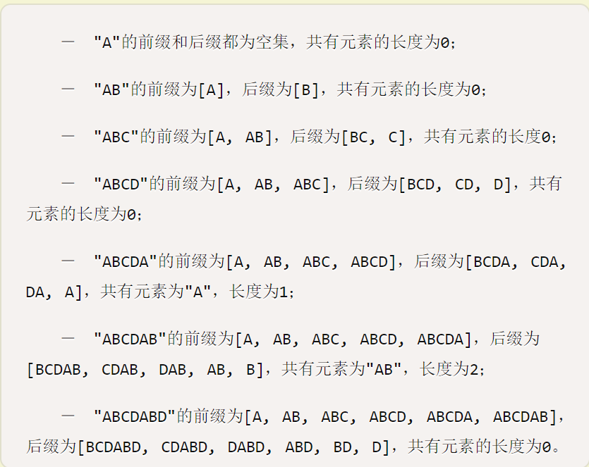

# String searching

[toc]

## KMP

参考[阮一峰—KMP算法](http://www.ruanyifeng.com/blog/2013/05/Knuth%E2%80%93Morris%E2%80%93Pratt_algorithm.html)

**重要概念**

- 前缀和后缀
    - 前缀：指除了最后一个字符以外，一个字符串的全部头部组合
    - 后缀：指除了第一个字符以外，一个字符串的全部尾部组合。
- 对应的部分匹配值的表的建立
    - 部分匹配值：就是前缀和后缀的最长的共有元素的长度 
    - 从而生成
    - 实质：有时候字符串头部和尾部会有重复，因此利用已知的信息，KMP算法的想法是，设法利用这个已知信息，不要把"搜索位置"移回已经比较过的位置，继续把它向后移，这样就提高了效率。
- 之后利用公式：**移动位数 = 已匹配的字符数 - 对应的部分匹配值**

## Boyer-Moore算法

参考[阮一峰—Boyer-Moore算法](http://www.ruanyifeng.com/blog/2013/05/boyer-moore_string_search_algorithm.html)
