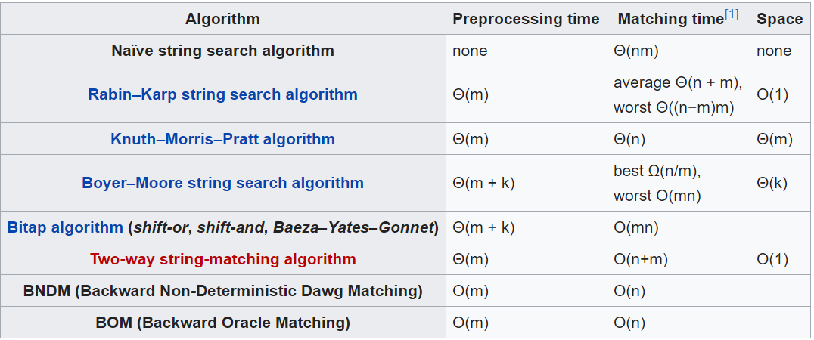

# String searching

[toc]

各种算法的时间复杂度和空间复杂度

## KMP

参考[阮一峰—KMP算法](http://www.ruanyifeng.com/blog/2013/05/Knuth%E2%80%93Morris%E2%80%93Pratt_algorithm.html)

**重要概念**

- 前缀和后缀
    - 前缀：指除了最后一个字符以外，一个字符串的全部头部组合
    - 后缀：指除了第一个字符以外，一个字符串的全部尾部组合。
- 对应的部分匹配值的表的建立
    - 部分匹配值：就是前缀和后缀的最长的共有元素的长度 
    - 从而生成
    - 实质：有时候字符串头部和尾部会有重复，因此利用已知的信息，KMP算法的想法是，设法利用这个已知信息，不要把"搜索位置"移回已经比较过的位置，继续把它向后移，这样就提高了效率。
- 之后利用公式：**移动位数 = 已匹配的字符数 - 对应的部分匹配值**

## Boyer-Moore算法

参考[阮一峰—Boyer-Moore算法](http://www.ruanyifeng.com/blog/2013/05/boyer-moore_string_search_algorithm.html)

KMP 算法很好，但不是效率最高的算法，实际采用的不多。各种文本编辑器的“查找”的功能（ctrl + F），大多采用的是`Boyer-Moore`算法

该算法不仅效率高，而且构思精巧，容易理解，（感觉就是按照直觉想出的一种算法）

主要是基于两个规则

- 坏字符规则
    - 坏字符，即不匹配的字符
    - 后移位数 = 坏字符的位置 - 搜索词中的上一次出现位置
    - 如果坏字符不包含在搜索词之中，则上一次出现位置为 - 1
- 好后缀规则
    - 好后缀，即所有尾部匹配的字符串"MPLE","PLE","LE","E"
    - 后移位数 = 好后缀的位置 - 搜索词中的上一次出现位置
    - 举例来说，如果字符串"ABCDAB"的后一个"AB"是"好后缀"。那么它的位置是5（从0开始计算，取最后的"B"的值），在"搜索词中的上一次出现位置"是1（第一个"B"的位置），所以后移 5 - 1 = 4位，前一个"AB"移到后一个"AB"的位置。
    - 再举一个例子，如果字符串"ABCDEF"的"EF"是好后缀，则"EF"的位置是5 ，上一次出现的位置是 -1（即未出现），所以后移 5 - (-1) = 6位，即整个字符串移到"F"的后一位。
   
需要注意的三个点
> 
>- （1）"好后缀"的位置以最后一个字符为准。假定"ABCDEF"的"EF"是好后缀，则它的位置以"F"为准，即5（从0开始计算）。
>- （2）如果"好后缀"在搜索词中只出现一次，则它的上一次出现位置为 -1。比如，"EF"在"ABCDEF"之中只出现一次，则它的上一次出现位置为-1（即未出现）。
>- （3）如果"好后缀"有多个，则除了最长的那个"好后缀"，其他"好后缀"的上一次出现位置必须在头部。比如，假定"BABCDAB"的"好后缀"是"DAB"、"AB"、"B"，请问这时"好后缀"的上一次出现位置是什么？回答是，此时采用的好后缀是"B"，它的上一次出现位置是头部，即第0位。这个规则也可以这样表达：如果最长的那个"好后缀"只出现一次，则可以把搜索词改写成如下形式进行位置计算"(DA)BABCDAB"，即虚拟加入最前面的"DA"。

需要预先生成《坏字符规则表》和《好后缀规则表》

