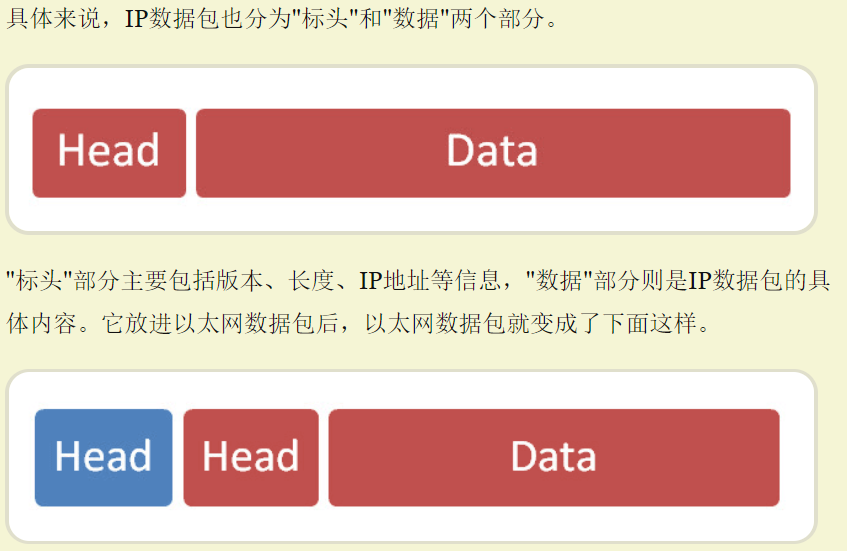

# 互联网协议
参考原文：[互联网协议入门——阮一峰](http://www.ruanyifeng.com/blog/2012/05/internet_protocol_suite_part_i.html)

[toc]

## 一、概述

### 1.1 互联网的分层

- 应用层（application layer）
    - 传输层（Transport）
        - 网络层（network）
            - 连接层（Link）
                - 实体层（Physical）

越下面的层，越靠近硬件；
越上面的层，越靠近用户。

### 1.2 层与协议

层与层之间遵守的共同规则叫：协议

## 二、实体层

"实体层“就是把电脑连接起来的物理手段。它主要规定了网络的一些电气特性，作用是负责传送0和1的电信号。

## 三、链接层

### 3.1 定义

链接层的功能，它在"实体层"的上方，确定了0和1的分组方式。即，解决了：解读方式的问题，多少个电信号算一组？每个信号位有何意义？

### 3.2 以太网协议

以太网规定，一组电信号构成一个数据包，叫做”帧“，每一帧分成两部分：
- 标头（Head）
    - 包含数据包的一些说明项，比如发送者、接收者、数据类型等等；
    - 长度固定为18字节
- 数据（Data）
    - 最短为 46 歌字节，最长为 1500 字节

如果数据很长，就必须分割成多个帧发送

### 3.3 MAC地址

以太网规定，连入网络的所有设备，都必须具有”网卡“接口。数据包必须是从一块网卡，传送到另一块网卡。

网卡的地址就是数据包的发送地址和接收地址，这就叫做 MAC 地址

每块网卡出厂时，都有一个全世界独一无二的 MAC 地址，长度时 48 个二进制，通常用 12 个十六进制数表示，前 6 个十六进制数是厂商编号，后 6 个是该厂商的网卡流水号

### 3.4 广播

以太网采用了一种很"原始"的方式，它不是把数据包准确送到接收方，而是向本网络内所有计算机发送，让每台计算机自己判断，是否为接收方。

## 四、网络层

### 4.1 由来

互联网是无数子网络共同组成的一个巨型网络。为了使不同子网络的计算机之间可以进行通话，就必须找到一种方法，用来区分哪些 MAC 地址属于同一个子网络，哪些不是。

如果同一个子网络，就采用广播方式发送，否则采用”路由“的方式发送（"路由"的意思，就是指如何向不同的子网络分发数据包）

然而 MAC 地址本身无法做到这一点，只与厂商有关，与所处网络无关。

**这就导致了”网络层“的诞生**

它的作用就是引进一套新的地址，使我们能够区分不同计算机是否属于同一个子网络，这套地址叫做”网络地址“，即：网址

MAC 地址与网络地址，二者没有任何关系，二者只是随记的组合在一起。
- MAC 地址是绑定在网卡上的
- 网络地址是管理员分配的

网络地址帮助我们确定计算机属于哪一个计算机网络，而 MAC 地址则将数据包送到该子网络的目标计算机中（目标网卡），即，先处理网络地址，再处理 MAC 地址。

### 4.2 IP协议

规定网络地址的协议，叫做IP协议， ipv4，ipv6

互联网上的每一台计算机，都会分配到一个IP地址。这个地址分成两个部分，前一部分代表网络，后一部分代表主机。

同时，还可以使用“子网掩码”来判断任意两个 IP 地址 是否处于同一个子网络

方法是将两个IP地址与子网掩码分别进行AND运算（两个数位都为1，运算结果为1，否则为0），然后比较结果是否相同，如果是的话，就表明它们在同一个子网络中，否则就不是。

比如，已知IP地址172.16.254.1和172.16.254.233的子网掩码都是255.255.255.0，请问它们是否在同一个子网络？两者与子网掩码分别进行AND运算，结果都是172.16.254.0，因此它们在同一个子网络。

总结一下，IP 协议的作用主要有两个，一个是为每一台计算机分配 IP 地址，另一个是确定哪些地址在同一个子网络。

### 4.3 IP数据包

根据IP协议发送的数据，就叫做IP数据包

我们可以把IP数据包直接放进以太网数据包的"数据"部分，因此完全不用修改以太网的规格。这就是互联网分层结构的好处：上层的变动完全不涉及下层的结构。

IP数据包的"标头"部分的长度为20到60字节，整个数据包的总长度最大为65,535字节。因此，理论上，一个IP数据包的"数据"部分，最长为65,515字节。前面说过，以太网数据包的"数据"部分，最长只有1500字节。因此，如果IP数据包超过了1500字节，它就需要分割成几个以太网数据包，分开发送了。

### 4.4 ARP协议

因为 IP 数据包是放在以太网数据包里发送的，所以 IP 地址和 MAC 地址必须都要知道，而通常情况下，IP 地址是已知的，因此，我们需要一种机制，能够从 IP 地址得到 MAC 地址。

分两种不同的情况

1. 如果两台主机不在同一个子网络，那么事实上没有办法得到对方的MAC地址，只能把数据包传送到两个子网络连接处的"网关"（gateway），让网关去处理。
2. 如果两台主机在同一个子网络，可以使用 ARP 协议， 得到对方的 MAC 地址。ARP 协议也是发出一个数据包（包含在以太网数据包中），其中包含它所要查询主机的地址的 IP 地址，在对方 MAC 地址这一栏，填的是 FF:FF:FF:FF:FF:FF，表示这个一个“广播”地址。它所在的子网络中的所有计算机都会收到这个数据包 ，从中拿出 IP 地址，与自己的 IP 地址 比较。如果相同，就做出回复，向对方报告自己的 MAC 地址，否则就丢弃这个数据包。

总之，有了 ARP 协议之后，我们就可以得到同一个子网络中的主机的 MAC 地址，可以把数据包发送到任意一台主机上了

## 五、传输层

### 5.1 由来

有了 IP 地址和 MAC 地址，我们已经可以在互联网上任意两台主机上建立通信。

**场景：**同一台主机上有许多程序都需要用到网络，比如，你一边浏览网页，一边与朋友在线聊天。当一个数据包从互联网上发来的时候，你怎么知道，它是表示网页的内容，还是表示在线聊天的内容？

即说明我们还需要一个参数，表示这个数据包到底是供哪个程序（进程）使用，这个参数叫做：端口（port）

- 每一个使用网卡的程序的编号
- 每个数据包都发到主机的特定端口，所以不同的程序就能取到自己所需要的数据

端口是 0 到 65535 之间的一个整数，正好 16 个二进制位。0-1023 的端口被系统占用，用户只能选择大于 1023 的端口，不管是浏览网页还是在线聊天，应用程序会随机选用一个端口，然后与服务器的相应端口联系。

**传输层的功能：**端口到端口的通信

**网络层的功能：**主机到主机的通信

确定主机和端口，就可以实现程序之间的交流，因此，Unix 系统把主机 + 端口，叫做“套接字”，有了它，就可以进行网络应用程序开发了。

### 5.2 UDP协议

需要新的协议，才能在数据包中加入端口信息，最简单的实现叫：UDP 协议，就是在数据前加上端口号。

UDP 数据包，也是由标头和数据两部分组成的。UDP数据包非常简单，"标头"部分一共只有8个字节，总长度不超过65,535字节，正好放进一个IP数据包。

标头主要定义了发出端口和接受端口，然后整个 UDP 数据包放入 IP数据包的数据部分，和上面说到的一样，现在整个数据包就变成了

### 5.3 TCP协议

UNP 协议比较简单，容易实现，但是可靠性较差，一旦数据包发出，也无法知道对方是否收到。

于是，TCP 协议诞生了
[阮一峰—TCP协议简介](http://www.ruanyifeng.com/blog/2017/06/tcp-protocol.html)

## 六、应用层

从用户的角度来看
[二](http://www.ruanyifeng.com/blog/2012/06/internet_protocol_suite_part_ii.html)

