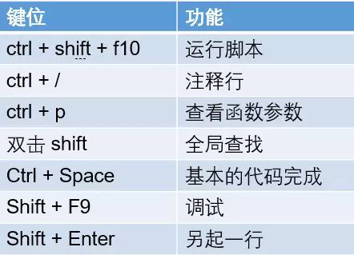

# 1
## 字符串和编码
### 字符编码
1. python 提供了`ord()`函数获取字符的整数表示， `chr()`函数把编码转换为对应的字符
2. python对`bytes`类型的数据用带b前缀的单引号或双引号表示：
    1. 要注意区分'ABC'和b'ABC'，前者是str，后者虽然内容显示得和前者一样，但bytes的每个字符都只占用一个字节。
    2. 使用encode和decode来在bytes和其他之间转换
        1. 如果我们从网络或磁盘上读取了字节流，那么读到的数据就是bytes。要把bytes变为str，就需要用decode()方法，
            1. 如果bytes中包含无法解码的字节，decode()方法会报错，
            2. 如果bytes中只有一小部分无效的字节，可以传入errors='ignore'忽略错误的字节：` b'\xe4\xb8\xad\xff'.decode('utf-8', errors='ignore')`
    1. 计算str包含多少个字符，可以使用`len()`函数
    2. len()函数计算的是str的字符数，如果换成bytes，len()函数就计算字节数：
```python
>>> len(b'ABC')
3
>>> len(b'\xe4\xb8\xad\xe6\x96\x87')
6
>>> len('中文'.encode('utf-8'))
6
```
> 可见，1个中文字符经过UTF-8编码后通常会占用3个字节，而1个英文字符只占用1个字节。
在操作字符串时，我们经常遇到`str`和`bytes`的互相转换。为了避免乱码问题，应当始终坚持使用`UTF-8`编码对`str`和`bytes`进行转换。
### 格式输出
1. 在Python中，采用的格式化方式和C语言是一致的，用%实现，举例如下：
```python
>>> 'Hello, %s' % 'world'
'Hello, world'
>>> 'Hi, %s, you have $%d.' % ('Michael', 1000000)
'Hi, Michael, you have $1000000.'
```
    你可能猜到了，%运算符就是用来格式化字符串的。在字符串内部，%s表示用字符串替换，%d表示用整数替换，有几个%?占位符，后面就跟几个变量或者值，顺序要对应好。如果只有一个%?，括号可以省略。

2. 常见的占位符有：

|  占位符 | 替换内容 |
| :--- | :--- | 
| %d	  | 整数 |
| %f |	    浮点数  |
| %s |	    字符串|
| %x |	    十六进制整数|

3. 如果你不太确定应该用什么，%s永远起作用，它会把任何数据类型转换为字符串, 而且，有些时候，字符串里面的%是一个普通字符怎么办？这个时候就需要转义，用%%来表示一个%：

4. format（）
另一种格式化字符串的方法是使用字符串的format()方法，它会用传入的参数依次替换字符串内的占位符{0}、{1}……，不过这种方式写起来比%要麻烦得多：
```python
>>> 'Hello, {0}, 成绩提升了 {1:.1f}%'.format('小明', 17.125)
'Hello, 小明, 成绩提升了 17.1%'
```
注释： 

### list和tuple
#### list
1. list是一个可变有序表
2. 可倒序索引，即可以使用-3，-2，-1，0，1，2
3. list中的操作
    1. 向list中追加元素到末尾， `classmates.append('Adam')`
    2. 可以把元素插入到指定的位置，`classmates.insert(1, 'Jack')`
    3. 要删除list末尾的元素，用pop()方法：`classmates.pop()`
    4. 要删除指定位置的元素，用pop(i)方法，其中i是索引位置： `classmates.pop(1)`
    5. 要把某个元素替换成别的元素，可以直接赋值给对应的索引位置:` classmates[1] = 'Sarah'`
8.  list中的元素的数据类型也可以是不同的，`L= ['apple',123, True]`
9. list元素也可以是另一个list，
```python
>>> s= ['apple', 'java', ['php', 'python'], 123]
>>> len(s)
4
```
10. 要注意s只有4个元素，其中s[2]又是一个list，如果拆开写就更容易理解了：
```python
>>> p = ['asp', 'php']
>>> s = ['python', 'java', p, 'scheme']
```
要拿到'php'可以写p[1]或者s[2][1]，因此s可以看成是一个二维数组，类似的还有三维、四维……数组，不过很少用到。如果一个list中一个元素也没有，就是一个空的list，它的长度为0。

#### tuple


