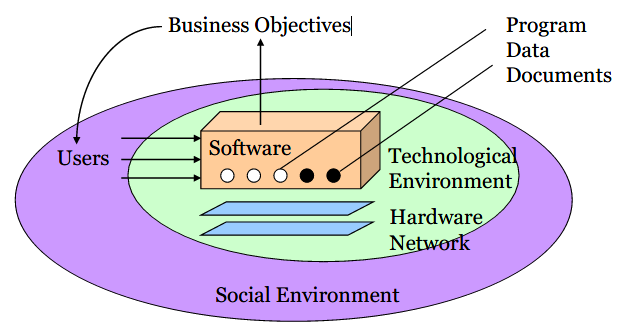

***1.软件构造的视角和质量目标***

# 1.1 软件构造的多维视角

## 1. 多维度的软件视角

软件系统的构成

多维度的软件视角——一张很概括的表

### 1) 构造阶段

- Code-level view：代码的逻辑组织，`functions，classes,methods,interfaces`
- Component-level：代码的物理组织, `files,directories,pachages,`
- Moment view：特定时刻的软件形态
- Period view： 软件形态随时间的变化

#### (1) Build-time, moment, and code-level view

- 词汇
    - 词汇定向的源代码
    - 半结构化：近乎自然语言的风格 + 遵循特定的编程语法（前者方便程序员，后者方便编译器）
- 语法
    - 抽象语法树（AST）
    - 彻底结构化，将源代码编程一棵树，对树做各种操作==对源代码的修改
- 语义
    - Class Diagram（类的图像）
    - 源代码具体想要实现什么目标（源代码--现实世界）

#### (2) Build-time, period, and code-level view

Code churn 代码变化: Lines added, modified or deleted to a file from one version to another.

#### (3) Build-time, moment, and component-level view

**和类库链接**

编程时和 build 时，需要告诉 IDE 和JVM 在哪里寻找某些库，有两种链接方式
- Static linking
    - 库被拷贝进入代码形成整体，执行的时候无需提供库文件
    - 静态链接发生在构造阶段
- Dynamic linking

#### (4) Build-time, period, and component-level view

SCI: Software Configuration Item（配置项）

VCS: Version Control System（版本控制系统）

Evolution Graph (of a SCI or a Software)

### 2) 执行阶段

1. 类库不能被直接在目标机器上加载和执行，它必须首先和可执行程序链接。
2. Executable Programs：Native Machine Code（可执行程序：原生机器码）
    1. 原生机器码：
        1. 计算机的 CPU 可以直接执行的，速度也是最快的
        2. 
    2. 程序完全解释执行
        1. 运行的程序把整个源代码加载到内存并且解释它（BASIC，UNIX shell，etc）
        2. 
    3. 解释型字节码
        1. 字节码和原生机器码很相似，除了 CPU 不能直接理解它
        2. 需要被一个字节码环境预编译，JVM
        3. 
    4. Perl 和 python ：
        1. 

**Dynamic linking**

- 库文件不会在 build 阶段被加入可执行文件，仅仅做出标记
- 程序运行时，根据标记装载库至内存
- 发布软件时，也要将程序所依赖的所有动态库都赋值给用户
- 优势：
    - 不需要重新创建可执行程序就可以更新版本。
    - 

分布式程序的运行态：需要多个运行程序，分别部署于多个计算机物理环境

#### (5) Run-time, moment, and code-level view

快照图：描述程序运行时内存里变量层面的状态

**内存信息转储**

#### (6) Run-time, period and code-level view

UML 序列图

执行跟踪，用日志方式记录程序执行的调用次序

#### (7) Run-time, moment, and component-level view

UML 调度图

#### (8) Run-time, period, and component-level view

事件日志：系统层面

## 2. 软件构造：不同视角的转换

- 空集 -> Code
    - Programming / Coding (Chapter 3 ADT/OOP)
    - Review, static analysis/checking (Chapter 4 Understandability)
- Code ->Component 
    - Design (Chapter 3 ADT/OOP; Chapter 5 Reusability; Chapter 6 Maintainability)
    - Build: compile, static link, package, install, clean (Chapter 2 Construction process)
- Build-time Run-time
    - Install / deploy (Course in the 3rd year)
    - Debug, unit/integration testing (Chapter 7 Robustness)
- Moment Period
    - Refactoring (Chapter 9 Refactoring)
    - Version control (Chapter 2 SCM)
    - Loading, dynamic linking, interpreting, execution (dumping, profiling, logging)(Chapter 8 Performance)

# 1.2 软件构造的质量目标

## 1. 

