***10. 并行与分布式编程***

Table of Contents
=================

* [10\.1 并行性与线程安全](#101-%E5%B9%B6%E8%A1%8C%E6%80%A7%E4%B8%8E%E7%BA%BF%E7%A8%8B%E5%AE%89%E5%85%A8)
  * [1\. 并发编程](#1-%E5%B9%B6%E5%8F%91%E7%BC%96%E7%A8%8B)
  * [2\. 进程，线程](#2-%E8%BF%9B%E7%A8%8B%E7%BA%BF%E7%A8%8B)
    * [1) 进程](#1-%E8%BF%9B%E7%A8%8B)
    * [2) 线程](#2-%E7%BA%BF%E7%A8%8B)
  * [3\. 交叉存取与竞争条件](#3-%E4%BA%A4%E5%8F%89%E5%AD%98%E5%8F%96%E4%B8%8E%E7%AB%9E%E4%BA%89%E6%9D%A1%E4%BB%B6)
  * [4\. 线程安全](#4-%E7%BA%BF%E7%A8%8B%E5%AE%89%E5%85%A8)
    * [1) Confinement](#1-confinement)
    * [2) Immutability](#2-immutability)
    * [3) Using Threadsafe Data Types](#3-using-threadsafe-data-types)
    * [4) Locks and Synchronization](#4-locks-and-synchronization)
      * [(1)Synchronized Blocks and Methods](#1synchronized-blocks-and-methods)
        * [i\. Synchronized Statements](#i-synchronized-statements)
        * [ii\. Synchronization：Synchronized Methods](#ii-synchronizationsynchronized-methods)
      * [(2)Atomic operations](#2atomic-operations)
      * [(3) Sprinkling synchronized everywhere?](#3-sprinkling-synchronized-everywhere)
      * [(4) Liveness:deadlock,starvation and livelock](#4-livenessdeadlockstarvation-and-livelock)
        * [i\. Deadlock](#i-deadlock)
        * [ii\.Starvation](#iistarvation)
        * [iii\.livelock](#iiilivelock)
      * [(5) 线程调度的方法](#5-%E7%BA%BF%E7%A8%8B%E8%B0%83%E5%BA%A6%E7%9A%84%E6%96%B9%E6%B3%95)
        * [sleep()](#sleep)
        * [join()](#join)
        * [Guarded Blocks](#guarded-blocks)
        * [wait(), notify(), notifyAll()](#wait-notify-notifyall)
        * [Blocking methods](#blocking-methods)
        * [interrupt()](#interrupt)
  * [5\. 制定安全的论证](#5-%E5%88%B6%E5%AE%9A%E5%AE%89%E5%85%A8%E7%9A%84%E8%AE%BA%E8%AF%81)
* [10\.2 消息传递和图形界面](#102-%E6%B6%88%E6%81%AF%E4%BC%A0%E9%80%92%E5%92%8C%E5%9B%BE%E5%BD%A2%E7%95%8C%E9%9D%A2)
  * [1\. 两台电脑进程之间的消息传递](#1-%E4%B8%A4%E5%8F%B0%E7%94%B5%E8%84%91%E8%BF%9B%E7%A8%8B%E4%B9%8B%E9%97%B4%E7%9A%84%E6%B6%88%E6%81%AF%E4%BC%A0%E9%80%92)

---

# 10.1 并行性与线程安全

## 1. 并发编程
多个运算同时发生

**原因有三**
- 处理器时钟速度不再增加
- 新一代芯片都会有很多的内核
- 为了让计算更快运行，我们必须将计算分解为并发模块

**两种常见的并发模型**
- 共享内存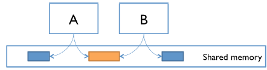
    - 例子
        - 两个处理器共享内存
        - 两个程序共享文件
        - 两个线程共享对象
- 消息传递
    - 例子
        - 网络中两台计算机通信
        - web 浏览器和 web server
        - 即使消息的客户端和服务器
        - 通过管道连接两个程序的输入和输出

## 2. 进程，线程
进程和线程是两种不同的并发模块
- 进程是正在运行程序的一个实例，它拥有自己私有专用的内存空间
- 线程是正在运行程序的一个执行路径（一个进程可以对应多个线程），每个线程有自己独立的堆栈和局部变量，但是多个线程共享内存空间。

### 1) 进程
进程可抽象成虚拟计算机，拥有独立的执行环境和完整的资源（内存空间）
- 它使得这个程序好像自己独自占有整台机器

**进程通常不共享内存**
- 进程不能访问其他进程的内存或对象
- 需要特殊机制才能实现进程间共享内存
- 进程通信采用的是消息传递方式（因采用标准 I/O 流）

进程通常被视为程序或者应用，但**事实上，应用程序可能是一组协作进程**，为了实现进程间通信，大多数操作系统都支持“进程间通信（IPC）资源，例如管道和socket
- IPC 不仅在同一系统的不同进程中使用，而且可以在不同系统的进程中被用到。

Java虚拟机本身的大多数实现都是作为单个进程运行的
### 2) 线程
线程可抽象为一个虚拟处理器，有时也被称为轻量级进程。线程与进程中的其他线程共享共同的资源（内存，打开文件等），即”**线程存在于进程内**。

线程采用内存共享机制通信，需要特殊处理才能实现**消息传递和私有内存**。

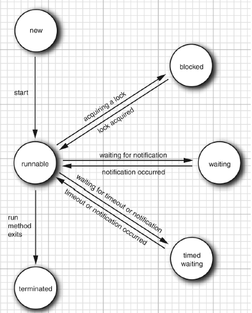

每一个应用程序至少有一个线程，从 main 线程开始，创建其他的线程。

两个创建线程的方法
- （很少用）创建 Thread 类的子类
- （大多数）实现 Runnable 接口，作为参数传递给 new Thread() 构造函数

所有的线程都需要实现 Runnable 接口，在 run() 中写具体实现
```java
public interface Runnable {
    void run();
}

//Method1 Subclasss Thread
public class HelloThread extends Thread{
    public void run(){
        System.out.println("Hello");
    }
    public static void main(String args[]){
        (new HelloThread()).start();
        (new HelloThread()).start();
        (new HelloThread()).start();
    }
}
//Method2 Provide a Runnable object
public class HelloRunnable implements Runnable{
    public void run(){
        System.out.println("Hello");
    }
    public static void main(String args[]){
        (new Thread(new HelloRunnable())).start();
    }
}
```

惯用法：用一个匿名的`Runnable`启动一个线程，它避免了创建命名的类
```java
    new Thread(new Runnable(){
        public void run(){
            System.out.println("hello");
        }
    }).start();
```
注：new Runnable () {...} 不是实例化 Runnable 接口（java 不支持对接口的实例化），实际是上一种内部类的简写

- 1. 构造一个实现 Runnable 接口的无名 local 内部类（方法内的内部类）
- 2. 构造这个无名 local 内部类的一个实例
- 3. 用 Runnable 来表示这个无名 local 内部类的类型（OO多态）。

## 3. 交叉存取与竞争条件
**时间切片**

一个运行核心上只有一个线程可以运行

- 进程 / 线程等采用 OS 提供的时间片特征来共享处理时间
- 当线程数多于处理器数量时，并发性通过时间片来模拟，处理器切换处理不同的线程。

**时间片的例子**
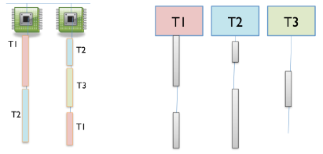

时间片的使用是不可预知和非确定性的，这意味着线程可能随时暂停或恢复。

共享内存可能会导致微妙的错误。

竞争条件：程序的正确性（后置条件和不变量的满足）取决于并发计算 A 和 B 中事件的相对时间，也叫（线程干扰）（Thread Interference）

**调整代码无济于事**，不能仅仅从 Java 代码中看出处理器将如何执行它，也无法通过观察一个表达式来判断它是否会在竞赛状态下安全。

**消息传递的例子**

模块之间通过消息传递进行交互

- 消息接收方将接受到的消息形成队列逐一处理（先进先出）
- 消息发送者并不停下来等待结果而是继续执行（异步方式）

消息传递的方式并不能消除竞争条件的可能性，在 Java 中，采用 happened-before 机制，保证了语句 A 内存的写入对语句 B 是可见的，从而确保内存一致性。

## 4. 线程安全

数据类型或静态方法在线程中执行时，无论如何执行，不需要调用者做额外的协作，仍然能够行为正确，则称为线程安全。

- 行为正确意味着满足规格说明和保持不变性
- 不能在前置条件中对调用者增加时间性要求 

Iterator 不是线程安全的，因为需要满足特殊约定

**保证线程安全的四个方法**

- 限制可变变量的共享
- 用不可变的共享变量
- 将共享数据封装在线程安全的数据类型中
- 使用同步来防止线程同时访问变量

### 1) Confinement
通过将数据限制在单个线程中，可以避免线程在可变数据上进行竞争

**限制可变变量[^4]**

- 局部变量保存在线程栈中，每一个调用都有自己的变量副本
- 局部变量如果是对象的引用，则要确保不能引用任何其他线程可访问的对象

 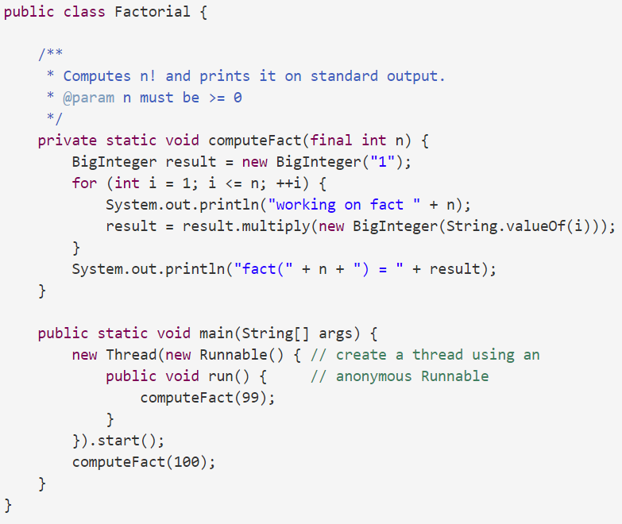

**避免全局变量**

- 全局静态变量不会自动收到线程访问限制
    - 如果使用了全局静态变量，则应说明只有一个线程会使用它们。
- 在多线程环境中，取消全局变量

### 2) Immutability

使用不可变的引用和数据类型

- 不可变解决了因为共享可变数据造成的竞争，并简单地通过使共享数据不可变来解决他。
- `final` 变量是不可变的引用，所以声明为`final`的变量可以安全的从多个线程访问。
- 因为这种安全性只适用于变量本身，仍然必须确保变量指向的对象是不可变的。

回顾 3.3 不可变性

- 类型是不可变的：如果类型的对象在其整个生命周期中始终表示相同的抽象值
- 但实际上，允许对 rep 进行修改，只要这些改变对客户是不可变的，并且对应的抽象值不变，，例如有益的突变。
- 但是对于并发性，这种隐藏的变化是不安全的，使用有益的变化的不可变数据类型必须使用锁来使自己线程安全。

**更强的不可变性的定义**

- 没有改变数据的操作
    - don not provide "`setter`"methods
- 所有字段均为 private 和 final
    - make all fields `final`and`private`
- 没有表示泄露
    - 不允许子类重写方法
        - 类声明为`final`
        - 更复杂的方法是使构造函数为私有，并使用工厂方法构造实例[^5]
- 表示中的任何可变对象都不能变化
    - 不提供修改可变对象的方法
    - 不要共享对可变对象的引用
    - 不存储传递给构造函数的外部可变对象的引用
    - 避免在方法返回值中包含对可变对象的引用

### 3) Using Threadsafe Data Types
将共享的可变数据存储在线程安全的数据类型中

因为线程安全的数据类型性能较差，所以 Java 对一些可变数据类型提供了两种方式选择：线程安全的和线程不安全的，比如：

- `StringBuffer` 和 `StringBuilder` 都是可变数据类型，功能基本相同
- `StringBuffer` 是线程安全的，`StringBuilder` 不是
- `StringBuilder`性能更好，推荐在单线程程序中使用

**线程安全的 Collection**

- `List，Set，Map`这些都不是线程安全的类型
- Java 提供了线程安全的 Collections 类型版本
    - 确保方法是原子的
    - 原子方法：动作的内部操作不会同其他操作交叉，不会产生部分完成的情况

```java
private static Map<Integer, Boolean> cache = 
    Collections.synchronizedMap(new HashMap<>());
```

**一些要点**

- 不要绕开包装类，统一采用包装类的形式(Don not circumvent the wrapper)[^6]
    - 确保抛弃对底层非线程安全容器类的引用，并只通过同步的包装来访问它
    - 新的`HashMap`只传递给`synchronizedMap`，并且永远不会存储在其他地方
    - 因为底层的容器仍然是可变的，引用它的代码可以规避不变性，失去了包装的意义
- 迭代器仍然是线程不安全的(Iterators are still not threadsafe)
    - 即使`collection`自己调用的`get(), put(), add(), etc`是线程安全的，被`collection`创建的迭代器也是不安全的
    - 所以，你不能使用`iterator(), or the for loop syntax:`
        - `for (String s: list){...}`
    - 解决方法是将在需要迭代`collection`时获取集合的锁[^7]
- 原子操作不足以完全防止竞争，例如检查列表是否至少有一个元素，然后获取该元素
    - `if (!list,isEmpty()) { String s = list .get(0);...}`
    - 即使你已经把 list 变为同步包装的 list ，上述代码依然会有竞争条件，因为另一个线程可能删除一个元素在`isEmpty()call 和 get()call` 之间

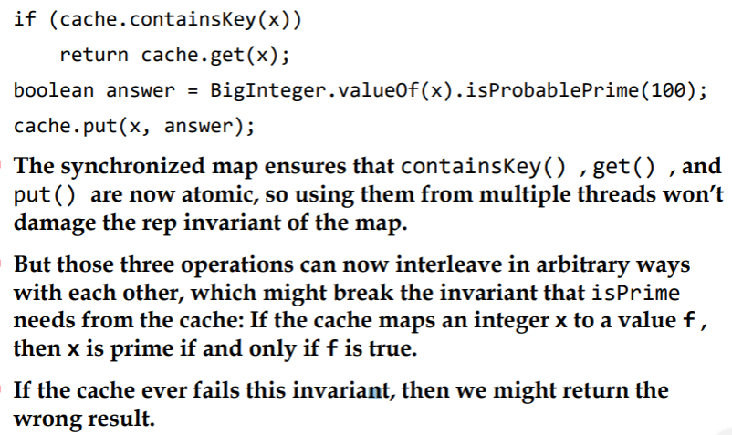

包装的实现是将所有的实际工作委托给指定的容器，但在容器的基础上添加额外的功能。
### 4) Locks and Synchronization
**并发程序的正确性不应依赖于事件的时间。**

Synchronization：防止多个线程同时访问共享数据

- 锁定是一种实现同步的技术
    - 锁是一种抽象，某时刻最多只允许一个线程拥有锁（即意味着一个线程告诉其他的线程：我正在修改这个东西，不要现在动他）
- 锁有两个操作：
    - **acquire：**获取锁的所有权，如果锁被其他进程拥有，那么进入阻塞状态，等待锁释放之后，再与其他进程争夺锁的所有权
    - **release：**释放锁的所有权
- 使用锁还可以确保锁的所有者始终查看最新的数据
- 阻塞一般意味着线程等待（不再继续工作），直到一个事件发生。[^8]

**Recall : Steps to develop an ADT**

- 指定：定义操作
- 测试：为操作设计测试用例
- Rep：选择不变量
    - 简单，强有力
    - 写 AF 和 RI，并且在每一个 constructor, producer, mutator 执行 `CheckRep()`来核对不变量

**加入 Synchronize**
- 阐述如何使 rep 线程安全
- 写入表示不变性的说明中，以便代码维护者知道你使如何为类设计线程安全性的

例子

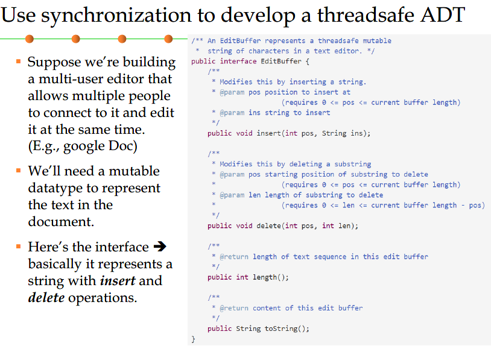

不好的方案

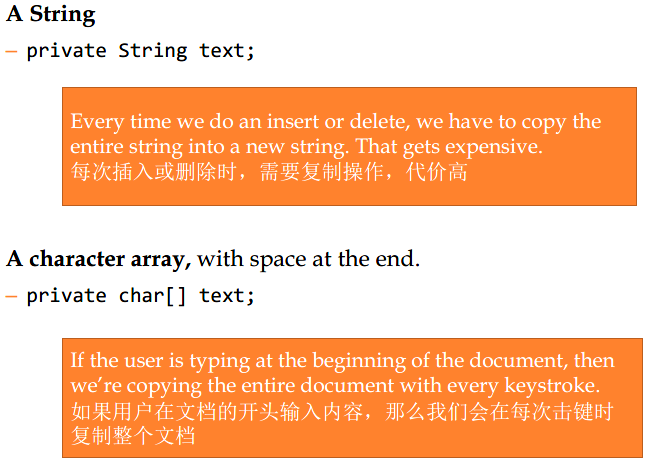

较好的解决方案（类似光标）

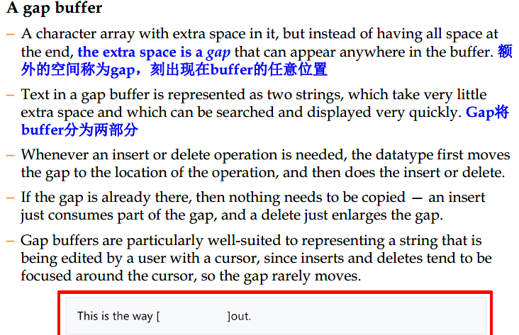

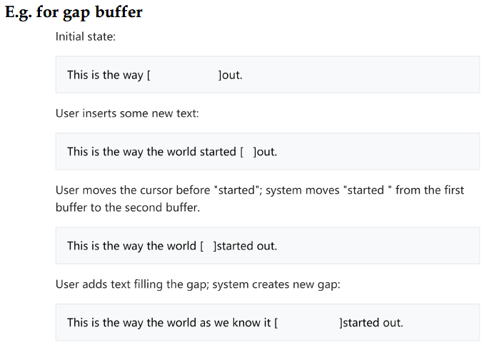

Gap buffer（示范 RI 和 AF 如何书写）
```java
public class GrpBuffer implements EditBuffer{
    private char[] a;
    private int gapStart;
    private int gapLength;
    //Rep invariant;
    //    a != null
    //    0 <= gapStart <= a.length
    //    0 <= gapLength <= a.length - gapStart
    //Abstraction function
    //    represents the sequence a[0],...a[gapStart - 1], a[gapStart+gapLength],...,a[Length-1]
```

#### (1)Synchronized Blocks and Methods

**Locking**

Java 将锁定机制作为内置语言提供

同步是围绕内部锁或监视器锁实体构建的，（API规范通常将此实体简称为“监视器”）。在同步时：强制对象状态的独占访问和建立 happens-before 关系，内部锁都起作用
- 每个类及其所有对象实例都有一个锁

**Synchronization**

Java 提供了两种基本同步的方法
- 同步方法
- 同步语句/同步代码块（Synchronized Statements)

##### i. Synchronized Statements

- 同步语句必须指定内部锁的对象
- 同步区域提供了互斥功能：一次只能有一个线程处于由给定对象的锁保护的同步区域中。
- 锁定时，遵循顺序执行模式

```java
//lock is an object of a class
synchronized (lock) { // thread blocks here until lock is free
    // now this thread has the lock
    balance = balance + 1;
    // exiting the block releases the lock
}
```

- 锁用于保护共享数据变量，确保原子性
- 使用`synchronized(obj){...}`只能做一件事情：在线程 t 中，会阻止其他线程进入保护块中，直到语句块中代码执行完。
- 锁只能确保与其他请求获取相同对象锁的线程互斥访问
- 有一个**误区：**拥有对象的锁会自动阻止其他线程访问该对象
- 锁只能确保与其他请求获取相同对象锁的线程互斥访问，如果其他线程没有使用`synchronized(obj)`或者利用了不同`object`的锁，则同步会失效

```java
public class ThreadTest_02a extends Thread{
    private String lock;
    private String name;

    public ThreadTest_02a(String name, String lock){
        this.name = name;
        this.lock = lock;
    }

    @Override
    public void run(){
        synchronized (lock){
            for (int i = 0; i < 3; i++) {
                System.out.println(name + " run ...");
            }
        }
    }

    // example1
    public static void main(String[] args) {
        String lock = new String("test");
        for (int i = 0; i < 5; i++){
            new ThreadTest_02a("ThreadTest_" + i,lock).start();
        }
    }

    //example2
    public static void main(String[] args) {
        String lock;
        for (int i = 0; i < 5; i++){
            lock = new String("test");
            new ThreadTest_02a("ThreadTest_" + i,lock).start();
        }
    }
}
```
Example 1

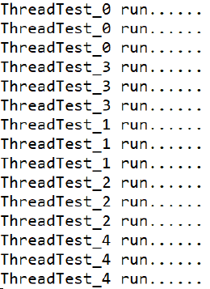

Example 2

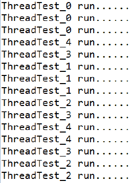

造成上面结果不同的原因就是：
- example 1 中，lock 对象只创建了一次，因而确保了获得锁的线程可以去其他请求获取 lock 对象（因为是同一个）的线程互斥访问。
- example 2 中， lock 每次循环都在 new String，所以对象不同，同步就会失效。

**监视器模式**

- 最方便的锁就是`this`
- `synchronized(this)`
- 在 Monitor pattern 中，某时刻只能有一个线程在类的实例中

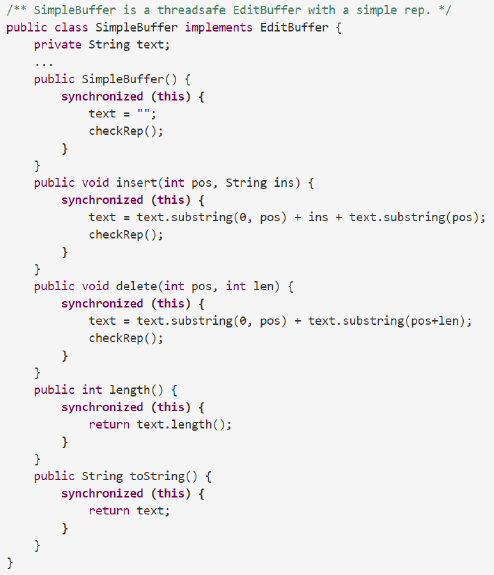

##### ii. Synchronization：Synchronized Methods

除了同步代码块之外，还可以同步方法

```java
public synchronized void increment() {c++;}
```

- 当线程调用同步方法时，它会自动获取该方法对象的**内部锁**，并在方法返回时释放它。即使返回是由未捕获的异常引起的，也会释放锁。
- 同一对象上的同步方法的两次调用不会有交错现象
- 当一个线程正在执行一个对象的同步方法时，所有其他线程如果调用同一对象的同步方法块，则会挂起执行，直到第一个线程针对此对象的操作完成。
- 当一个同步方法退出时，它会自动建立一个与之后调用同一个对象的同步方法的 happens-before 关系，这保证对象状态的更改对所有线程都是可见的。

**happens-before relationship**

- *happenes-before*保证了语句 A 内存的写入对语句 B 是可见的，也就是在 B 开始读数据之前，A 已经完成了对数据的写入
- 确保了内存一致性

```java
public class ThreadTest3 implements Runnable{
  public synchronized void run() {
    for (int i = 0; i < 3; i++) {
      System.out.println(Thread.currentThread().getName() + "...");
    }
  }
  //example1
  public static void main(String[] args) {
    for (int i = 0; i < 5; i++) {
      new Thread(new ThreadTest3(), "Thread_" + i).start();
    }
  }
  //example2
  public static void main(String[] args) {
    ThreadTest3 threadTest3 = new ThreadTest3();

    for (int i = 0; i < 5; i++) {
      new Thread(threadTest3, "Thread_" + i).start();
    }
  }
}
```
example 1

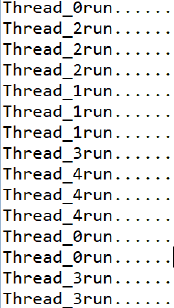

example 2

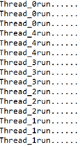

synchronized methods


**静态同步方法**

当一个静态同步方法被调用，什么是锁？

- 由于静态方法与类关联，而不是对象，在这种情况下，线程获取与该类关联的`class`对象的内部锁
- 对类的静态字段的访问由与该类的任何实例的锁截然不同的锁来控制

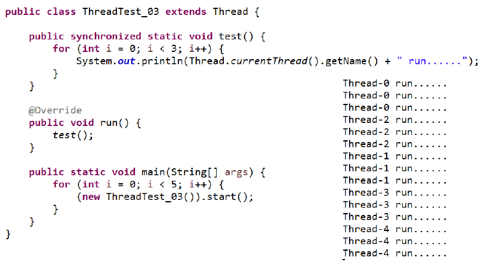

Synchronized 语句可用于实现具有细粒度同步的并发性

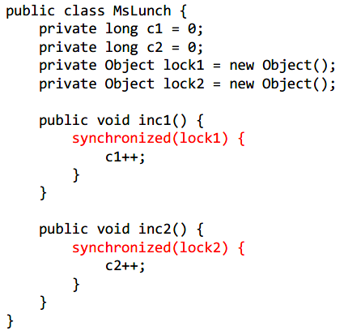

**Locking Discipline**

- 锁定规则是确保同步代码是线程安全的策略
- 我们必须明确两个条件
    - 每个共享的可变变量必须由每个锁保护
    - 如果一个不变量涉及多个共享的可变变量（甚至可能在不同的对象中），那么涉及的所有变量都必须由相同的锁保护
- 监视器模式满足这两个规则，rep 中所有共享的可变数据（表示不变量依赖的）都被相同的锁保护

State model for Java threads：locking

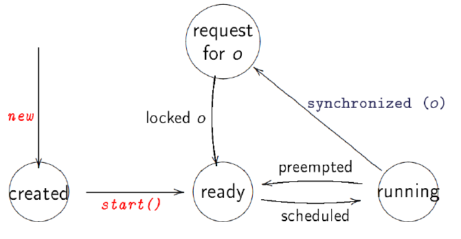

#### (2)Atomic operations

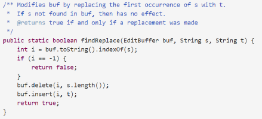

让数据类型的锁对客户端可用，以实现更高级的原子操作

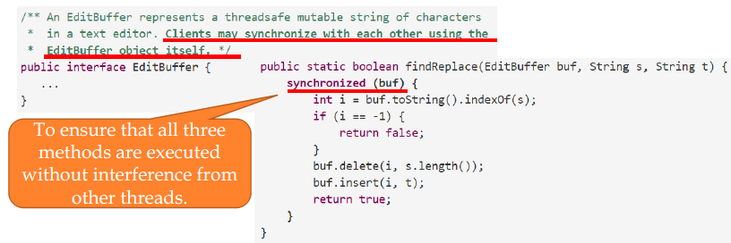

扩大了同步的区域

以下关于`volatile`的内容参考[volatile 关键字解析](https://www.cnblogs.com/dolphin0520/p/3920373.html)

**volatile关键字**

`private volatile int counter;`

一旦一个共享变量（类的成员变量，类的静态成员变量）被`volatile`修饰之后，那么就具备了两层语义

1. 保证了不同线程对这个变量进行操作时的可见性，即一个线程修改了某个变量的值，那么这个新值对其他线程来说也是立即可见的。
2. 禁止进行指令重排序，在一定程度上保证了有序性
    1. 当程序执行到`volatile`变量的读操作或者写操作时，在其前面的操作的更改肯定全部已经进行，且结果已经对后面的操作可见；在其后面的操作肯定还没有进行；
    2. 在进行指令优化时，不能将在对`volatile`变量访问的语句放在其后面执行，也不能把`volatile`变量后面的语句放在其前面执行。

**`volatile`不能保证原子性**

**`volatile`的原理和实现机制**

如何保证可见性和禁止指令重排序的？

```md
观察加入`volatile`关键字和没有加入`volatile`关键字时所生成的汇编代码发现，加入`volatile`关键字时，会多出一个`lock`前缀指令——《深入理解 java 虚拟机》
```

lock 前缀指令实际上相当于一个内存屏障，会提供三个功能：

1. 它确保指令重排序时不会把其后面的指令排到内存屏障之前的位置，也不会把前面的指令排到内存屏障的后面；即在执行到内存屏障这句指令时，在它前面的操作已经全部完成
2. 它会强制将对缓存的修改操作立即写入主存
3. 如果是写操作，它会导致其他 CPU 中对应的缓存行无效

**使用`volatile`关键字的场景**

**注意:**synchronized关键字是防止多个线程同时执行一段代码，那么就会很影响程序执行效率，而volatile关键字在某些情况下性能要优于synchronized，但是要注意volatile关键字是无法替代synchronized关键字的，因为volatile关键字无法保证操作的原子性。

使用`volatile`必须具备以下 2 个条件

1. 对变量的写操作不依赖于当前值
2. 该变量没有包含在具有其他变量的不变式中

上面的2个条件需要保证操作是原子性操作，才能保证使用volatile关键字的程序在并发时能够正确执行。

#### (3) Sprinkling synchronized everywhere?

不需要所有的方法都使用`synchronize`
- 同步开销大
- 当你不需要同步时，不要使用它

#### (4) Liveness:deadlock,starvation and livelock

并发应用程序的及时执行能力被称为活跃度
##### i. Deadlock

由于使用锁需要线程等待（当另一个线程持有锁时），因此可能会陷入两个线程正在等待对方的情况-因此都无法继续

死锁描述了两个或更多线程永远被阻塞的情况，都在等待对方

死锁可能涉及两个以上的模块：线程间的依赖关系环时出现死锁的信号

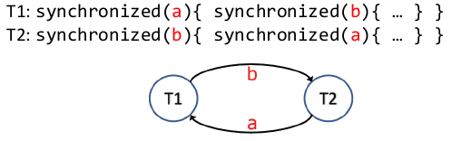

1. Lock ordering——防止死锁的一种方法是对需要同时获取的锁进行排序，并确保所有代码按照该顺序获取锁定
2. coarse-grained locking——粗粒度的锁，用单个锁来监控多个对象实例
    1. 性能损失大
    2. 如果用一个锁保护大量的可变数据，那么也就放弃了同时访问这些数据的能力
    3. 在最糟糕的情况下，程序可能基本上是顺序执行，从而丧失了并发性

##### ii.Starvation

- 饥饿描述了线程无法获得共享资源的访问，从而无法取得进展的情况
- 当共享资源有“贪婪”的线程导致长时间不可用时，会发生这种情况

##### iii.livelock

- 如果一个线程的行为也是对另一个线程的行为的响应，则可能导致活锁
- 与死锁一样，活锁线程无法取得进一步进展
- 线程并未被阻止，他们只是忙于响应对方恢复工作

#### (5) 线程调度的方法

##### sleep()

让当前线程暂停指定时间的执行`Thread.sleep(1000)`

##### join()

join() 方法用于保持当前正在运行的线程的执行，直到该线程死亡（执行完毕），才能继续执行后续线程

- 线程调度安排线程，但不规定线程执行的顺序（？什么意思）
- 让一个线程等待另一个线程结束（可能需要前面线程的输出结果作为输入）

##### Guarded Blocks

防护块：在语句块开始放一个轮询条件（一直检测），当条件为真才能执行后续的语句

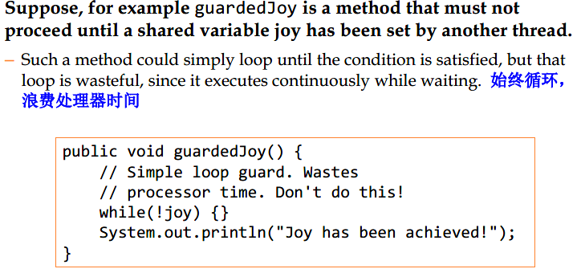

##### wait(), notify(), notifyAll()

- o.wait()：释放对象 o 的锁，使线程进入等待状态
    - 执行wait()后，当前线程会等待，直到其他线程调用
此对象的notify( ) 方法或notifyAll( ) 方法
- o.notify()：唤醒对象 o 监视器上（锁对象）等待的单个线程
- o.notifyAll()：唤醒对象 o 监视器上等待的所有线程

##### Blocking methods

- 阻塞方法不同于一般的要运行较长时间的方法
- 一般方法的完成只取决于它所要做的事情，以及是否有足够多可用的计算资源
- 而阻塞方法的完成还取决于一些外部的事件，例如计时器到期，I/O 完成，或者另一个线程的动作（释放一个锁，设置一个标志，或者将一个任务放在一个工作队列中）。
- 一般方法在它们的工作做完后即可结束，而阻塞方法较难于预测，因为它们取决于外部事件，阻塞方法可能影响响应能力，因为难于预测它们何时会结束。
- 阻塞方法可能因为等不到所等的事件而无法终止，因此令阻塞方法可取消就非常有用（如果长时间运行的非阻塞方法是可取消的，通常也非常有用）
- 可取消操作是指能从外部使之在正常完成之前终止的操作。

##### interrupt()

- 每个线程都有一个与之相关联的 Boolean 属性，用于表示线程的中断状态，中断状态初始时为 false
- 当另一个线程通过调用 Thread.interrupt() 中断一个线程时，会出现两种情况
    - 如果被中断线程正在执行一个低级可中断阻塞方法，例如 Thread.sleep()，Thread.join() 或 Object.wait()，那么它将要取消阻塞并抛出 interruptedException
    - 否则，interrupt() 只是设置线程的中断状态。
- 在被中断线程中运行的代码以后可以轮询中断状态，看看它能否被请求停止正在做的事情
- 中断状态可以通过 Thread.isInterruputed() 来读取，并且可以通过一个名为 Thread.interrupted() 的操作读·取和清除
- **中断是一种协作机制**。当一个线程中断另一个线程时，被中断的线程不一定要立即停止正在做的事情。相反，中断是礼貌地请求另一个线程在它愿意并且方便的时候停止它正在做的事情。
- 有些方法，例如Thread.sleep()，很认真地对待这样的请求，但每个方法不是一定要对中断作出响应。对于中断请求，不阻塞但是仍然要花较长时间执行的方法可以轮询中断状态，并在被中断的时候提前返回。您可以随意忽略中断请求，但是这样做的话会影响响应。
- 中断的协作特性所带来的一个好处是，它为安全地构造可取消活动提供更大的灵活性。
- 我们很少希望一个活动立即停止；如果活动在正在进行更新的时候被取消，那么程序数据结构可能处于不一致状态。中断允许一个可取消活动来清理正在进行的工作，恢复不变量，通知其他活动它要被取消，然后才终止。

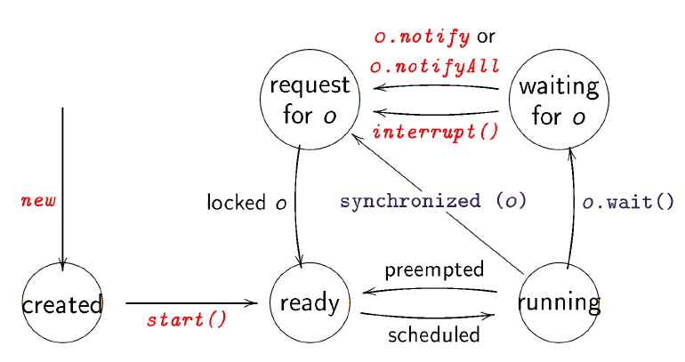

## 5. 制定安全的论证

```java
if (cache.containsKey(x)){
    return cache.get(x);
}

boolean answer = BigInteger.valueOf(x).isProbablePrime(100);
cache.put(x, answer);
```

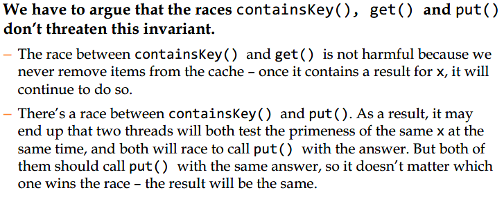

需要对安全性进行这种仔细的论证——即使在使用线程安全数据类型时——也是并发性很难的主要原因

- 阐述使用了哪种技术
- 使用threadsafe data types, or synchronization时，还需要论证所有对数据的访问都是具有原子性的。

**Thread Safety Arguments for Immutability**

Good Safety Arguments

一、

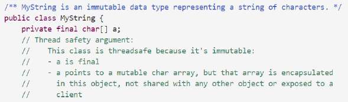

二、

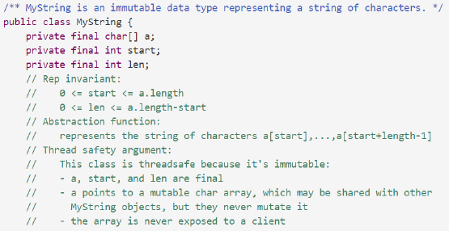

Bad Safety Arguments

一、

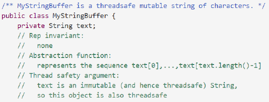

为什么这个论证是没用的

- `String`是确实不可变和线程安全的，但是 指向了string，尤其是 可变的 text 的 rep 是可变的
- text 不是一个常量，并且事实上，它不可能是在这个数据类型中是常量，因为我们需要 text 去支持增加和删除的操作
- 所以 text 的读和写不是线程安全的

二、

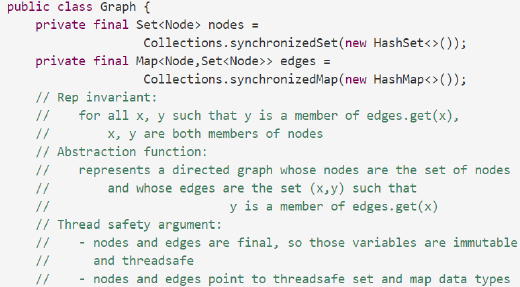

原因有二

- Graph 依赖于其他线程安全的数据类型去帮助它执行它自己的 rep
- node set 和 edge map 之间有关系，All nodes that appear in the edge map also have to appear in the node set.

# 10.2 消息传递和图形界面

## 1. 两台电脑进程之间的消息传递

**Sockets & Networking**

- 网络中的 Client/server 模式，采用 socket 作为对象
- 网络通信是并发的，需要考虑线程安全问题
- 设计 client 和 server 通讯用的有线协议
- 阻塞操作使代码编写更容易，但有可能造成死锁

**Client/server 设计模式**

客户端发起通信，服务器接受、处理、回复，重复此过程，客户端断开连接。服务器可同时处理多个客户端，客户端也可同时连接多个服务器。

客户机和服务器可在不同的计算机上，也可在一台计算机上


