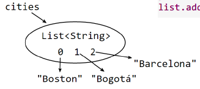

***3. 抽象数据类型和面向对象编程***

* [3\.1 数据类型和类型检查](#31-%E6%95%B0%E6%8D%AE%E7%B1%BB%E5%9E%8B%E5%92%8C%E7%B1%BB%E5%9E%8B%E6%A3%80%E6%9F%A5)
  * [1\. 数据类型](#1-%E6%95%B0%E6%8D%AE%E7%B1%BB%E5%9E%8B)
  * [2\. 静态和动态数据类型](#2-%E9%9D%99%E6%80%81%E5%92%8C%E5%8A%A8%E6%80%81%E6%95%B0%E6%8D%AE%E7%B1%BB%E5%9E%8B)
  * [3\. 类型检查](#3-%E7%B1%BB%E5%9E%8B%E6%A3%80%E6%9F%A5)
  * [4\. 可变性与不变性](#4-%E5%8F%AF%E5%8F%98%E6%80%A7%E4%B8%8E%E4%B8%8D%E5%8F%98%E6%80%A7)
    * [immutability 不变性](#immutability-%E4%B8%8D%E5%8F%98%E6%80%A7)
    * [可变性与不变性](#%E5%8F%AF%E5%8F%98%E6%80%A7%E4%B8%8E%E4%B8%8D%E5%8F%98%E6%80%A7)
    * [可变类型的优势](#%E5%8F%AF%E5%8F%98%E7%B1%BB%E5%9E%8B%E7%9A%84%E4%BC%98%E5%8A%BF)
    * [变化的风险](#%E5%8F%98%E5%8C%96%E7%9A%84%E9%A3%8E%E9%99%A9)
    * [防御式拷贝](#%E9%98%B2%E5%BE%A1%E5%BC%8F%E6%8B%B7%E8%B4%9D)
  * [5\. 快照图](#5-%E5%BF%AB%E7%85%A7%E5%9B%BE)
  * [6\. 复杂的数据类型: Arrays and Collections](#6-%E5%A4%8D%E6%9D%82%E7%9A%84%E6%95%B0%E6%8D%AE%E7%B1%BB%E5%9E%8B-arrays-and-collections)
  * [7\. 有用的不可变类型](#7-%E6%9C%89%E7%94%A8%E7%9A%84%E4%B8%8D%E5%8F%AF%E5%8F%98%E7%B1%BB%E5%9E%8B)
  * [8\. 空引用](#8-%E7%A9%BA%E5%BC%95%E7%94%A8)

# 3.1 数据类型和类型检查

## 1. 数据类型

变量：用特定数据类型定义，可存储满足类型约束的值

**java中的数据类型**

- 基本数据类型
- 对象数据类型

**对象类型形成层次结构**

- 根是 Object
- 继承关系
- 

**包装类**

- 将基本类型包装为对象类型
    - Boolean, Integer, Short, Long, Character, Float, Double
- 通常是在定义集合类型的时候使用它们
- 一般情况下，尽量避免使用
- 一般可以自动转换

**重载 Overloading operators**

-同样的操作名可用于不同的数据类型

## 2. 静态和动态数据类型

- java是一种静态类型语言
    - 在编译阶段进行类型检查
- 动态类型语言：python
    - 在运行阶段进行类型检查

## 3. 类型检查

类型转换

- 静态类型检查——程序运行前
    - 可在编译阶段发现错误，避免了将错误带入到运行阶段，可提高程序正确性/健壮性。
    - 检查出来的错误类型包括
        - 语法错误
        - 类名/函数名错误
        - 参数数目错误
        - 参数类型错误
        - 返回值类型错误
    - 
- 动态类型检查——程序运行后
    - 检查出来的错误类型包括
        - 非法的参数值
        - 非法的返回值
        - 越界
        - 空指针
    - 
- 无检查

**静态检查：**关于“类型”的检查，不考虑值

**动态检查：**关于“值”的检查。

## 4. 可变性与不变性

- 改变一个变量：将该变量指向另一个值的存储空间
- 改变一个变量的值：将该变量当前指向的值的存储空间中写入一个新的止、
- 变化是罪恶的，但程序不能没有变化，但是要尽可能的避免变化，以避免副作用。

### immutability 不变性

- 重要的设计原则
- 不变数据类型：一旦被创建，其值不能改变
- 如果是引用类型，也可以是不变的，一旦确定其指向的对象，不能再被改变
    - 使用`final`来确保不变性
- 如果编译器无法确定`final`变量不会改变，就提示错误，这也是静态类型检查的一部分。
- 所以，尽量使用`final`变量作为方法的输入参数、作为局部变量
- `final`表明了程序员的一种设计决策

注：

1. `final`类无法派生子类
2. `final`变量无法改变值/引用
3. `final`方法无法被子类重写

### 可变性与不变性

**不变对象：**一旦被创建，始终指向同一个值/引用
**可变对象：**拥有方法可以修改自己的值/引用

举个栗子

- `String`是个不可变的
- 
- `StringBuilder`是可变的
- 

看起来都是一样，事实上，当只有一个引用指向该值，没有区别，**但是，有多个引用的时候，差异就出现了**

### 可变类型的优势

- 使用不可变类型，对其频繁修改会产生大量的临时拷贝（需要垃圾回收）
    - 第一个字符被拷贝了 n 次， 第二个被拷贝了 n-1 次，......
    - 事实上，花费了 O(n^2) 的时间去连接 n 个元素
- 可变类型最少化拷贝以提高效率
- 
- 使用可变数据类型，可以获得更好的性能
- 也适合在多个模块之间共享数据

### 变化的风险

- 不可变类型更**安全**，在其他质量指标上表现更好
- 折中，看你看重哪个质量指标

**有风险的例子1：传递可变的值**

改变了输入参数的值，导致 list 中都变成了正数。

### 防御式拷贝

通过防御式拷贝，给客户端返回一个全新的对象，但是大部分时候该拷贝不会被客户端修改，可能造成大量的内存浪费

如果使用不可变类型，则节省了频繁复制的代价

## 5. 快照图

- 用于描述程序运行时的内部状态
- 使用快照图可以
    - 便于程序员之间的交流
    - 便于刻画各类变量随时间变化
    - 便于解释设计思路

**基本类型的值 Primitive values**

**对象类型的值 Object values**

**不可变对象：双线椭圆**

**可变对象：单线椭圆**

**不可变的引用：双箭头**

- 引用是不可变的，但指向的值却可以是可变的
- 可变的引用，也可指向不可变的值

从练习中可以认识到

- final 修饰的变量，无法再次更改（分配，即再new一个）
    - 静态检查即可发现
    - 
- 可变与不可变对象的差异
    - 

## 6. 复杂的数据类型: Arrays and Collections

**List**

- List 是一个接口
- List 中的成员必须是一个对象
- 

**Set**

**Map**

我们不能创建一个基本数据类型的集合，Set<int> does not work，Set<Integer> numbers is ok。

基本的遍历方式

使用迭代器遍历

自己写的一个迭代器

从例子中可以学到
- 可变性会暗中破坏一个迭代器
- 正确的打开姿势
    - 

## 7. 有用的不可变类型

- 基本类型以及其封装对象类型都是不可变的
    - 计算大数字的时候，BigInteger 和 BigDecimal 也是不可变的
    - 不要使用`Date`，use the appropriate immutable type from `java.time` or `java.time.ZonedDateTime`based on the granularity of timekeeping you need.
    - 一般用到的集合的接口都是可变的
- 但是 java 提供了对集合的包装类
    - 
- 这种包装器得到的结果是不可变的：即只能看
    - 使一个 list 看起来像一个 list，但是，它的任何操作都会抛出异常，比如，`set(), add(), remove(), etc`
- 但是这种“不可变”是在运行阶段获得的，编译阶段无法据此进行静态检查
    - 但是当你运行时，比如你要对一个 list 进行 sort() ，此时就会抛出异常
    - 

这种无法改变的封装器主要有两个目的

- 确保一个集合自建立之初就是不可变的
- 使客户端对自己的数据结构是只读状态

## 8. 空引用

- 基础数据类型不能是`null`，并且编译器会使用静态检查报错，比如`int size = null; //illegal`
- 
- `null`和空串或者空数组不一样。
- 非基础数据类型的数组和像 list 一样的集合都是不`null`但是可以保存 `null`作为值。
- 
- 

