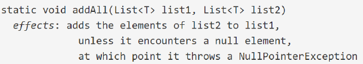
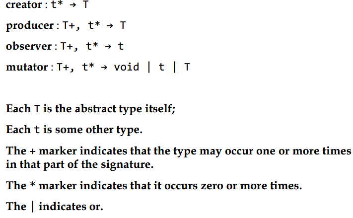
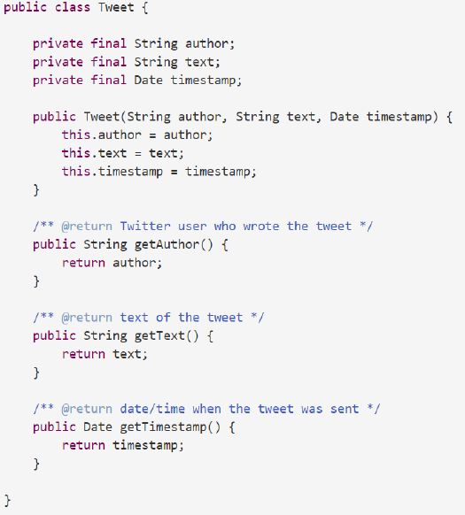
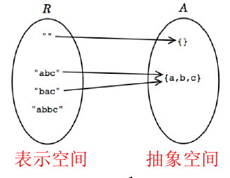
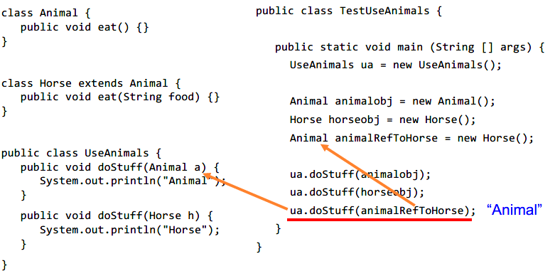

***3. 抽象数据类型和面向对象编程***

- 3-1节研究了“数据类型”及其特性
- 3-2节研究了方法和操作的“规约”及其特性
- 3-3节将数据和操作复合起来，构成 ADT，学习 ADT 的核心特征，以及如何设计“好的”ADT
- 3-4节学习 ADT 的具体实现技术：OOP


* [3\.1 数据类型和类型检查](#31-%E6%95%B0%E6%8D%AE%E7%B1%BB%E5%9E%8B%E5%92%8C%E7%B1%BB%E5%9E%8B%E6%A3%80%E6%9F%A5)
  * [1\. 数据类型](#1-%E6%95%B0%E6%8D%AE%E7%B1%BB%E5%9E%8B)
  * [2\. 静态和动态数据类型](#2-%E9%9D%99%E6%80%81%E5%92%8C%E5%8A%A8%E6%80%81%E6%95%B0%E6%8D%AE%E7%B1%BB%E5%9E%8B)
  * [3\. 类型检查](#3-%E7%B1%BB%E5%9E%8B%E6%A3%80%E6%9F%A5)
  * [4\. 可变性与不变性](#4-%E5%8F%AF%E5%8F%98%E6%80%A7%E4%B8%8E%E4%B8%8D%E5%8F%98%E6%80%A7)
    * [immutability 不变性](#immutability-%E4%B8%8D%E5%8F%98%E6%80%A7)
    * [可变性与不变性](#%E5%8F%AF%E5%8F%98%E6%80%A7%E4%B8%8E%E4%B8%8D%E5%8F%98%E6%80%A7)
    * [可变类型的优势](#%E5%8F%AF%E5%8F%98%E7%B1%BB%E5%9E%8B%E7%9A%84%E4%BC%98%E5%8A%BF)
    * [变化的风险](#%E5%8F%98%E5%8C%96%E7%9A%84%E9%A3%8E%E9%99%A9)
    * [防御式拷贝](#%E9%98%B2%E5%BE%A1%E5%BC%8F%E6%8B%B7%E8%B4%9D)
  * [5\. 快照图](#5-%E5%BF%AB%E7%85%A7%E5%9B%BE)
  * [6\. 复杂的数据类型: Arrays and Collections](#6-%E5%A4%8D%E6%9D%82%E7%9A%84%E6%95%B0%E6%8D%AE%E7%B1%BB%E5%9E%8B-arrays-and-collections)
  * [7\. 有用的不可变类型](#7-%E6%9C%89%E7%94%A8%E7%9A%84%E4%B8%8D%E5%8F%AF%E5%8F%98%E7%B1%BB%E5%9E%8B)
  * [8\. 空引用](#8-%E7%A9%BA%E5%BC%95%E7%94%A8)

# 3.1 数据类型和类型检查

## 1. 数据类型

变量：用特定数据类型定义，可存储满足类型约束的值

**java中的数据类型**

- 基本数据类型
- 对象数据类型


**对象类型形成层次结构**

- 根是 Object
- 继承关系
- 

**包装类**

- 将基本类型包装为对象类型
    - Boolean, Integer, Short, Long, Character, Float, Double
- 通常是在定义集合类型的时候使用它们
- 一般情况下，尽量避免使用
- 一般可以自动转换
- 包装类都是不可变数据类型

**重载 Overloading operators**

-同样的操作名可用于不同的数据类型

## 2. 静态和动态数据类型

- java是一种静态类型语言
    - 在编译阶段进行类型检查
- 动态类型语言：python
    - 在运行阶段进行类型检查

## 3. 类型检查

类型转换


- 静态类型检查——程序运行前
    - 可在编译阶段发现错误，避免了将错误带入到运行阶段，可提高程序正确性/健壮性。
    - 检查出来的错误类型包括
        - 语法错误
        - 类名/函数名错误
        - 参数数目错误
        - 参数类型错误
        - 返回值类型错误
    - 
- 动态类型检查——程序运行后
    - 检查出来的错误类型包括
        - 非法的参数值
        - 非法的返回值
        - 越界
        - 空指针
    - 
- 无检查

**静态检查：**关于“类型”的检查，不考虑值

**动态检查：**关于“值”的检查。

## 4. 可变性与不变性

- 改变一个变量：将该变量指向另一个值的存储空间
- 改变一个变量的值：将该变量当前指向的值的存储空间中写入一个新的止、
- 变化是罪恶的，但程序不能没有变化，但是要尽可能的避免变化，以避免副作用。

### immutability 不变性

- 重要的设计原则
- 不变数据类型：一旦被创建，其值不能改变
- 如果是引用类型，也可以是不变的，一旦确定其指向的对象，不能再被改变
    - 使用`final`来确保不变性
- 如果编译器无法确定`final`变量不会改变，就提示错误，这也是静态类型检查的一部分。
- 所以，尽量使用`final`变量作为方法的输入参数、作为局部变量
- `final`表明了程序员的一种设计决策

注：

1. `final`类无法派生子类
2. `final`变量无法改变值/引用
3. `final`方法无法被子类重写

### 可变性与不变性

**不变对象：**一旦被创建，始终指向同一个值/引用
**可变对象：**拥有方法可以修改自己的值/引用

举个栗子

- `String`是个不可变的
- 
- `StringBuilder`是可变的
- 

看起来都是一样，事实上，当只有一个引用指向该值，没有区别，**但是，有多个引用的时候，差异就出现了**


### 可变类型的优势

- 使用不可变类型，对其频繁修改会产生大量的临时拷贝（需要垃圾回收）
    - 第一个字符被拷贝了 n 次， 第二个被拷贝了 n-1 次，......
    - 事实上，花费了 O(n^2) 的时间去连接 n 个元素
- 可变类型最少化拷贝以提高效率
- 
- 使用可变数据类型，可以获得更好的性能
- 也适合在多个模块之间共享数据

### 变化的风险

- 不可变类型更**安全**，在其他质量指标上表现更好
- 折中，看你看重哪个质量指标

**有风险的例子1：传递可变的值**


改变了输入参数的值，导致 list 中都变成了正数。

### 防御式拷贝

通过防御式拷贝，给客户端返回一个全新的对象，但是大部分时候该拷贝不会被客户端修改，可能造成大量的内存浪费

如果使用不可变类型，则节省了频繁复制的代价

## 5. 快照图

- 用于描述程序运行时的内部状态
- 使用快照图可以
    - 便于程序员之间的交流
    - 便于刻画各类变量随时间变化
    - 便于解释设计思路

**基本类型的值 Primitive values**


**对象类型的值 Object values**


**不可变对象：双线椭圆**


**可变对象：单线椭圆**


**不可变的引用：双箭头**


- 引用是不可变的，但指向的值却可以是可变的
- 可变的引用，也可指向不可变的值

从练习中可以认识到

- final 修饰的变量，无法再次更改（分配，即再new一个）
    - 静态检查即可发现
    - 
- 可变与不可变对象的差异
    - 

## 6. 复杂的数据类型: Arrays and Collections

**List**

- List 是一个接口
- List 中的成员必须是一个对象
- 

**Set**


**Map**


我们不能创建一个基本数据类型的集合，Set<int> does not work，Set<Integer> numbers is ok。

基本的遍历方式


使用迭代器遍历


自己写的一个迭代器


从例子中可以学到
- 可变性会暗中破坏一个迭代器
- 正确的打开姿势
    - 

## 7. 有用的不可变类型

- 基本类型以及其封装对象类型都是不可变的
    - 计算大数字的时候，BigInteger 和 BigDecimal 也是不可变的
    - 不要使用`Date`，use the appropriate immutable type from `java.time` or `java.time.ZonedDateTime`based on the granularity of timekeeping you need.
    - 一般用到的集合的接口都是可变的
- 但是 java 提供了对集合的包装类
    - 
- 这种包装器得到的结果是不可变的：即只能看
    - 使一个 list 看起来像一个 list，但是，它的任何操作都会抛出异常，比如，`set(), add(), remove(), etc`
- 但是这种“不可变”是在运行阶段获得的，编译阶段无法据此进行静态检查
    - 但是当你运行时，比如你要对一个 list 进行 sort() ，此时就会抛出异常
    - 

这种无法改变的封装器主要有两个目的

- 确保一个集合自建立之初就是不可变的
- 使客户端对自己的数据结构是只读状态


## 8. 空引用

- 基础数据类型不能是`null`，并且编译器会使用静态检查报错，比如`int size = null; //illegal`
- 
- `null`和空串或者空数组不一样。
- 非基础数据类型的数组和像 list 一样的集合都是不`null`但是可以保存 `null`作为值。
- 
- 

# 3.2 设计规格说明

>- 方法的规约
>- 前置/后置条件
>- 欠定规约、非确定规约
>- 陈述式、操作式规约
>- 规约的强度及其比较
>- 如何写出好的规约

## 1. 编程的函数和方法

在静态类型检查阶段完成

- 参数类型是否匹配，
- 返回值类型是否匹配

**一个完整的方法**


## 2. specification（规格说明）

### 1）编程中的文档

java API 文档实例

**Hacking vs. Engineering**


### 2）方法的 specification 和 Contract

Spec 给供需双方都确定了责任，在调用的时候双方都要遵守


**规约的特点**

- 规约可以隔离“变“，无需通知客户端
- 规约也可以提高代码效率
- 规约：扮演防火墙的角色
    - 解耦，即不需要了解具体实现
    - 
- 客户和对象之间的协议
    - 输入/输出的数据类型
    - 功能和正确性
    - 性能
- 只讲”能做什么“，不讲”怎么实现“

### 3）行为等价性

**要站在客户端视角来看行为等价性**

- 根据规约来判断行为是否等价
    - 
    - 如果都满足，则等价
- specification 永远不应该讨论方法的`local variables`和方法所在类的`private field`，因为与实现无关。

### 4）Specification 结构：前置/后置条件

- 前置条件：`requires`
    - 对客户端的约束，在使用方法时必须满足的条件
- 后置条件：`effects`
    - 对开发者的约束，方法结束时必须满足的条件
- 契约
    - 如果前置条件满足了，后置条件必须满足
        - 
    - 前置条件不满足，则方法可做任何事情
        - 
        - 你违约在先，我自然不遵守承诺

**Specification in java**

- 静态类型声明是一种规约，可据此进行静态类型检查
- 方法前的注释也是一种规约，但需人工判定其是否满足
- 

**一个栗子**


- 除非在后置条件中声明过，否则方法内部不应该改变输入参数
- 应尽量遵循此规则，尽量不设计 mutating 的 Spec，否则就容易引发 bugs
- 程序员之间应该达成的默契：除非 Spec 必须如此，否则不应修改键入参数
- 可变的对象会使得非常简单的 Specification 变的非常复杂，因此应尽量避免使用 mutable 的对象
    - 程序中可能有很多变量指向同一个可变对象（别名）
    - 无法强迫类的实现体和客户端不保存可变变量的别名
    - 避免使用可变的全局变量，但是有时候为了性能，有时候不得不用，这对程序的安全性造成了很大破坏
    - 可变数据类型导致程序修改变得异常困难

**一个栗子**


这个看起来好像数组是新的，但是不能保证使用者不使用别名，更不能保证使用者改变这个数组或者在复用它


关键就在不可变，在规约里限定住。

### 5）测试 Spec

Javadoc

- 实际的方法
- 说明每一个变量，每一个返回值，每一个异常
- 不说明实现的细节


**黑盒测试**

## 3. 设计Spec

### 1）对 Spec 分类

对比 Spec——用于判断哪个规约更好

- 规约的确定性
- 规约的陈述性
- 规约强度

#### Stronger vs. weaker specs

- 规约的强度 S2 > S1 
    - S2 的前置条件更弱
    - S1 的后置条件更强
- 就可以用 S2 代替 S1
- Spec 变强：更放松的前置条件 + 更严格的后置条
件

**一个栗子**


when a specification is strengthened :


#### Deterministic vs. underdetermined specs

- 确定的规约（Deterministic）：给定一个满足 precondition 的输入，其输出是唯一的、明确的
- 欠定的规约（Under-deterministic）：同一个输入可以有多个输出
    - 欠定的规约通常也有确定的实现
- 非确定的规约（Nondeterministic）：同一个输入，多次执行时得到的输出可能不同

#### Declarative vs. operational specs

- 操作式规约：例如：伪代码
    - 程序员希望向使用者解释实现，但是不要这么做
    - 内部实现的细节不在规约里呈现，放在代码实现体内部注释里呈现
- 声明式规约：没有内部实现的描述，只有“初-终”状态
    - 更有价值

**一个栗子**


### 2）图形 Spec

- 每一个在这个空间的点表示一个方法实现
- 
- 一个 Spec 定义了一个空间中所有可能执行的区域
- 某个具体实现，若满足规约，则落在其范围内：否则，在其之外
- 程序员可以在规约的范围内自由选择实现方式
- 客户端无需了解具体使用了哪个实现
- 更强的规约，表达为更小的范围
    - 
    - 更强的后置条件意味着实现的自由度更低了-》在图中面积变小
    - 更弱的前置条件意味着实现时要处理更多的可能输入，实现的自由度低了-》面积更小


### 3）设计一个好的 Spec

1. 应该是内聚的（coherent）
    1. Spec 描述的功能应单一，简单，易理解。
2. 信息丰富
    1. 
    2. 不能让客户端产生理解的歧义
3. 足够强
    1. 
    2. 没有充分阐明遇到`null`之后参数是否变化
4. 足够弱
    1. 
    2. is a bad specification，这个文件是读还是写，是已经存在的还是需要创建的
5. 使用抽象类型
    1. 在规约中使用抽象类型，可以给方法的实现体与客户端更大的自由度
6. 前置还是后置？
    1. 是否应该使用前置条件？在方法正式执行之前，是否要检查前置条件已被满足？
    2. 对程序员来说，不写 Precondition，就要在代码内部check；若代价太大，在规约中加入 precondition，把责任交给 client
    3. 对使用者来说，客户端不喜欢太强的precondition，不满足precondition的输入会导致失败。
        1. 惯用做法是：不限定太强的precondition，二是在postcondition中抛出异常：输入不合法
        2. 尽可能在错误的根源处fail，避免其大规模扩散
        3. 衡量标准：检查参数合法性的代价多大？

**总结**

是否使用前置条件取决于

- check 的代价
- 方法的使用范围

注：

- 如果只在类的内部使用该方法(private)，那么可以不使用前置条件，在使用该方法的各个位置进行check——责任交给内部client；
- 如果在其他地方使用该方法(public)，那么必须要使用前置条件，若client端不满足则方法抛出异常


# 3.3 抽象数据类型

>- 抽象数据类型与表示独立性：如何设计良好的抽象数据结构，通过封装来避免客户端获取数据的内部表示（即“表示泄露”），避免潜在的bug——在client和implementer之间建立“防火墙”
>- ADT 的特性：不变量，表示泄露，抽象函数 AF，表示不变量 RI
>- 基于数学的形式对 ADT 这些核心特征进行描述并应用于设计中。

## 1. 抽象和用户定义类型

- 数据抽象：由一组操作所刻画的数据类型
- 传统的类型定义：关注数据的具体表示
- 抽象类型：强调“作用于数据上的操作”，程序员和客户端无需关心数据如何具体存储，只需设计/使用操作即可

## 2. 把类型和操作分类

**类型**

- 可变类型的对象：提供了可改变其内部数据的值的操作
- 不变数据类型：其操作不改变内部值，而是构建新的对象

**抽象类型的操作**

- Creators 构造器
    - 可能实现为构造函数或静态函数
    - 静态函数实现通常也称为工厂方法
- Producer 生产器
    - String 中的concat()方法
- Observers 观察器
    - List 中的 size()
- Mutators 变值器，改变对象属性的方法
    - List 中的 add()
    - 变值器通常返回void，即意味着必然改变了对象的某些内部状态
    - 也可能返回非空类型
- 
- 操作的说明
    - 
    - 

## 3. 抽象数据类型的例子


## 4. 设计一个抽象数据类型

设计好的ADT，靠“经验法则”，提供一组操作，设计其行为规约spec

- 设计简洁、一致的操作
- 要足以支持client对数据所做的所有操作需要，且用操作满足client需要的难度要低
- 要么抽象、要么具体，不要混合--- 要么针对抽象设计，要么针对具体应用的设计

## 5. 表示独立性

- 表示独立性：client 使用 ADT 时无需考虑其内部如何实现，ADT 内部表示的变化不应影响外部 spec 和客户端。
    - 
- 除非 ADT 的操作指明了具体的 pre 和 post-condition，否则不能改变 ADT 的内部表示，--spec规定了 client 和 implement 之间的契约
- 
- 


## 6. 测试一个抽象数据类型

- 测试 creators, producers, and mutators：调用observers来观察这些 operations的结果是否满足 spec；
- 测试 observers：调用 creators, producers, and mutators等方法产生或改变对象，来看结果是否正确。

**Partition the input spaces of ADT operations**


**Test suite that covers all partitions**

，

## 7. 不变量

- 一个好的抽象数据结构的最重要的性质就是**保持不变量**
- 不变量：在任何时候总是`true`
- 由 ADT 来负责其不变量，与客户端的任何行为无关
- 为什么需要不变量
    - 保持程序的“正确性”，并容易发现错误
    - `String`是不可变的，你可以使用`String`作为 ADT 的不变量
    - 如果没有这个不变性，那么在所有使用 String 的地方，都要检查其是否改变了

**举个栗子**


d
表示泄露

- 不仅影响不变性，也影响了表示独立性
- 无法在不影响客户端的情况下改变其内部表示
- 解决方法
    - private 和 final 的使用



**接下来这样呢？**


解决方法

- 防御式拷贝
- 
- 可变的数据类型通常有一个 copy  的构造器，可以允许你创建一个新的实例来复制
- 另一个方法是 clone ，但是有些类型不支持

**仍然是表示泄露的**


解决方法
- 依然是防御式拷贝，直接在构造器里作用
- 

**问题**

- 这样浪费了很多空间，当复制代价很高的时候，需要把这一部分的责任交给客户端，不得不这么做
- 
- 但是由此引发的潜在 bug 也会很多
- 除非迫不得已，否则不要把希望寄托于客户端上，ADT 有责任保证自己的 invariants ，并且避免表示泄露
- 最好的方法就是使用不可变的数据类型，彻底避免表示泄露
- 

**强调：保持不变性和避免表示泄漏，是ADT最
重要的一个Invariant！**

## 8. Rep Invariant and Abstraction Function



- R：表示空间
    - 一般情况下ADT的表示比较简单，有些时候需要复杂表示
- A：抽象值构成的空间：客户端看到和使用的值

ADT 实现者关注表示空间 R ,用户关注抽象空间 A


R 和 A 之间的映射关系

- 满射
- 未必单射
- 未必双射
- 

### Abstraction Function

- 抽象函数：R 和 A 之间映射关系的函数
    - AF ： R -》A

### Rep Invariant

- R 和 Boolean之间的映射关系
    - RI ：R -》 boolean
- 表示不变性 RI：某个具体的“表示”是否是“合法的”
    - 也可看作：所有表示值的一个子集，包含了所有合法的表示值
    - 也可看作：一个条件，描述了什么是“合法”的表示值

### RI 和 AF 文档


双射

### 什么决定了 AF 和 RI

- 抽象值的空间不能决定 AF 和 RI
- 不同的内部表示需要设计不同的 AF 和 RI
- 选择某种特定的表示方式R，进而指定某个子集是“合法”的(RI)，并为该子集中的每个值做出“解释”(AF)——即如何映射到抽象空间中的值。
- 
- 即使是同样的 R ,同样的 RI，也可能有不同的 AF ，即“解释不同”
    - 

### RI 和 AF 如何影响 ADT 的设计

- 设计 ADT
    1. 选择 R 和 A
    2. RI --- 合法的表示值
    3. 如何解释合法的表示值 ---映射 AF
- 做出具体的解释：每一个 rep value 如何映射到 abstract value
- 而且要把这种选择和解释明确的写到代码中

**例子**


- 随时检查 RI 是否满足
- 程序员之间的潜规则：数据都是非空（non-null）

## 9. 有益的可变性

我们应该知道一个抽象值是不应该变化的

- 对于不可变的 ADT 来说，它在 A 空间的 abstract value 应是不变的
- 但其内部表示的 R 空间中的取值则是可以变化的

## 10. AF，RI 和 Safety from Rep Exposure 的文档

在代码中以注释形式记录 AF 和 RI

**一个栗子**


```java
// Rep invariant:
//     author is a Twitter username (a nonempty string of letters , digits ,underscores)
//     text.length <= 140
// Abstraction Function:
//     represents a tweet posted by author , with content text, at time timstamp
// Safety from rep exposure:
//     all fields are private
//     author and text are Strings, so are guaranteed immutable;
//     timestamp is a mutable Data, so Tweet() constructor and getTimestamp()
//         make defensive copies to avoid sharing the rep's Data object with clients
```

**两个栗子**


**三个栗子**


### ADT 的 spec 都在说些什么

- ADT 的规约里只能使用 client 可见的内容来撰写，包括参数，返回值，异常。
- 如果规约里需要提及“值”，只能使用 A 空间中的“值”
- 
- ADT 的规约也不应谈及任何内部表示的细节，以及 R 空间中的任何值
- ADT 的内部表示（私有属性）对外部都应严格不可见
- 故在代码中以注释的形式写出AF和RI而不能在Javadoc文档中，防止被外部看到而破坏表示独立性/信息隐藏

### 如何建立不变量

- 去做一个不变量，我们需要
    - 在对象的初始状态不变量为`true`
    - 在对象发生变化时，不变量也要为`true`
- 将其转化为 ADT 操作的类型
    - 构造器和生产器在创建对象时要确保不变量为`true`
    - 变值器和观察器在执行时必须保持不变性
- 表示泄露的风险
    - 一旦泄露，ADT 内部表示可能会在程序的任何位置发生改变（而不是限制在 ADT 内部），从而无法确保 ADT 的不变量是否能够始终保持为`true`
    - 


## 11. ADT 不变量代替前置条件

设计良好的抽象数据类型的巨大优势在于它封装和执行了我们必须在前提条件下必须规定的属性。因此，可以用不变量取代方法的Precondition

**举个栗子**

```java
/** 
 * @param set1 is a sorted set of characters with no repeats
 * @param set2 is likewise
 * @return characters that appear in one set but not the other,
 *  in sorted order with no repeats 
 */
static String exclusiveOr(String set1, String set2);
```

改为
```java
/** @return characters that appear in one set but not the other */
static SortedSet<Character> exclusiveOr(SortedSet<Character>  set1, SortedSet<Character> set2);
```

- 因为所需条件（不重复排序）可以在一个地方，SortedSet类型中强制执行，并且由于Java静态检查起作用，阻止不满足此条件的值根本无法使用，在编译时出错。
- 它更容易理解，因为它更简单，并且名称SortedSet传达了程序员需要知道的内容。
- 它更容易进行更改，因为SortedSet现在可以更改表示量而不更改exclusiveOr任何客户端。

# 3.4 面向对象编程（OOP）

## 1. 面向对象的条件

面向对象的编程方法/语言应该以类的概念作为中心概念。同时还有如下标准：

- 静态类型（static typing）：一个定义良好的类型系统应该通过强制执行一些类型声明和兼容性规则来保证它接受的系统的运行时的类型安全
- 泛型（Genericity）**For “ready for change”and “design for/with reuse”**：应该可以编写具有代表任意类型的正式泛型参数的类。
- 继承（Inheritance）：应该尽可能的定义可以从其他类继承的类，以控制潜在的复杂性
- 多态（Polymorphism）：在基于继承的类型系统的控制下，应该可以将实体（表示运行时对象的在软件文本中的名称）附加到各种可能类型的运行时对象
- 动态分派/绑定（Dynamic dispatch/binding）：在一个实体上调用一个特性应该总是触发与所连接的运行时对象的类型相对应的特性，这在调用的不同执行过程中不一定是相同的。

## 2. 基本概念

- 一个与类相关的变量，而不是类的一个实例，称为类成员变量，相似的，若一个 method 与类相关，称为类方法。
- 不是类方法或类变量的方法和变量被称为实例方法和实例成员变量。
- 类变量和类方法与类相关联，并且每个类都会出现一次，使用它们不需要创建对象。
- 实例方法和变量会在每个类的实例中出现一次

**一个栗子**


**区别**


## 3. 接口

- Interface 和 Class：定义和实现 ADT
- 接口之间可以继承
- 一个类可以实现多个接口
- 一个接口也可以有多种实现

**一个栗子**

接口


实现1


实现2


**但随之而来的问题是：打破了抽象边界**

- 因为 Java 中的接口不能包含构造函数，所以它们必须直接调用其中一个具体类的构造函数，该构造函数的规范不会出现在接口的任何地方，所以，没有任何静态保证，即不同的实现甚至会提供相同的构造函数
- 接口定义中没有包含 constructor，也无法保证所有实现类中都包含了同样的名字 constructor，故而，客户端需要知道该接口的某个具体实现类的名字

**解决方法：使用静态工厂**


- Safe from bugs
- Easy to understand
- Ready for change

## 4. 封装和信息隐藏

设计良好的代码隐藏了所有的实现细节

- 干净的将 API 与实施分开
- 模块只能通过 API 进行通信
- 对彼此的内在运作不了解

这就是被称为信息隐藏或封装，是软件设计的基本原则


信息隐藏接口

- 使用接口类型声明变量
- 客户端仅使用接口中定义的方法
- 客户端代码无法直接访问属性

成员可见的修饰符

- `private`：只能从声明类内访问
- `protected`：可以从声明类的子类（以及包内）
- `public`：从任何地方访问

## 5. 继承和重写

### 1）Overriding 重写

可重写方法：允许重新实现的方法

严格继承：

- 子类只能添加新方法，无法重写超类中的方法
- 如果一个方法不能被重写，一定被`final`所修饰

注：


- 重写的函数：完全同样的 signature
- 实际执行时调用哪个方法，运行时决定
- 父类的对象调用该方法，执行父类中的版本，子类的对象调用，执行子类中的版本
    - 
    - 

当子类包含一个覆盖超类的方法时，它也可以使用关键字`super`调用超类方法


重写方法的时候，不要改变原方法的本意

### 2）抽象类


## 6. 多态性，子类型和重载

### 1）多态的三种类型

- 特殊多态：功能重载
- 参数化多态：泛型或泛型编程
- 子类型多态，包含多态：当一个名称表示许多不同的类与一些常见的超类相关的实例

### 2）特殊多态和重载

```java
public class OverloadExample {
    public static void main(String args[]) {
        System.out.println(add("C","D"));
        System.out.println(add("C","D","E"));
        System.out.println(add(2,3));
    }
    public static String add(String c, String d) {
        return c.concat(d);
    }
    public static String add(String c, String d, String e){
        return c.concat(d).concat(e);
    }
    public static int add(int a, int b) {
        return a+b;
    }
}
```

### 3）重载

- 重载：多个方法具有相同的名字，但有不同的参数列表或者返回值类型
- 价值：方便 client 调用，client 可用不同的参数列表，调用同样的函数
- 例如：`doTask()` 和 `doTask(Object O)` 就是重载函数。 
- 重载是静态多态，根据参数列表进行最佳匹配。在编译阶段时决定要具体执行哪个方法 (static type checking) ，与之相反，overridden methods则是在run-time进行dynamic checking！

**一个合法栗子**


重载的方法调用版本时基于对象类型在运行时决定的，但是重载的方法调用版本是基于在编译时传递的参数的引用类型

**一个正确的栗子**



**额外的小栗子**


传参数时要看“=”左边的类型，以其为主体调用函数时，看“=”右边的类型

**重写（override）和重载（overload）**


### 4）参数多态性和泛型编程

**两个小栗子**

```java
//example1 
public class PapersJar<T> {
    private List<T> itemList = new ArrayList<>();
    public void add(T item) {
        itemList.add(item);
    }
    public T get(int index) {
        return (T) itemList.get(index);
    }
    public static void main(String args[]) {
        PapersJar<String> papersStr = new PapersJar<>();
        papersStr.add("Lion");
        String str = (String) papersStr.get(0);
        System.out.println(str);
        
        PapersJar papersInt = new PapersJar();
        papersInt.add(new Integer(100));
        Integer integerObj = (Integer) papersInt.get(0);
        System.out.println(integerObj);
    }
}
//example2
public class Pair<E> {
    private final E first, second;
    public Pair(E first, E second) {
        this.first = first;
        this.second = second;
    }
    public E first() { return first; }
    public E second() { return second; }
    }
Client:
Pair<String> p = new Pair<>("Hello", "world");
String result = p.first();
```

**另一个大栗子：Java Set**

Creator


Observer


Mutator


**泛型接口**


**Some details**


### 5) 子类型多态


- 在 Java 中：每一个类只直接的继承于一个父类，而一个类可以实现很多接口
- 继承的好处：代码的复用，模块的灵活性

**子类型**

- 子类型的规约不能弱化超类型的规约
- 子类型多态：不同类型的对象可以统一的处理而无需区分，从而隔离了变化

**instanceof**


## 7. 动态分派（Dynamic dispatch）

- 绑定：将调用的名字和实际的方法名字联系起来（可能很多个）
- 分派：具体执行哪个方法（early binding -》static dispatch）
- 静态绑定：编译阶段即可确定要执行哪个具体操作
- 动态绑定：也称为推迟绑定，编译阶段可能绑定到多态操作，运行阶段决定具体执行哪个（override 和 overload 均是如此）
    - 推迟绑定：编译阶段不知道类型，一定是动态分派（override 是推迟绑定，overload 是 early binding）

**一个栗子**


## 8. java 中一些重要的方法


## 9. 设计好的类

- 简单
- 本质上是线程安全的
- 可以自由分享
- 不需要防御式拷贝
- 优秀的 building blocks

**如何编写一个不可变的类**

- 不要提供任何 mutators
- 确保没有方法可能被覆盖
- 使所有的 fields 有 `final`和`private`修饰
- 确保任何可变组件的安全性（避免表示泄露）
- 实现`toString(), hashCode(), clone(), equals()`

**一个栗子**


# 3.5 ADT 和 OOP的质量

> 站在观察者角度，利用 AF， 定义对象之间的等价关系
> 引用等价性和对象等价性
> 可变数据类型的观察等价性和行为等价性
> 理解 Object 的契约，正确实现等价关系判定

## 1. 什么是等价性和为什么需要等价性

- ADT 是对数据的抽象，体现为一组对数据的操作
- 抽象函数 AF：内部表示 -》抽象显示
- 基于抽象函数 AF 定义 ADT 的等价操作

现实生活中的每个对象实体都是独特的，所以无法完全相等，但有相似性，而在数学中，“绝对相等”是存在的

## 2. 三种判断等价性的方法

- 利用抽象函数
    - AF 映射到同样的结果，则等价，即 a equals b if and only if f(a) = f(b)
- 利用关系
    - 一个等价关系是 E ⊆ T x T
        - 自反：E(t,t) ∀t∈T
        - 对称：E(t,u) ⇒ E(u,t)
        - 传递：E(t,u) ∧ E(u,v) ⇒ E(t,v)
- 站在外部观察者角度
    - 我们可以说，当两个对象无法通过观察进行区分时，这两个对象是相同的，如果我们可以应用的每一个操作对两个对象都产生相同的结果，考虑集合表达式{1，2}，{2，1}
    - {1,2}| = 2 and |{2,1}| = 2
    - 1 ∈ {1,2} is true, and 1 ∈ {2,1} is true
    - 2 ∈ {1,2}is true, and 2 ∈ {2,1} is true
    - 3 ∈ {1,2} is false, and 3 ∈ {2,1} is false

## 3. == vs. equals()

`==`是引用等价性，而`equals`是对象等价性

在自定义 ADT 时，需要重写`object`的`equals`

- 对于基本数据类型，使用`==`判定相等
- 对于对象类型，使用`equals()`，如果用`==`，是在判断两个对象身份标识 ID 是否相等

## 4. 不可变类型的等价性

首先来看 `object`中实现的缺省`equals()`

```java
public class Object{

    public boolean equals (Object that){
        return this == that;
    }
}
```

在`Object`中实现的缺省`equals()`是在判断引用等价性，这通常不是程序员所期望的，因此需要重写

**一个栗子**


测试代码


**怎么肥四？**，o2 和 d2 最终参照相同的对象在内存中，为什么得到的结果还不一样

事实证明，该方法 overload 了`equals`，因为方法签名与 Objects 不相同，我们实际上有两种 `equals`方法

- 隐氏`equals(Object)`继承`Object`
- 新的`equals(Duration)`

相当于是


在方法签名中犯一个错误很容易，并且当您打算覆盖它时重载一个方法。这是一个常见的错误，Java具有语言特性，注释@Override，只要您的意图是重写超类中的方法，就应该使用它。通过这个注释，Java编译器将检查超类中是否存在具有相同签名的方法，如果签名中出现错误，则会给出编译器错误。

因此，正确的应该是


- `instanceof`操作测试了是否是对应的类
- 使用`instanceof`是动态类型检查，而不是静态类型检查
- 使用`instanceof`是不好的行为，也包括那些检查对象运行时类型的方法，比如，`getClass()`

## 5. 对象合约

当重写该`equals`方法时，必须遵守总体合约

- 必须定义一个等价关系：即一个自反，对称和传递的关系
- 必须保持一致：对方法的重复调用必须产生相同的结果，前提是`equals`未修改用于比较对象的信息
- 对于非空引用`x`，`x.equals(null)`应该返回`false`
- `hashcode`必须为两个被`equals`方法视为相等的对象产生相同的结果


## 6. 可变类型的等价性

- 观察等价性：在不改变状态的情况下，即通过只调用observer，producer和creator的方法，两个mutable对象是否看起来一致 。
- 行为等价性：调用对象的任何方法都展示出一致的结果
- 对不可变类型来说，观察等价性和行为等价性都是一样的，因为它们都不是变值器方法

对可变类型来说，往往倾向于实现严格的观察等价性

- java 对多数可变类型使用多数观察等价性，比如`Collections`，但是也有其他的类使用行为等价性
- 但在有些时候，观察等价性可能导致bug，甚至可能破坏RI

**一个栗子**


这是怎么回事？`List<String>`是一个可变对象。在标准的Java实现集合类例如`List`，突变影响`equals()`和`hashCode()`的结果。当`list`首次放入`HashSet`，它存储在其散列桶的结果对应`hashCode()`。当`list`随后发生突变，它的`hashCode()`变化，但`HashSet`并没有意识到它应该被移动到不同的桶。所以它再也找不到了。

由于`equals()`和`hashCode()`可能被突变影响时，我们可以打破使用该对象作为关键字的散列表的不变量。

比如在可变的对象在set中使用时小心

- 如果某个可变的对象包含在集合类中，当其发生改变后，集合类的行为不确定，务必小心
- 在 JDK 中，不同的可变类使用不同的等价性标准

我们可以从这个栗子中学到

- 对可变类型，实现行为等价性即可
- 也就是说，只有指向同样内存空间的 `objects`，才是相等的
- 所以对可变类型来说，无需重写这两个函数，直接继承`object`对象的两个方法即可
- 如果一定要判断两个可变对象看起来是否一致 ，最好定义一个新的方法

**equals() 和 hashCode() 的最终规则**

- 对于不可变类型
    - `equals`应该比较抽象值，这与说`equals`应该提供行为等价性是一样的
    - `hashcode`应该将抽象值映射为一个整数
- 对于可变类型
    - `equals`应该比较引用，就像`==`。这与说`equals`应该提供行为等价性是一样的
    - `hashcode`应该将引用映射为一个整数

## 7. 自动装箱和等价性


```java
x == y // return false

(int)x == (int)y // returns true
```


