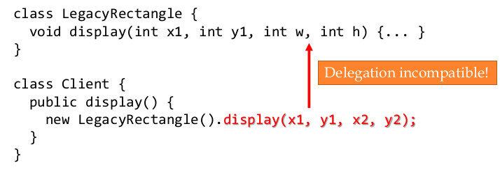

***5.面向复用性编程***

- 5.1学习了可复用的层次、形态、表现
- 5.2从类、API、框架三个层面学习如何设计可复用软件实现的具体技术
- 5.3主要是讲解几个设计模式

* [5\.1 可复用软件的形态与特征](#51-%E5%8F%AF%E5%A4%8D%E7%94%A8%E8%BD%AF%E4%BB%B6%E7%9A%84%E5%BD%A2%E6%80%81%E4%B8%8E%E7%89%B9%E5%BE%81)
  * [可复用软件](#%E5%8F%AF%E5%A4%8D%E7%94%A8%E8%BD%AF%E4%BB%B6)
  * [如何去度量可服用性](#%E5%A6%82%E4%BD%95%E5%8E%BB%E5%BA%A6%E9%87%8F%E5%8F%AF%E6%9C%8D%E7%94%A8%E6%80%A7)
  * [可复用组件的水平和度量](#%E5%8F%AF%E5%A4%8D%E7%94%A8%E7%BB%84%E4%BB%B6%E7%9A%84%E6%B0%B4%E5%B9%B3%E5%92%8C%E5%BA%A6%E9%87%8F)
  * [系统级别的复用：框架](#%E7%B3%BB%E7%BB%9F%E7%BA%A7%E5%88%AB%E7%9A%84%E5%A4%8D%E7%94%A8%E6%A1%86%E6%9E%B6)
  * [对可复用性的外部观察](#%E5%AF%B9%E5%8F%AF%E5%A4%8D%E7%94%A8%E6%80%A7%E7%9A%84%E5%A4%96%E9%83%A8%E8%A7%82%E5%AF%9F)
* [5\.2 面向复用性的构造](#52-%E9%9D%A2%E5%90%91%E5%A4%8D%E7%94%A8%E6%80%A7%E7%9A%84%E6%9E%84%E9%80%A0)
  * [1\. 设计可复用的类](#1-%E8%AE%BE%E8%AE%A1%E5%8F%AF%E5%A4%8D%E7%94%A8%E7%9A%84%E7%B1%BB)
    * [1）行为子类型与 Liskov 替换原则](#1%E8%A1%8C%E4%B8%BA%E5%AD%90%E7%B1%BB%E5%9E%8B%E4%B8%8E-liskov-%E6%9B%BF%E6%8D%A2%E5%8E%9F%E5%88%99)
  * [2\. 设计可复用库和框架](#2-%E8%AE%BE%E8%AE%A1%E5%8F%AF%E5%A4%8D%E7%94%A8%E5%BA%93%E5%92%8C%E6%A1%86%E6%9E%B6)
* [5\.3 面向复用的设计模式](#53-%E9%9D%A2%E5%90%91%E5%A4%8D%E7%94%A8%E7%9A%84%E8%AE%BE%E8%AE%A1%E6%A8%A1%E5%BC%8F)
  * [1\. 创建者模式](#1-%E5%88%9B%E5%BB%BA%E8%80%85%E6%A8%A1%E5%BC%8F)
    * [1\. 适配器模式](#1-%E9%80%82%E9%85%8D%E5%99%A8%E6%A8%A1%E5%BC%8F)
    * [2\. 装饰器模式](#2-%E8%A3%85%E9%A5%B0%E5%99%A8%E6%A8%A1%E5%BC%8F)
    * [3\. 外观模式](#3-%E5%A4%96%E8%A7%82%E6%A8%A1%E5%BC%8F)
  * [2\. 行为类模式](#2-%E8%A1%8C%E4%B8%BA%E7%B1%BB%E6%A8%A1%E5%BC%8F)
    * [1\. 策略模式](#1-%E7%AD%96%E7%95%A5%E6%A8%A1%E5%BC%8F)
    * [2\. 模板模式](#2-%E6%A8%A1%E6%9D%BF%E6%A8%A1%E5%BC%8F)
    * [3\. 迭代器模式](#3-%E8%BF%AD%E4%BB%A3%E5%99%A8%E6%A8%A1%E5%BC%8F)


# 5.1 可复用软件的形态与特征

## 可复用软件

- 开发成本高于一般软件的成本：要有足够高的适应性
- 性能差一些：针对更普适的场景，缺少足够的针对性

## 如何去度量可服用性

- 复用的机会的频率
- 复用的代价的多少


## 可复用组件的水平和度量

主要是代码，但是软件构造的过程中任何实体都可以被复用

- 需求
- 设计/规约spec
- 数据
- 测试用例
- 文档

我们关心的

- 源码
    - 方法，statement
- 模块
    - 类和接口
- 类库
    - API
- 架构
    - framework 框架

代码复用的种类

- 白盒复用：源代码可见，可修改和扩展
    - 复制已有代码当正在开发的系统，进行修改
    - 可定制化程度高
    - 对其修改增加了软件的复杂度，且需要对其内部充分的了解
- 黑盒复用：源代码不可见，不能修改
    - 只能通过 API 接口来使用，无法修改代码
    - 简单，清晰
    - 适应性差


## 系统级别的复用：框架

- 一组具体类，抽象类，及其之间的连接关系
- 开发者根据 framework 的规约，填充自己的代码进去，形成完整体系
- 
- 

**领域复用**

开发者：增加新代码，对抽象类进行具体化

- 通常通过选择性覆盖来扩展框架; 或者程序员可以添加专门的用户代码来提供特定的功能—定义继承了抽象类祖先操作的具体类
- Hook 方法，它被应用程序覆盖以扩展框架。Hook方法系统地将应用程序域的接口和行为与应用程序在特定上下文中所需的变体解耦
- 控制反转，由第三方的容器来控制对象之间的依赖关系，而非传统实现中由代码直接操控。
    - 
    - 控制权由代码中转到了外部容器，带来的好处就是降低了对象之间的依赖程度，提高灵活性和可维护性
- 不可修改的框架代码，在接受用户实现的扩展时，框架代码不应该被修改。 换句话说，用户可以扩展框架，但不应修改其代码。

**框架可以被实现它们的技术分为**

- 白盒框架
    - 通过继承和动态绑定实现可扩展性
    - 通过继承框架几类和重写预定义的 Hook 方法来扩展框架现有功能
    - 通常使用模板方法模式等设计模式来重写 Hook 方法
- 黑盒框架
    - 通过为可插入框架的组件定义接口来实现可扩展性。
    - 通过定义符合特定接口的组件来复用现有功能。
    - 这些组件通过委派（Delegation）与框架集成。

## 对可复用性的外部观察

- 类型可变
    - 类型可变（泛型）：适应不同的类型，且满足 LSP
- 实现可变
    - ADT 有多种不同的实现，提供不同的 representations 和 abstract function ，但具有同样的 specification （pre-condition，post-condition，invariants），从而可以适用不同的应用场景
- 功能分组
    - 提供完备的细粒度操作，保证功能的完整性，不同场景下复用不同的操作（及其组合）
- 表示独立
    - 内部实现可能会经常变化，但客户端不应收到影响
    - 需要实现表示独立性，信息隐藏
    - 反应了用户对可复用性的视角，即忽略内部实现的细节和变量的能力
- 共性抽取
    - 将共同的行为（共性）抽象出来，形成可复用实体

# 5.2 面向复用性的构造

## 1. 设计可复用的类

### 1）行为子类型与 Liskov 替换原则

子类型多态：客户端可用统一的方式处理不同类型的对象

Java 中编译器执行的规则（静态类型检查）：

- 子类型可以增加方法，但不可删
- 子类型需要实现抽象类型中所有未实现的方法
- 子类型中重写的方法必须使用同样类型的参数
- 子类型中重写的方法不能抛出额外的异常

LSP 也适用于指定的行为

- 更强的不变量
- 更弱的前置条件
- 更强的后置条件


组合（Composition）和聚合（Aggregation）

- 在组合中，当拥有的对象被破坏时，被包含的对象也被破坏
- 在聚合中，这不一定是真的
- 举个栗子
    - 大学有很多个部门，每个部门都有一批教授
    - 如果大学关闭，则部门将不复存在
    - 但是每个部门的教授将继续存在
    - 一个教授可以在一个以上的部门工作
    - 但一个部门不能成为多个大学的一部分
    - 大学与部门之间的关系即是组合
    - 部门和教授的关系即是聚合


上面的是聚合，下面的是组合

## 2. 设计可复用库和框架

- 库
    - 
- 框架
    - 
- 它们被称为是系统层面的复用，是因为它们不仅定义了1个可复用的接口/类，而是将某个完整系统中的所有可复用的接口/类都实现出来
- 并且定义了这些类之间的交互关系、调用关系，从而形成了系统整体的架构

类的设计：尽量减少可变性，遵循 LSP 原则

方法的设计：不要让客户做任何模块可以做的事情，及时报错

框架设计

- 白盒
    - 通过子类化和重写方法进行扩展（使用继承）
    - 通用设计模式：模板方法
    - 子类具有主要方法但对框架进行控制
    - 
- 黑盒
    - 通过实现插件接口进行扩展（使用组合/委派）
    - 常用设计模式：策略模式，观察者模式
    - 插件加载机制加载插件并对框架进行控制
    - 
    - 

# 5.3 面向复用的设计模式

内容参考[设计模式](https://www.jianshu.com/p/1b027d9fc005)

除了类本身，设计模式更强调多个类/对象之间的关系和交互过程---比接口/类复用的粒度更大

设计模式分类：

- 创建者模式
- 结构者模式
- 行为类模式

## 1. 创建者模式

### 1. 适配器模式


如果不使用适配器模式，会出现如下问题：




### 2. 装饰器模式

装饰器 vs. 继承

- 装饰器在运行时组成特征；继承在编译时组成特征。
- 装饰器由多个协作对象组成；继承产生一个明确类型的对象。
- 可以混合和匹配多个装饰；多重继承在概念上是困难的

### 3. 外观模式

外观模式是为了解决客户端需要通过一个简化的接口来访问复杂系统内的功能这一问题提出的。

记住爷爷开电器那个栗子

## 2. 行为类模式

### 1. 策略模式

百货商场根据不同节日选不同策略

步骤1： 定义抽象策略角色（Strategy）：百货公司所有促销活动的共同接口

```java
public abstract class Strategy {  

    public abstract void Show()；
}
```

步骤2：定义具体策略角色（Concrete Strategy）：每个节日具体的促销活动

```java
class StrategyA extends Strategy{

    @Override
    public void show() {
        System.out.println("为春节准备的促销活动A");
    }
}


class StrategyB extends Strategy{

    @Override
    public void show() {
        System.out.println("为中秋节准备的促销活动B");
    }
}


class StrategyC extends Strategy{

    @Override
    public void show() {
        System.out.println("为圣诞节准备的促销活动C");
    }
}
```

步骤3：定义环境角色（Context）：用于连接上下文，即把促销活动推销给客户，这里可以理解为销售员

```java
class Context_SalesMan{

    private Strategy strategy;

    
    
    public SalesMan(String festival) {
        switch ( festival) {
            
            case "A":
                strategy = new StrategyA();
                break;
            
            case "B":
                strategy = new StrategyB();
                break;
            
            case "C":
                strategy = new StrategyC();
                break;
        }

    }

    
    public void SalesManShow(){
        strategy.show();
    }

}
```

步骤4：客户端调用-让销售员进行促销活动的落地

```java
public class StrategyPattern{
  public static void main(String[] args){

        Context_SalesMan mSalesMan ;

        
        System.out.println("对于春节：");
        mSalesMan =  Context_SalesMan SalesMan("A");
        mSalesMan.SalesManShow();
        
        
        
        System.out.println("对于中秋节：");
        mSalesMan =  Context_SalesMan SalesMan("B");
        mSalesMan.SalesManShow();

        
        System.out.println("对于圣诞节：");
        mSalesMan =  Context_SalesMan SalesMan("C");
        mSalesMan.SalesManShow();  
  }   
}
```

结果输出

对于春节：为春节准备的促销活动A

对于中秋节：为中秋节准备的促销活动B

对于圣诞节：为圣诞节准备的促销活动B

### 2. 模板模式

背景：小成希望学炒菜：手撕包菜 & 蒜蓉炒菜心

冲突：两道菜的炒菜步骤有的重复有的却差异很大，记不住

解决方案：利用代码记录下来

步骤1： 创建抽象模板结构（Abstract Class）：炒菜的步骤

```java
public  abstract class Abstract Class {  
//模板方法，用来控制炒菜的流程 （炒菜的流程是一样的-复用）
//申明为final，不希望子类覆盖这个方法，防止更改流程的执行顺序 
        final void cookProcess(){  
        //第一步：倒油
        this.pourOil()；
        //第二步：热油
         this.HeatOil();
        //第三步：倒蔬菜
         this.pourVegetable();
        //第四步：倒调味料
         this.pourSauce（）；
        //第五步：翻炒
         this.fry();
    }  

//定义结构里哪些方法是所有过程都是一样的可复用的，哪些是需要子类进行实现的

//第一步：倒油是一样的，所以直接实现
void pourOil(){  
        System.out.println("倒油");  
    }  

//第二步：热油是一样的，所以直接实现
    void  HeatOil(){  
        System.out.println("热油");  
    }  

//第三步：倒蔬菜是不一样的（一个下包菜，一个是下菜心）
//所以声明为抽象方法，具体由子类实现 
    abstract void  pourVegetable()；

//第四步：倒调味料是不一样的（一个下辣椒，一个是下蒜蓉）
//所以声明为抽象方法，具体由子类实现 
    abstract void  pourSauce（）；


//第五步：翻炒是一样的，所以直接实现
    void fry();{  
        System.out.println("炒啊炒啊炒到熟啊");  
    }  
}
```

步骤2： 创建具体模板（Concrete Class）,即”手撕包菜“和”蒜蓉炒菜心“的具体步骤

```java
//炒手撕包菜的类
  public class ConcreteClass_BaoCai extend  Abstract Class{
    @Override
    public void  pourVegetable(){  
        System.out.println(”下锅的蔬菜是包菜“);  
    }  
    @Override
    public void  pourSauce（）{  
        System.out.println(”下锅的酱料是辣椒“);  
    }  
}
//炒蒜蓉菜心的类
  public class ConcreteClass_CaiXin extend  Abstract Class{
    @Override
    public void  pourVegetable(){  
        System.out.println(”下锅的蔬菜是菜心“);  
    }  
    @Override
    public void  pourSauce（）{  
        System.out.println(”下锅的酱料是蒜蓉“);  
    }  
}
```

**步骤3： **客户端调用-炒菜了

```
public class Template Method{
  public static void main(String[] args){

//炒 - 手撕包菜
    ConcreteClass_BaoCai BaoCai = new ConcreteClass_BaoCai（）；
    BaoCai.cookProcess()；

//炒 - 蒜蓉菜心
  ConcreteClass_ CaiXin = new ConcreteClass_CaiXin（）；
    CaiXin.cookProcess()；
    }
        
}
```

结果输出

倒油

热油

下锅的蔬菜是包菜

下锅的酱料是辣椒

炒啊炒啊炒到熟

倒油

热油

下锅的蔬菜是菜心

下锅的酱料是蒜蓉

炒啊炒啊炒到熟

### 3. 迭代器模式

问题：客户需要统一的策略来访问容器中的所有元素，与容器类型无关

解决方案：迭代器策略模式


Iterable接口：实现该接口的集合对象是可迭代遍历的

```java
public interface Iterable<T> { 
    ... 
    Iterator<T> iterator(); 
} 
```

Iterator接口：迭代器

```
public interface Iterator<E> { 
    boolean hasNext(); 
    E next(); 
    void remove(); 
}
```


