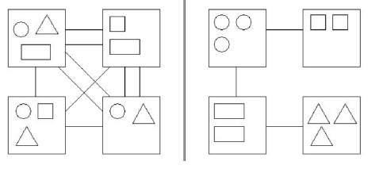
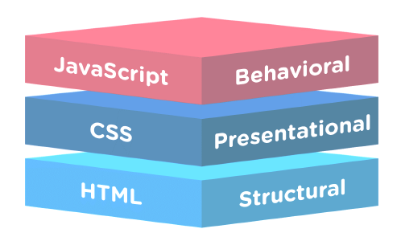
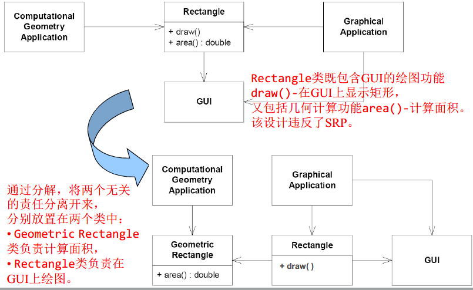
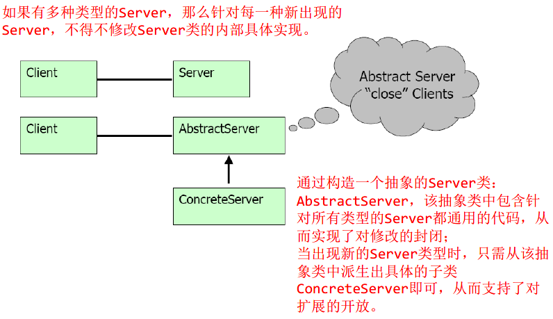
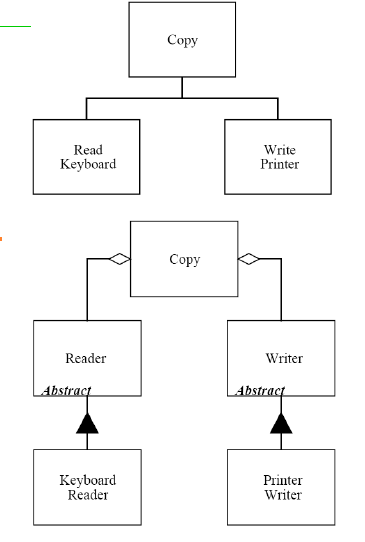
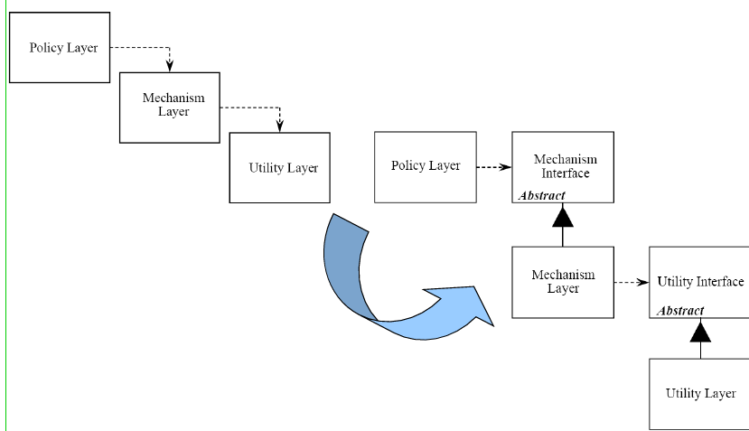
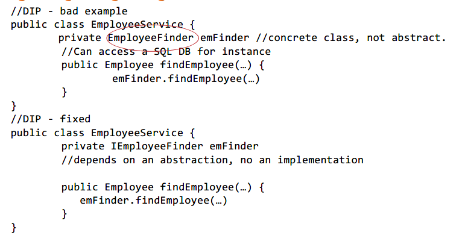
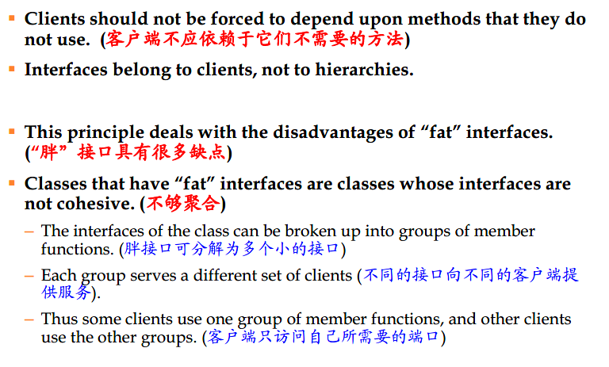
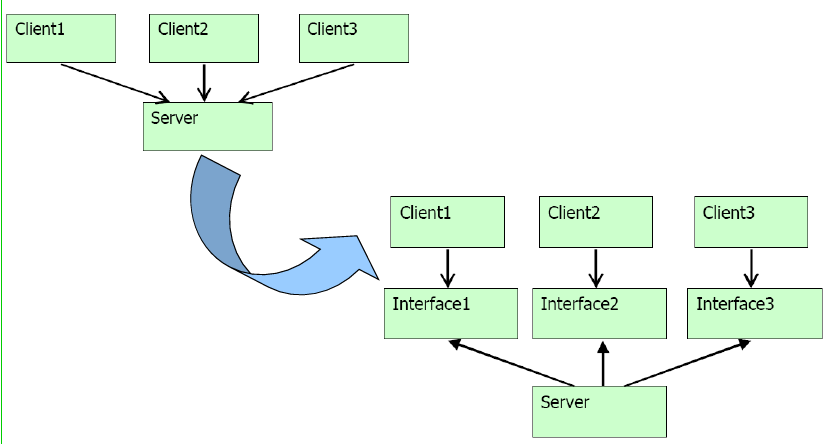
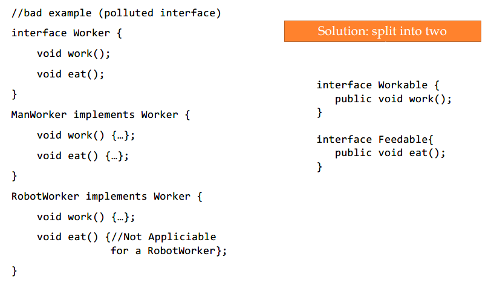

***6.面向可维护性编程***

- 6.1节
    - （1）什么是软件维护；
    - （2）可维护性如何度量；
    - （3）实现高可维护性的设计原则——很抽象
- 6.3 从委派和子类型跳出来，学习
    - 基于状态的构造技术
    - 表驱动的构造技术
    - 基于语法的构造技术

# 6.1 可维护性的度量和构造原则

## 可维护性的度量

可维护性：可轻松修改软件系统或组件，以纠正故障，提高性能或其他属性，或适应变化的环境。

除此之外，可维护性还有其他许多别名：可扩展性、灵活性、可适应性、可管理性、支持性。总之，有好的可维护性就意味着容易改变，容易扩展。

一些常用的可维护性度量标准：

- 圈复杂度（CyclomaticComplexity）：度量代码的结构复杂度。
- 代码行数（Lines of Code）：指示代码中的大致行数。
- Halstead Volume：基于源代码中（不同）运算符和操作数的数量的合成度量。
- 可维护性指数（MI）：计算介于0和100之间的索引值，表示维护代码的相对容易性。 高价值意味着更好的可维护性。
- 继承的层次数：表示扩展到类层次结构的根的类定义的数量。 等级越深，就越难理解特定方法和字段在何处被定义或重新定义。
- 类之间的耦合度：通过参数，局部变量，返回类型，方法调用，泛型或模板实例化，基类，接口实现，在外部类型上定义的字段和属性修饰来测量耦合到唯一类。
- 单元测试覆盖率：指示代码库的哪些部分被自动化单元测试覆盖。

## 模块化设计和模块化原则

模块化编程是一种设计技术，它强调将程序的功能分解为独立的可互换模块，以便每个模块都包含执行所需功能的一个方面。

设计的目标是将系统划分为模块并在组件之间分配责任，方式如下：

- 模块内高内聚
- 模块间低耦合

模块化降低了程序员在任何时候都必须处理的总体复杂性，因为模块化实现了

- 分离关注点
- 信息隐藏。

内聚和耦合的原则可能是评估设计可维护性的最重要的设计原则。

### 评估模块化的五个标准

- 可分解性
- 可组合性
- 可理解性
- 可持续性
- 出现异常之后的保护
### 模块化设计的五项原则

- Direct Mapping (直接映射)
- Few Interfaces (尽可能少的接口)
- Small Interfaces (尽可能小的接口）
- Explicit Interfaces (显式接口)
- Information Hiding (信息隐藏)

### Coupling and Cohesion（耦合和聚合）

耦合是模块之间依赖关系的度量。 如果两个模块之间的变化可能需要另一个模块的变更，则两个模块之间存在依赖关系。

模块之间的耦合程度取决于：

- 模块之间的接口数量（数量）
- 每个接口的复杂性（由通信类型决定）（质量）



精心设计的Web应用程序模块化：

- 指定数据和语义的HTML文件
- 指定HTML数据外观和格式的CSS规则
- 定义页面行为/交互性的JavaScript



聚合是衡量一个模块的功能或责任有多强烈程度的一个指标。如果一个模块的所有元素都朝着相同的目标努力，则它具有很高的聚合度。

最好的设计在模块内具有高内聚力（也称为强内聚力）和模块之间的低耦合（也称为弱耦合）。

即：高内聚，低耦合

### OO设计原则：SOLID

SOLID：5类设计原则

- (SRP) The Single Responsibility Principle 单一责任原则
- (OCP) The Open-Closed Principle 开放-封闭原则
- (LSP) The Liskov Substitution Principle Liskov替换原则
- (ISP) The Interface Segregation Principle 接口聚合原则
- (DIP) The Dependency Inversion Principle 依赖转置原则


#### 1. 单一责任原则（SRP）

**责任：变化的原因**

SRP：不应有多于1个的原因使得一个类发生变化；一个类，一个责任。

如果一个类包含了多个责任，那么将引起不良后果：引入额外的包，占据资源；导致频繁的重新配置、部署等。

SRP 是最简单的原则，却是最难做好的原则。

SRP 的一个反例



#### 2. 开放-封闭原则（OCP）

- 开放-对扩展性的开放
    - 模块的行为应是可扩展的，从而该模块可表现出新的行为以满足需求的变化。
- 封闭-对修改的封闭
    - 但模块自身代码是不应被修改的
    - 扩展模块行为的一般途径是修改模块的内部实现)
    - 如果一个模块不能被修改，那么它通常被认为是具有固定的行为

关键的解决方案：抽象技术

使用继承和组合来改变类的行为

OCP的一个反例



再来看一个栗子

```java
Open-Close Principle - Bad example
class GraphicEditor {

public void drawShape(Shape s) {
    if (s.m_type==1)
        drawRectangle(s);
    else if (s.m_type==2)
        drawCircle(s);
    }
    
public void drawCircle(Circle r)
{....}
public void drawRectangle(Rectangle r)
{....}
}

class Shape {
    int m_type;
}

class Rectangle extends Shape {
    Rectangle() {
    super.m_type=1;
    }
}

class Circle extends Shape {
    Circle() {
    super.m_type=2;
    }
}
```

上面的代码有几个问题

- 不可能在不修改GraphEditor的情况下添加新的Shape
- GraphEditor和Shape之间的紧密耦合
- 不调用GraphEditor就很难测试特定的Shape

改进之后

```java
// Open-Close Principle - Good example

class GraphicEditor {
    public void drawShape(Shape s) {
    s.draw();
    }
}
class Shape {
    abstract void draw();
}
class Rectangle extends Shape {
    public void draw() {
    // draw the rectangle
    }
}
```

#### 3. Liskov替换原则（LSP）

LSP：子类型必须能够替换其基类型。 

派生类必须能够通过其基类的接口使用，客户端无需了解二者之间的差异。

#### 4. 依赖转置原则（DIP）

高级模块不应该依赖于低级模块。 两者都应该取决于抽象。

- 抽象的模块不应依赖于具体的模块
- 具体应依赖于抽象。

**举个栗子**



通常我们会

```java
void Copy(OutputStream dev) {
    int c;
    while ((c = ReadKeyboard()) != EOF)
        if (dev == printer)
            writeToPrinter(c);
        else
            writeToDisk(c);
}
```

改为抽象技术后

```java
interface Reader {
    public int read();
}
interface Writer {
    public int write(c);
}
class Copy {
    void Copy(Reader r, Writer w) {
        int c;
        while (c=r.read() != EOF)
            w.write(c);
    }
}
```



一个不好的栗子



改进之后，就能够将finder变成任意的EmployeeFinder，例如XmEmployeeFinder, DBEmployeeFinder, FlatFileEmployeeFinder, MockEmployeeFinder….

而在之前的代码中，就无法这么方便的改变类的属性了。

#### 5. 接口聚合原则（ISP）








#### OO设计原则：GRASP

GRASP是关于如何为“类”和“对象”指派“职责”的一系列原则。

对象的责任：与对象的义务相关

了解：

- 了解私有封装数据
- 了解相关对象
- 了解它可以派生或计算的事物

执行：

- 自己做某件事，例如创建对象或执行计算
- 在其他对象中启动动作
- 控制和协调其他对象中的活动。

# 6.2 可维护性的设计模式

## 1. 创造性模式

### 1. 工厂方法模式（Factory Method pattern）

又称工厂模式、多态工厂模式和虚拟构造器模式，通过定义工厂父类负责定义创建对象的公共接口，而子类则负责生成具体的对象。

- 背景：小成有一间塑料加工厂（仅生产A类产品）；随着客户需求的变化，客户需要生产B类产品；
- 冲突：改变原有塑料加工厂的配置和变化非常困难，假设下一次客户需要再发生变化，再次改变将增大非常大的成本；
- 解决方案：小成决定置办塑料分厂B来生产B类产品；

### 2. 抽象工厂模式

考虑两个实际应用场景：

- 一个UI，包含多个窗口控件，这些控件在不同的OS中实现不同
- 一个仓库类，要控制多个设备，这些设备的制造商各有不同，控制接口有差异

### 3.Builder 模式

## 2. 结构化模式

### 1. 桥接模式

### 2. 代理模式

### 3. 组合模式

## 3. 行为化模式

### 1. Observer

### 2. Visitor

### 3. Mediator

### 4. Command

### 5. 职责链模式（Chain of responsibility）

# 6.3 可维护的构造技术

## 状态模式（state）

## 备忘录模式

## 3. 语法驱动的构造

### 正则表达式

### 语法


