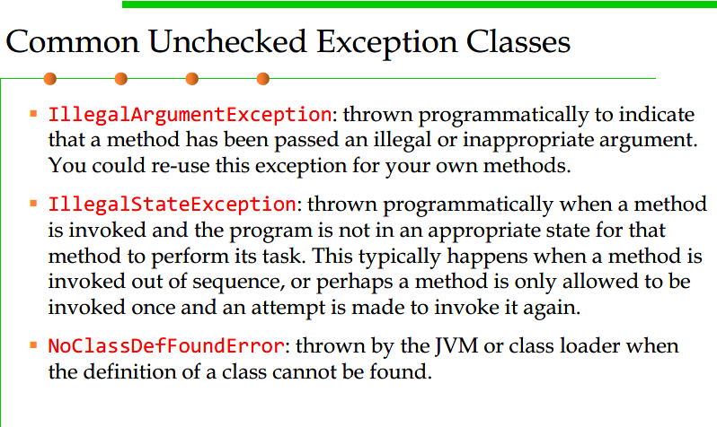
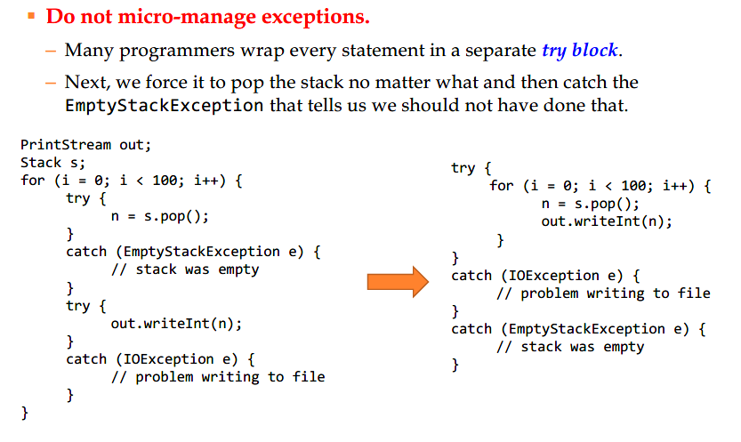
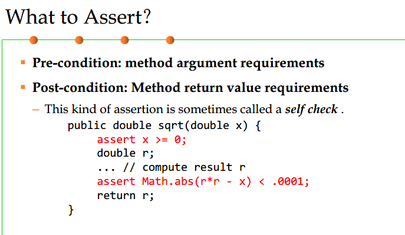
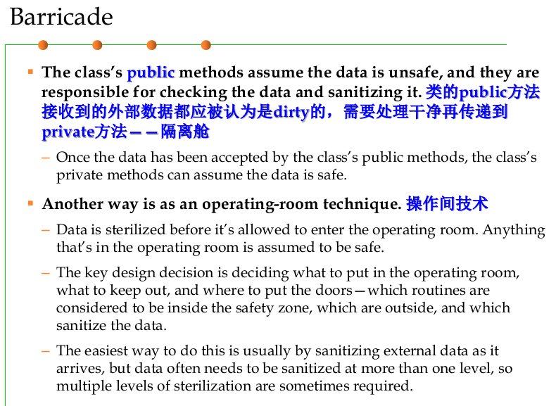
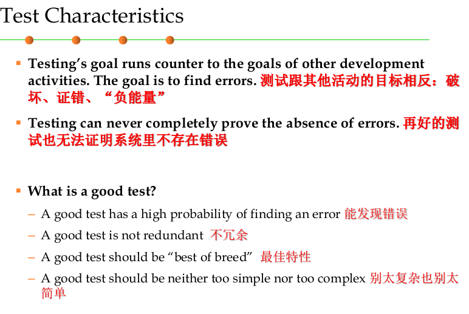
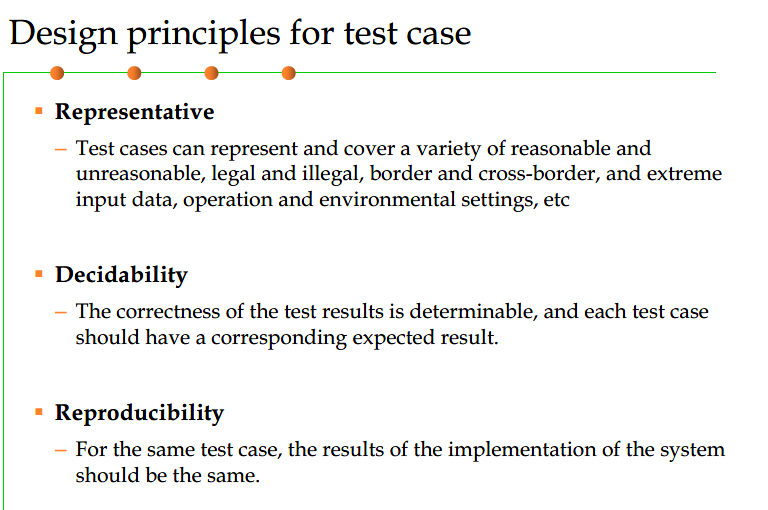

*** 7. 面向健壮性编程***

软件构造最关键的质量特性--健壮性和正确性

- 7-1节在1-2节的基础上，重申了Robustness and Correctness的重要性并指明了在软件构造中处理二者的典型技术（防御式编程、异常处理、测试、调试等
- 7.2 Java中错误和异常处理的典型技术——把原理落实到代码上！（面向健壮性 robustness）
- 7.3 第二种技术--断言、防御式编程，侧重于正确性（correctness）
- 7.4 防不胜防的bug引入了代码，如何发现并消除之？

# 7.1 健壮性和正确性之间的不同


- 正确性：程序按照 spec 加以执行的能力，是最重要的质量指标
    - 永远不给用户错误的结果
    - 让开发者变得更容易，用户输入错误（不满足 precondition的调用），直接结束
- 健壮性
    - 尽可能保持软件运行而不是总是退出
    - 让用户变得更容易，出错也可以容忍，程序内部已有容错机制
- 正确性倾向于直接报错，健壮性则倾向于容错
- 在内外部做好隔离，防止“错误”扩散
- 对外的接口，倾向于健壮；对内的实现，倾向于正确
- 可靠性 = 健壮性 + 正确性


**健壮性和正确性的测度**

- 外部观察角度
    - MTBF，平均失效间隔时间（Mean time between failures）
    - 每一次系统失败的间隔时间
    - 
- 内部观察角度（间接）
    - 残余缺陷率：每千行代码中遗留的 bug 的数量
    - 


# 7.2 Java中的 Error 和 Exception


- Error
    - 内部错误：程序通常无能为力，一旦发生，想办法让程序优雅的结束
        - 用户输入错误
        - 设备错误
        - 物理限制
- Exception
    - 异常：你自己程序导致的问题，可以捕获，可以处理

## 异常捕获


### 1）什么是异常


### 2）异常的种类


### 3）Checked and unchecked exceptions

这是从异常处理机制的角度所作的分类

**异常被谁 Check？ ——编译器，程序员**


Unchecked Exception





### 4）用 throws 声明 Checked Exceptions


### 5）如何抛出一个异常


### 6）创建一个异常类

### 7）捕获异常


### 8）再度抛出和异常链


### 9）finally Clause


```java
InputStream in = new FileInputStream(. . .);
try {
    // 1
    code that might throw exceptions
    // 2
}
catch (IOException e) {
    // 3
    show error message
    // 4
}
finally {
    // 5
    in.close();
}
// 6
```


### 10）Try-with-Resources Statement


### 11）分析堆栈信息


### 12）tips for Using Exceptions


捕获异常不能代替简单的测试

只为额外的错误使用异常



不要只是抛出 `RuntimeException`，找一个合适的子类或者创造你自己的

不要只是捕获异常，这会使你的代码不容易阅读和维护

**Throw early， catch late**


# 7.3 断言和防御式编程

最好的防御就是不要引入 bug


- Assertions 断言： Fail Fast ，避免扩散
- 检查前置条件是防御式编程的一种典型形式

## 断言

### 1）什么是以及为什么使用断言

- 在开发阶段的代码中嵌入，检验某些“假设”是否成立。若成立，表明程序运行正常，否则表明存在错误
- 


**举个栗子**


**为什么要使用断言**


### 2）断言的使用时机





### 3）使用断言的参考

- 断言-》correctness
    - 使用断言处理“绝不应该发生”的情况
    - ssertions are especially useful in large, complicated programs and in high reliability programs
    - 对前置和后置条件使用 assert
- 错误/异常处理-》Robusness
    - 使用异常来处理你“预料到可以发生”的不正常情况


- 断言和异常处理都可以处理同样的错误
- 开发阶段用断言尽可能消除 bugs，在发行版本里用异常处理机制处理漏掉的错误

## 防御式编程

### 拒绝不合法输入


### 设置路障



- “隔离舱”外部的函数应使用异常处理，“隔离舱”内的函数应使用断言。
- Proxy设计模式？——隔离

# 7.4 Debugging


## Debugging 的过程


- 错误定位占据了绝大部分时间
- 研究问题：自动化错误定位
- 常用方法：假设-检验

### 1.重现

- 控制软件版本
- 软件运行环境
    - 硬件环境
    - 虚拟机环境
- 输入数据
    - 用日志记录


# 7.5 测试和测试先行编程


- 程序确认的基本方法
    - 形式化推理
    - 代码评审
    - 测试




- 测试的层级
    - 单元测试
    - 集成测试
    - 系统测试
    - 回归测试
        - 


测试

- 白盒测试
    - 对程序内部代码结构的测试
    - 
- 黑盒测试
    - 对程序外部表现出来的行为的测试
    - 

**为什么测试如此难**

- 穷举+暴力=  不可能
- 靠偶然测试没有意义
- 基于样本的统计数据对软件测试意义不大——软件和产品的巨大差异


## 测试用例

- 测试用例：输入+执行条件+期望结果
- 




## 测试先行编程

## 黑盒测试

用于检查代码的功能，不关心内部实现的细节


测试用例

- 检查程序是否符合规约

## 等价类划分


看 MIT 软件构造的笔记


