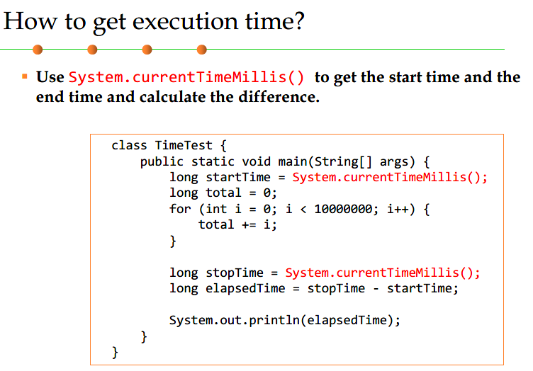
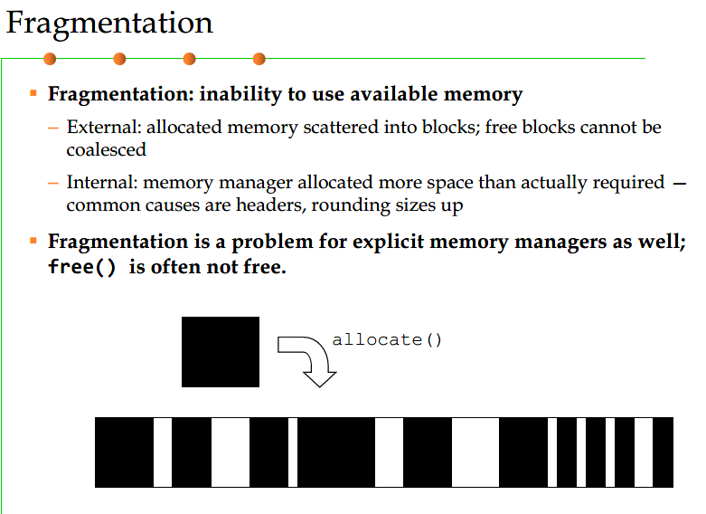
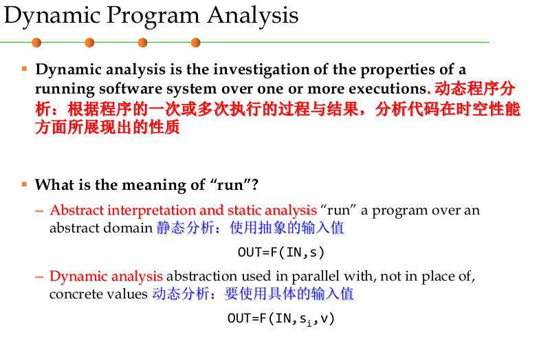

***8.面向性能编程***

- 8-1 重点学习了memory performance和I/O performance
- 8-2 如何利用工具对运行的程序性能进行动态监控，以发现性能瓶颈，并试图加以消除
- 8-3 如何通过对代码的修改，消除性能瓶颈，提高系统性能？——代码调优、面向性能的设计模式

# 8.1 面向性能的度量和原则以及方法

## 内存管理

### 1. 操作系统层级的内存管理

一个字节8位，一个字2两个字节，int是4个字节，

内存管理包括

- 内存分配
- 垃圾回收

对象模型

- heap 对象在 heap 堆中分配内存
- 对象引用：指其他对象在堆中的起始地址
- 非基本数据类型的变量等价于对象引用
- 每个对象包含一组变量，每个变量可指向其他对象的引用
- 对象引用只能指向一个其他对象，而一个对象可被多个其他对象所引用

### 2. 三个对象管理的模式

- Static 静态
- Stack-based 动态，基于栈
- Heap-based（free）动态，基于堆
- 差异在于：如何与何时在程序对象与内存对象之间建立联系

- 后进先出
- 无法支持复杂数据类型

### 3. java内存模型

### 4. 垃圾回收

#### 1. 三种模式的空间释放

#### 2. 可到达的和不可到达的对象

#### 3. 垃圾回收的定义

#### 4. 自己做 GC

#### 5. 自动 GC

#### 6. GC 的基本算法

- 引用计数
- 标记-清除
- 标记-整理
- 复制

##### 1. 引用计数

- 引用计数方法的优点：简单、计算代价分散，“幽灵时间”短 -》0
- 引用计数方法的缺点：不全面（容易漏掉循环引用的对象）、并发支持较弱、占用额外内存空间、等。

##### 2. 标记-清除

##### 3. 标记-整理

##### 4. 复制

**碎片**

#### 7. JVM 中的垃圾回收

#### 8. JVM 中的 GC 协调

##### 1.  协调 VM heap size
**重要！！！**

默认空余堆内存小于40%时，JVM 就会增大堆直到-Xmx 的最大限制，可以由 -XX:MinHeapFreeRatio 指定。 

默认空余堆内存大于70%时，JVM 会减少堆直到-Xms的最小限制，可以由 -XX:MaxHeapFreeRatio 指定，

### 5. 算法性能

### 6. I/O 性能

#### 软件的 I/O

#### Java IO 

看到了 141

# 8.2 动态程序分析方法和工具

## 1. 动态程序分析

## 2. 性能分析

实时或周期性的获取/展示程序运行过程中的数据

## 3. Java中的性能分析工具

### 1. 命令行

**没有认真看**

# 8.3 代码调优

## 1. 单例模式

## 2. 轻量模式

## 3. 原型模式

引用拷贝

对象拷贝

46——54

## 4. 对象池模式

## 5. 规范化

## 6.字符串常量池

