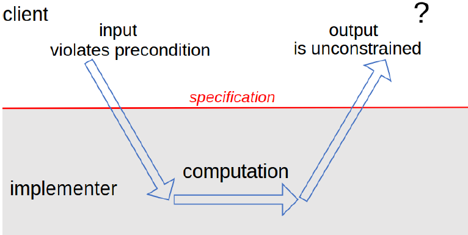

# MIT18年春 Software Construciton

* [MIT18年春 Software Construciton](#mit18%E5%B9%B4%E6%98%A5-software-construciton)
  * [01\. 静态检查](#01-%E9%9D%99%E6%80%81%E6%A3%80%E6%9F%A5)
    * [数组和聚集类型](#%E6%95%B0%E7%BB%84%E5%92%8C%E8%81%9A%E9%9B%86%E7%B1%BB%E5%9E%8B)
    * [额外的补充](#%E9%A2%9D%E5%A4%96%E7%9A%84%E8%A1%A5%E5%85%85)
    * [黑客派（Hacking）vs\. 工程派（Engineering）](#%E9%BB%91%E5%AE%A2%E6%B4%BEhackingvs-%E5%B7%A5%E7%A8%8B%E6%B4%BEengineering)
    * [课程（6\.031）的目标](#%E8%AF%BE%E7%A8%8B6031%E7%9A%84%E7%9B%AE%E6%A0%87)
    * [总结](#%E6%80%BB%E7%BB%93)
  * [02\.Java基础](#02java%E5%9F%BA%E7%A1%80)
    * [用快照图理解值与对象](#%E7%94%A8%E5%BF%AB%E7%85%A7%E5%9B%BE%E7%90%86%E8%A7%A3%E5%80%BC%E4%B8%8E%E5%AF%B9%E8%B1%A1)
    * [可改变的值 vs\. 可被重新赋值的改变](#%E5%8F%AF%E6%94%B9%E5%8F%98%E7%9A%84%E5%80%BC-vs-%E5%8F%AF%E8%A2%AB%E9%87%8D%E6%96%B0%E8%B5%8B%E5%80%BC%E7%9A%84%E6%94%B9%E5%8F%98)
    * [不可改变的引用](#%E4%B8%8D%E5%8F%AF%E6%94%B9%E5%8F%98%E7%9A%84%E5%BC%95%E7%94%A8)
    * [Java聚合类型](#java%E8%81%9A%E5%90%88%E7%B1%BB%E5%9E%8B)
  * [03\.测试](#03%E6%B5%8B%E8%AF%95)
    * [测试优先编程](#%E6%B5%8B%E8%AF%95%E4%BC%98%E5%85%88%E7%BC%96%E7%A8%8B)
    * [通过分区的方法选择测试用例](#%E9%80%9A%E8%BF%87%E5%88%86%E5%8C%BA%E7%9A%84%E6%96%B9%E6%B3%95%E9%80%89%E6%8B%A9%E6%B5%8B%E8%AF%95%E7%94%A8%E4%BE%8B)
    * [黑盒测试和白盒测试](#%E9%BB%91%E7%9B%92%E6%B5%8B%E8%AF%95%E5%92%8C%E7%99%BD%E7%9B%92%E6%B5%8B%E8%AF%95)
    * [覆盖率](#%E8%A6%86%E7%9B%96%E7%8E%87)
    * [单元测试 vs\. 综合测试和桩](#%E5%8D%95%E5%85%83%E6%B5%8B%E8%AF%95-vs-%E7%BB%BC%E5%90%88%E6%B5%8B%E8%AF%95%E5%92%8C%E6%A1%A9)
    * [自动化测试和回归测试](#%E8%87%AA%E5%8A%A8%E5%8C%96%E6%B5%8B%E8%AF%95%E5%92%8C%E5%9B%9E%E5%BD%92%E6%B5%8B%E8%AF%95)
    * [总结](#%E6%80%BB%E7%BB%93-1)
  * [04\.代码评审](#04%E4%BB%A3%E7%A0%81%E8%AF%84%E5%AE%A1)
    * [代码评审](#%E4%BB%A3%E7%A0%81%E8%AF%84%E5%AE%A1)
    * [风格标准](#%E9%A3%8E%E6%A0%BC%E6%A0%87%E5%87%86)
    * [别写重复的代码（Don’t Repeat Yourself）(DRY)](#%E5%88%AB%E5%86%99%E9%87%8D%E5%A4%8D%E7%9A%84%E4%BB%A3%E7%A0%81dont-repeat-yourselfdry)
    * [避免<a href="https://en\.wikipedia\.org/wiki/Magic\_number\_(programming)\#Unnamed\_numerical\_constants" rel="nofollow">幻数</a>](#%E9%81%BF%E5%85%8D%E5%B9%BB%E6%95%B0)
    * [不要使用全局变量](#%E4%B8%8D%E8%A6%81%E4%BD%BF%E7%94%A8%E5%85%A8%E5%B1%80%E5%8F%98%E9%87%8F)
    * [总结](#%E6%80%BB%E7%BB%93-2)
  * [05\.版本控制](#05%E7%89%88%E6%9C%AC%E6%8E%A7%E5%88%B6)
  * [06\.规格说明](#06%E8%A7%84%E6%A0%BC%E8%AF%B4%E6%98%8E)
    * [规格说明的必要性](#%E8%A7%84%E6%A0%BC%E8%AF%B4%E6%98%8E%E7%9A%84%E5%BF%85%E8%A6%81%E6%80%A7)
    * [行为等价](#%E8%A1%8C%E4%B8%BA%E7%AD%89%E4%BB%B7)
    * [规格说明的结构](#%E8%A7%84%E6%A0%BC%E8%AF%B4%E6%98%8E%E7%9A%84%E7%BB%93%E6%9E%84)
    * [Null引用](#null%E5%BC%95%E7%94%A8)
    * [测试单元](#%E6%B5%8B%E8%AF%95%E5%8D%95%E5%85%83)
    * [异常](#%E5%BC%82%E5%B8%B8)
    * [已检查（Checked）异常和未检查（Unchecked）异常](#%E5%B7%B2%E6%A3%80%E6%9F%A5checked%E5%BC%82%E5%B8%B8%E5%92%8C%E6%9C%AA%E6%A3%80%E6%9F%A5unchecked%E5%BC%82%E5%B8%B8)
    * [Throwable 类层次](#throwable-%E7%B1%BB%E5%B1%82%E6%AC%A1)
    * [设计异常时应该考虑的事情](#%E8%AE%BE%E8%AE%A1%E5%BC%82%E5%B8%B8%E6%97%B6%E5%BA%94%E8%AF%A5%E8%80%83%E8%99%91%E7%9A%84%E4%BA%8B%E6%83%85)
    * [07\.设计规格说明](#07%E8%AE%BE%E8%AE%A1%E8%A7%84%E6%A0%BC%E8%AF%B4%E6%98%8E)
    * [决定性的 vs\. 待决定性的规格说明](#%E5%86%B3%E5%AE%9A%E6%80%A7%E7%9A%84-vs-%E5%BE%85%E5%86%B3%E5%AE%9A%E6%80%A7%E7%9A%84%E8%A7%84%E6%A0%BC%E8%AF%B4%E6%98%8E)
    * [声明性的 vs\. 操作性的规格说明](#%E5%A3%B0%E6%98%8E%E6%80%A7%E7%9A%84-vs-%E6%93%8D%E4%BD%9C%E6%80%A7%E7%9A%84%E8%A7%84%E6%A0%BC%E8%AF%B4%E6%98%8E)
    * [更强或更弱的规格说明](#%E6%9B%B4%E5%BC%BA%E6%88%96%E6%9B%B4%E5%BC%B1%E7%9A%84%E8%A7%84%E6%A0%BC%E8%AF%B4%E6%98%8E)
    * [设计好的规格说明](#%E8%AE%BE%E8%AE%A1%E5%A5%BD%E7%9A%84%E8%A7%84%E6%A0%BC%E8%AF%B4%E6%98%8E)
    * [规格说明应该尽可能使用抽象的数据类型](#%E8%A7%84%E6%A0%BC%E8%AF%B4%E6%98%8E%E5%BA%94%E8%AF%A5%E5%B0%BD%E5%8F%AF%E8%83%BD%E4%BD%BF%E7%94%A8%E6%8A%BD%E8%B1%A1%E7%9A%84%E6%95%B0%E6%8D%AE%E7%B1%BB%E5%9E%8B)
    * [关于访问控制](#%E5%85%B3%E4%BA%8E%E8%AE%BF%E9%97%AE%E6%8E%A7%E5%88%B6)
    * [类方法和实例方法](#%E7%B1%BB%E6%96%B9%E6%B3%95%E5%92%8C%E5%AE%9E%E4%BE%8B%E6%96%B9%E6%B3%95)
    * [结语](#%E7%BB%93%E8%AF%AD)
  * [08\. 可变性与不变性](#08-%E5%8F%AF%E5%8F%98%E6%80%A7%E4%B8%8E%E4%B8%8D%E5%8F%98%E6%80%A7)
    * [创建和使用对象](#%E5%88%9B%E5%BB%BA%E5%92%8C%E4%BD%BF%E7%94%A8%E5%AF%B9%E8%B1%A1)
  * [09\.避免调试](#09%E9%81%BF%E5%85%8D%E8%B0%83%E8%AF%95)
    * [让bug无法产生](#%E8%AE%A9bug%E6%97%A0%E6%B3%95%E4%BA%A7%E7%94%9F)
  * [10\. 抽象数据类型](#10-%E6%8A%BD%E8%B1%A1%E6%95%B0%E6%8D%AE%E7%B1%BB%E5%9E%8B)
    * [什么是抽象](#%E4%BB%80%E4%B9%88%E6%98%AF%E6%8A%BD%E8%B1%A1)
    * [类型和操作的分类](#%E7%B1%BB%E5%9E%8B%E5%92%8C%E6%93%8D%E4%BD%9C%E7%9A%84%E5%88%86%E7%B1%BB)
    * [抽象数据类型的例子](#%E6%8A%BD%E8%B1%A1%E6%95%B0%E6%8D%AE%E7%B1%BB%E5%9E%8B%E7%9A%84%E4%BE%8B%E5%AD%90)
    * [抽象类型是通过它的操作定义的](#%E6%8A%BD%E8%B1%A1%E7%B1%BB%E5%9E%8B%E6%98%AF%E9%80%9A%E8%BF%87%E5%AE%83%E7%9A%84%E6%93%8D%E4%BD%9C%E5%AE%9A%E4%B9%89%E7%9A%84)
  * [11\. 抽象函数与表示不变量](#11-%E6%8A%BD%E8%B1%A1%E5%87%BD%E6%95%B0%E4%B8%8E%E8%A1%A8%E7%A4%BA%E4%B8%8D%E5%8F%98%E9%87%8F)
    * [不变量](#%E4%B8%8D%E5%8F%98%E9%87%8F)
    * [不变性](#%E4%B8%8D%E5%8F%98%E6%80%A7)
      * [使用者可以直接访问Tweet内部的数据，即表示暴露（Rep exposure）](#%E4%BD%BF%E7%94%A8%E8%80%85%E5%8F%AF%E4%BB%A5%E7%9B%B4%E6%8E%A5%E8%AE%BF%E9%97%AEtweet%E5%86%85%E9%83%A8%E7%9A%84%E6%95%B0%E6%8D%AE%E5%8D%B3%E8%A1%A8%E7%A4%BA%E6%9A%B4%E9%9C%B2rep-exposure)
      * [可变对象的索引泄露](#%E5%8F%AF%E5%8F%98%E5%AF%B9%E8%B1%A1%E7%9A%84%E7%B4%A2%E5%BC%95%E6%B3%84%E9%9C%B2)
      * [对Date创建者也进行防御式编程](#%E5%AF%B9date%E5%88%9B%E5%BB%BA%E8%80%85%E4%B9%9F%E8%BF%9B%E8%A1%8C%E9%98%B2%E5%BE%A1%E5%BC%8F%E7%BC%96%E7%A8%8B)
    * [可变类型的不可变包装](#%E5%8F%AF%E5%8F%98%E7%B1%BB%E5%9E%8B%E7%9A%84%E4%B8%8D%E5%8F%AF%E5%8F%98%E5%8C%85%E8%A3%85)
    * [表示不变量和抽象函数](#%E8%A1%A8%E7%A4%BA%E4%B8%8D%E5%8F%98%E9%87%8F%E5%92%8C%E6%8A%BD%E8%B1%A1%E5%87%BD%E6%95%B0)

## 01. 静态检查

---
> 学习目标
> - 学习静态类型
> - 了解好的软件应该具有的三个属性


### 数组和聚集类型

Java中有两种常用的线性存储结构：数组和列表
- *数组*
数组是⼀连串类型相同的元素组成的结构，⽽且它的⻓度是固定的（元素个数固定），例如

```java
    int[ ] a = new int  [100];  
```
对于数组，常用的操作符有：
- 索引其中的一个元素：`a[2]`
- 复制一个元素特定的值：`a[2] = 0` ;
- 求这个数组的长度：`a.length`（注意`String.length()` 的区别—— a.length 不是⼀个类内⽅法调⽤，你不能在它后⾯写上括号和参数）
然而数组都为定长，因此在`Java`中出现越界访问时，能够被动态检查检测出来，在`c`和`c++`中则会造成[缓冲区溢出(维基)](https://en.wikipedia.org/wiki/Buffer_overflow)[中文](https://zh.wikipedia.org/wiki/%E7%BC%93%E5%86%B2%E5%8C%BA%E6%BA%A2%E5%87%BA)（可以通过编译）,这也是很多漏洞的来源
解决方法是使用`List`类型，列表类型是⼀个⻓度可变的序列结构。我们可以这样声明列表：
```java
     List<Integer > list = new ArrayList <Integer >();
```
常用的操作符：
- 索引一个元素：`list.get(2)`
- 赋予一个元素特定的值：`list.set(2,0)`
- 求列表的长度：`list.size()`
这里要注意`list`是一个接口，这种类型的对象⽆法直接⽤`new`来构造，必须⽤能够实现`List`要求满⾜的操作符的⽅法来构造。

### 额外的补充
`public`意味着任何在你程序中的代码都可以访问这个类或者⽅法。其他的类型修饰符，例如`private`，是⽤来确保程序的安全性的——它保证了可变类型不会被别处的代码所修改。
`static`意味这这个⽅法没有`self`这个参数——Java会隐含的实现它，所以你不会看到这个参数。静态的⽅法不能通过对象来调⽤，例如`List add()` ⽅法 或者 `String length()` ⽅法，它们要求先有⼀个对象。静态⽅法
的正确调⽤应该使⽤类来索引，例如：
```
Hailstone .hailstoneSequence (83)
```
另外，记得在定义的⽅法前⾯写上注释。这些注释应该描述了这个⽅法的功能，输⼊输出/返回，以及注意事项。记住注释不要写的啰嗦，⽽是应该直切要点，简洁明了。例如在上⾯的代码中，n是⼀个整型的变量，这个在声明的时候`int`已经体现出来了，就不需要进⾏注释。但是如果我们设想的本意是n不能为负数，⽽这个编译器（声
明）是不能检查和体现出来的，我们就应该注释出来，⽅便阅读理解和修改。

### 黑客派（Hacking）vs. 工程派（Engineering）
我们已经在本门课程中编写了⼀些⿊客⻛格的代码, ⿊客派的编程⻛格可以理解为“放⻜⾃我并且乐观的”（译者注：贬义）：
- 缺点: 在已经编写⼤量代码以后才测试它们
- 缺点: 将所有的细节都放在脑⼦⾥, 以为⾃⼰可以永远记住所有的代码, ⽽不是将它们编写在代码中
- 缺点: 认为 BUG 都不存在或者它们都⾮常容易发现和被修复.
⽽⼯程派对应的做法是（译者注：褒义）：
- 优点: ⼀次只写⼀点点, ⼀边写⼀边测试. 在将来的课程中, 我们将会探讨"测试优先编程" (test-firstprogramming)
- 优点: 记录代码的设想、意图 (document the assumptions that your code depends on)
- 优点: 静态代码检查将会保护你的代码不沦为“愚蠢的代码”

### 课程（6.031）的目标
本门课程的主要目标为学习如何⽣产具有如下属性的软件:
- 安全健壮性. 正确性 (现在看起来是正确的), 防御性 (将来也是正确的)
- 可读性. 我们不得不和以后有可能需要理解和修改代码的程序员进⾏交流 (修改 BUG 或者添加新的功能), 那个将来的程序员或许会是⼏个⽉或者⼏年以后的你, 如果你不进⾏交流, 那么到了那个时候, 你将会惊讶于你居然忘记了这么多, 并且这将会极⼤地帮助未来的你有⼀个良好的设计。
- 可改动性. 软件总是在更新迭代的, ⼀些好的设计可以让这个过程变得⾮常容易, 但是也有⼀些设计将会需要让开发者扔掉或者重构⼤量的代码。

译者注：
- safe from bugs (SFB),
	- 动态检查
	- 常量
	- 静态类型
- easy to understand (ETU),
	- documented assumptions in comments
	- 常量（final）
- ready for change (RFC).
	- documented assumptions in comments
	- 方法

当然也有其他的⾮常重要的关于软件的性质(例如: 性能, 实⽤性以及安全性), 并且他们可能会和上述三种性质是互相⽭盾的。但是在 6.031 这门课程中, 我们重点关注上述三个重要性质, 并且软件开发者⼀般情况下会将这三种性质列于软件开发过程中的最重要的性质。
**本门课程中最重要内容: 安全性, 清晰性, 抽象, ⼯程化的本能, 这些知识将会让你游刃有余地应对各种编程语言的新潮流。**

### 总结

我们今天主要介绍的思想为静态代码检查, 下⾯是该思想如何和我们的⽬标进⾏关联
- 安全健壮性. 静态代码检查可以通过捕捉类型错误等其他BUG帮助我们在运⾏代码之前就发现它们
- 可读性. 它可以帮助我们理解, 因为所有的类型在代码中被明确定义 (译者注: 相⽐于 Python/PHP 这类动态变量类型的语⾔)
- 可改动性. 静态代码检查可以在你在修改你的代码的时候定位出也需要被修改的地⽅, 例如: 当你改变⼀个变量的类型或者名称的时候, 编译器⽴即就会在所有使⽤到这个变量的地⽅显⽰错误, 提⽰你也需要更新它们

## 02.Java基础

---
> 学习目标
> - 基本语法

### 用快照图理解值与对象

快照图能代表程序运行时的各种状态——它的栈（即方法和局部变量）和它的堆（即现在存在的对象）。


### 可改变的值 vs. 可被重新赋值的改变
通过快照图我们可以视图化可更改的值和可被重新赋值的改变之间的区别：
- 当你给⼀个变量或者⼀个区域（filed）赋值的时候，你实际上是改变了它指向的⽅向，即指向了另⼀个值。
- 当你修改⼀个可被更改(mutable)值的时候——例如数组或者列表——你真正修改了这个值本⾝（译者注：变量或者区域的指向并没有变）

### 不可改变的引用
java提供了不可改变的引用：`final`声明，变量一旦被赋值就不能再次改变它的引用（指向的值或者对象）
```java
final int n= 5;
```

如果Java编译器发现`final`声明的变量在运⾏中被赋值多次，它就会报错。所以`final`就是为不可更改的引⽤提供了静态检查。
在快照图中，不可更改的引⽤（ `final`）⽤双箭头表⽰，例如上图中的`id`， `Person`的`id`引⽤不可改变，但是age却是可改变的。
这⾥要特别注意⼀点，`final`只是限定了引⽤不可变，我们可以将其引⽤到⼀个可更改的值 （例如`final
StringBuilder sb`），虽然引⽤不变，但引⽤的对象本⾝的内容可以改变。
同样的，我们也可以将⼀个可更改的引⽤作⽤到⼀个不可更改的值（例如`String s`），这个时候变量值的改变就是将引⽤改变。

### Java聚合类型
1. 我们可以⽤[the utility function Arrays.asList](https://docs.oracle.com/javase/8/docs/api/?java/util/Arrays.html) 从数组创建列表：
``` java
Arrays.asList(new String [] { "a", "b", "c"})
```
… 或者直接提供元素:
``` java
Arrays.asList("a", "b", "c")
```
要注意的是，如果⼀个 `List` 是⽤ `Arrays.asList`创建的，它的⻓度就固定了。
2. **警告**
在使用foreach循环（用到了[Iterator](https://docs.oracle.com/javase/8/docs/api/?java/util/Iterator.html)）时，一定不要在循环的时候改变你的循环参量（他是可改变的值）！添加、删除、或者替换都会影响你的循环甚至中断你的程序

---
**创建集合和映射**
对于集合，默认使用[HashSet](https://docs.oracle.com/javase/8/docs/api/?java/util/HashSet.html)：
对于映射，我们默认使⽤ [HashMap](https://docs.oracle.com/javase/8/docs/api/?java/util/HashMap.html) :

## 03.测试

---
> 学习目标
> - 理解测试的意义，并了解“测试优先编程”的过程
> - 能够使用“分区”的方法选择合适的输入输出测试用例
> - 能够通过代码覆盖率来评价一个测试的好坏
> - 理解黑盒/白盒测试、单元/综合测试、自动化回归测试

### 测试优先编程
测试开始的时间应该尽量早，并且要频繁地测试。当你有⼀⼤堆未经验证的代码时，不要把测试⼯作留到最后。

在测试优先编程中，测试程序先于代码完成。编写一个函数应按照如下进行：
1. 为函数写一个规格说明
2. 为上一步的规格说明写一些测试用例
3. 编写实际代码。一旦你的代码通过了所有你写的测试用例，这个函数就算完成了。

规格说明描述了这个函数的输入输出行为。它确定了函数参数的类型和对它们的所有约束（例如sqrt 函数的参数必须是⾮负的），它还定义了函数的返回值类型以及返回值和输入之间的关系
### 通过分区的方法选择测试用例

将输入空间化为几个子域，每一个子域都是一类相似的数据，在每个子域中选取一些数据，它们合并起来就是我们需要的输入用例。
背后的原理在于同⼀类型的数据在程序中的⾏为⼤多类似，所以我们可以⽤⼀⼩部分代表整体的⾏为。这个⽅法的优点在于强迫程序相应输⼊空间⾥的不同地⽅，有效的利⽤了测试资源。
**例子1：`BigInteger.multiply()`**


**例子2：`max（）`**
针对`int`的`max（）`函数，属于[Math](https://docs.oracle.com/javase/8/docs/api/java/lang/Math.html)类

**注意分区之间的“边界”**
bug经常会在各个分区的边界处发生，例如
- 在正整数和负整数之间的0
- 数字类型的最⼤值和最⼩值，例如 int 和 double
- 空集，例如空的字符串，空的列表，空的数组
- 集合类型中的第⼀个元素或最后⼀个元素

**为什么这些边界的地⽅经常产⽣bug呢？**⼀个很重要的原因就是程序员经常犯“丢失⼀个（off-by-one
mistakes）”的错误。例如将`<=` 写成`<` ，或者将计数器⽤0来初始化⽽不是1。另外⼀个原因就是边界处的值可能需要⽤特殊的⾏为来处理，例如当`int`类型的变量达到最⼤值以后，再对其加正整数反⽽会变成负数。


### 黑盒测试和白盒测试

### 覆盖率
一种判断测试的好坏方法就是看该测试对软件的测试程度，也称覆盖率。
- 声明覆盖率：每一个声明都被测试到了吗？
- 分支覆盖率：对于每一个`if`或者`while`等等控制操作，它们的分支都被测试过吗？
- 路径覆盖率：每一种分支的组合路径都被测试过吗？

其中，分支覆盖率要比声明覆盖率严格（需要更多的测试），路径覆盖率要比分支覆盖率严格
### 单元测试 vs. 综合测试和桩
**单元测试：**对孤⽴的模块进⾏测试。这使得debugging变得简单，当⼀个单元测试报错是，我们只需要在这个单元找bug，⽽不是在整个程序去找。
**综合测试**对于组合起来的模块进行测试，甚至是整个程序。
关于mocks、stubs、fakes这些概念，可以参考：
- [Mock object](https://en.wikipedia.org/wiki/Mock_object)
- [软件测试中Mock和Stub](http://blog.csdn.net/wangjianno2/article/details/52177481)

### 自动化测试和回归测试
⾃动化回归测试(automated  regression testing)是软件⼯程⾥的⼀个“最佳实践”（best-practice）

### 总结
学到了
- 测试优先编程——在写代码前先写好测试⽤例，尽早发现bug。
- 利⽤分区与分区边界来选择测试⽤例。
- ⽩盒测试与声明覆盖率。
- 单元测试——将测试模块隔离开来。
- ⾃动化回归测试杜绝新的bug产⽣。

与好软件的三个属性联系起来：
- 远离bug 测试的意义在于发现程序中的bug，⽽“测试优先编程”的价值在于尽可能早的发现这些bug。
- 易读性 额.......测试并不会使代码审查变得容易，但是我们也要注意正确书写测试注释。
- 可改动性 我们针对改动后的程序进⾏测试时只需要依赖规格说明中的⾏为描述。（译者注：再说⼀遍，这⾥的测试针对的是正确性⽽不是鲁棒性）。另外，当我们完成修改后，⾃动化回归测试能够帮助我们杜绝新的bug产⽣。

## 04.代码评审

---
> 课程目标
> - 代码评审：阅读并讨论别人写的代码。
> - 好代码的书写原则：你在代码评审的过程中应遵循的标准，不管编程⽬的或编程语⾔是什么。

### 代码评审
主要目的：
- 提升代码质量。 找出存在及潜在的bug，分析代码的清晰度以及代码是否严格遵循了当前⼯程的标准。
- 提升程序员的⽔平。 代码评审是提升程序员⽔平的⼀个重要⽅法，通过它可以学习到语⾔新的特性、⼯程上新的设计以及⼀些新的实现⽅法。特别是在开源项⽬中，很多交流都是在代码评审这种环境下进⾏的。

### 风格标准
对于新手，推荐遵循[Google Java Style](http://google.github.io/styleguide/javaguide.html)
### 别写重复的代码（Don’t Repeat Yourself）(DRY)
重复的代码很不安全。如果你在两个地⽅放置了相似的代码，那么⼀个最基本的⻛险就是如果⼀处出现了bug，另⼀处也⾮常可能有bug。⽽修复的时候经常只会修复⼀个地⽅⽽忽略了另⼀个地⽅。
避免重复就像你过⻢路的时候要避免被⻋撞⼀样。赋值-粘贴在编程中是⼀个很⼤的诱惑，⽽你在使⽤它的时候，“**⽪肤应该感觉到危险⽽震颤**()”。（译者注：这描述也是醉了）

### 避免[幻数](https://en.wikipedia.org/wiki/Magic_number_(programming)#Unnamed_numerical_constants)
### 不要使用全局变量
- 变量：值是可以变化的
- 全局的：可以从程序的任何地方访问

[为什么全局变量是不好的](http://wiki.c2.com/?GlobalVariablesAreBad)

### 总结
代码评审是⼀种⼴泛应⽤的软件质量提升⽅法。它可以检测出代码中的各种问题，好的代码的通用的原则
- 不要重复你的代码(DRY)
- 仅在需要的地⽅做注释
- 快速失败/报错
- 避免使⽤幻数
- ⼀个变量有且仅有⼀个⽬的
- 使⽤好的命名
- 避免使⽤全局变量
- 返回结果⽽⾮打印它
- 使⽤空⽩符提升可读性

## 05.版本控制

---
详细参见[Git教程——廖雪峰](https://www.liaoxuefeng.com/wiki/0013739516305929606dd18361248578c67b8067c8c017b000/)
## 06.规格说明

---
> 学习目标
> - 理解方法规格说明中的前置条件和后置条件，并能够写出正确的规格说明
> - 能够针对规格说明写出测试
> 理解java中的检查异常和非检查异常
> 理解如何用异常处理特殊的结果

### 规格说明的必要性
规格说明对使用者是很有用的，阅读规格说明要比阅读源码更简单易懂。
另外，规格说明对于实现者也是很有好处的，因为它们给了实现者更改实现策略⽽不告诉使⽤者的⾃由。同时，规格说明可以限定⼀些特殊的输⼊，这样实现者就可以省略⼀些⿇烦的检查和处理，代码也可以运⾏的更快。

### 行为等价
为了判断“⾏为等价”，我们必须判断⼀个⽅法是否可以替换另⼀个⽅法，⽽程序的⾏为不发⽣改变。
**⾏为等价**是对于“旁观者”来说的——就是客户。为了让实现⽅法可以发⽣改动，我们就需要⼀个规格说明要求客户遵守某⼀些制约/前置条件。

### 规格说明的结构
一个规格说明含有以下两个“条款”
- 一个前置条件，关键词是`requires`
- 一个后置条件，关键词是`effects`

其中前置条件是客户的义务（谁调用的这个方法）。它确保了方法被调用时所处的状态

而后置条件是实现者的义务。如果前置条件得到了满⾜，那么该⽅法的⾏为应该符合后置条件的要求，例如返回⼀个合适的值，抛出⼀个特定的异常，修改⼀个特定的对象等等。

如果前置条件不满足的话，实现也不需要满足后置条件——方法可以做任何事情，，例如不终⽌⽽是抛出⼀个异常、返回⼀个任意的值、做⼀个任意的修改等等。
### Null引用
在java中，对于对象和数组的引用可以取一个特殊的值`null`，它表示这个引用还没有指向任何对象，Null值在java类型系统中是一个不幸的黑洞
原始类型不能是`null`
```java
int size= null;//illegal
double depth= null;//illegal
```
可以给非原始类型的变量赋予null值
```java
String name= null;
int[] points= null;
```
在编译的时候是合法的，但是如果你尝试调⽤这个null对象的⽅法或者访问它⾥⾯对应的数值，发产⽣⼀个运⾏时错误：
```java
name.length();// throws NullPointerException
points.length; // throws NullPointerException
```
### 测试单元
一个好的单元测试应该仅仅关注一个规格说明。
而对于一个好的综合测试（测试多个模块，它确保的是各个模块之间是兼容的：调用者和被调用者之间的数据输入输出应该是符合要求的。
同时综合测试不能取代系统的单元测试，因为各个模块的输出集合很可能在输入空间没有代表性。
### 异常

---
一个方法的标识包含它的名字、参数类型、返回类型，同时也包含该方法能触发的异常。
> 参考阅读：[Exceptions in the Java Tutorials](https://docs.oracle.com/javase/tutorial/essential/exceptions/index.html)

**报告bug的异常**
**报告特殊结果的异常**
异常不仅被⽤来报告bug，它们也被⽤来提升那些包含特殊结果的代码的结构。

⼀个常⻅的处理特殊结果的⽅法就是返回⼀个特殊的值。你在Java库中常常能发现这样的设计：当你期
望⼀个正整数的时候，特殊结果会返回⼀个-1；当你期望⼀个对象的时候，特殊结果会返回⼀个null 。这样的⽅法如果谨慎使⽤也还OK，但是它有两个问题。⾸先，它加重的检查返回值的负担。其次，程序员很可能会忘记检查返回值（我们待会会看到通过使⽤异常，编译器会帮助你处理这些问题。

### 已检查（Checked）异常和未检查（Unchecked）异常
报告特殊的结果或者报告bug。⼀个通⽤的规则是
- ⽤已检查的异常来报告特殊结果
- ⽤未检查的异常来报告bug
### Throwable 类层次

[Throwable](https://docs.oracle.com/javase/8/docs/api/?java/lang/Throwable.html)
是⼀个能够被抛出和捕获的对象对应的类.`Throwable`的实现记录了栈的结构（异常被抛出的时候），同时还有⼀个描述该异常的消息（可选）。任何被抛出或者捕获的异常对象都应该是 `Throwable` 的⼦类。
[Error](https://docs.oracle.com/javase/8/docs/api/?java/lang/Error.html/%22)是`Throwable`的一个子类，它被保留用于Java运行系统的异常，例如`StackOverfolwError`和`OutOfMemoryError`。Errors应该被认为是不可恢复的，并且一般不会去捕获它。（这里有一个特例，`AssertionError`也属于 `Error`的，即使它反映的是用户代码错误）

下面描述了在Java中如何区别**已检查异常**和**未检查异常**：
- `RuntimeException`， `Error`，以及它们的子类都是未检查异常。编译器不会要求它们被`throws`修饰，也不会要求它们被捕获。
- 所有其他的throwables——`Throwable`， `Exception`和其他子类都是已检查异常。编译器会要求它们被捕获或者用`throws`传给调用者处理。

当定义自己的异常时，应该使它是`RuntimeException`的子类（未检查异常），或是`Exception`的子类（已检查异常）。通常不会生成`Error`或者`Throwable`的子类，因为它们通常被java保留使用

### 设计异常时应该考虑的事情
**在规格说明中应该如何声明异常**
java中是以`@throws`作为javadoc中异常注释的，Java也可能要求函数声明时⽤throws 标出可能抛出的异常。

对于⾮检查的异常，由于它们描述的是意料之外的bug或者失败，不属于后置条件，所以不应该⽤ `@throws` 或`throws`修饰它们

对于报告特殊结果的未检查异常，Java允许但是不要求使⽤`throws`在声明中标识出。但是这种情况下通常不要使⽤ `throws`因为这会使得阅读者困惑（以为它是⼀个已检查异常）。
###  07.设计规格说明 

---
> - 理解待决定（underdetermined）规格说明，并能够辨别评估待决定的规格说明。
- 理解声明性的规格说明和操作性的规格说明之间的区别，并能够写出声明性的规格说明。
- 理解前置条件、后置条件、及规格说明的“强度”，并能够⽐较两个规格说明之间的强度。
- 能够写出逻辑严密、前后连贯的规格说明。

### 决定性的 vs. 待决定性的规格说明

### 声明性的 vs. 操作性的规格说明
规格说明分两种（笼统的说）
- 操作性的（Operational）规格说明给出了实现过程的步骤（就像伪代码⼀样）
- 声明性的（Declarative）规格说明不对实现过程进⾏要求，它们仅仅给出最后输出的属性和意义，以及它们和输⼊之间的关系。
### 更强或更弱的规格说明
定义：规格说明S2强于（等于）规格说明S1，如果
- S2的前置条件弱于或等价于S1的
- S2的后置条件强于 或等于S1的后置条件

如果 S2 强于 S1 ，那么任何 S2 的实现方法都可以拿来实现 S1 ，并且在程序中可以安全的用 S2 的模块替换 S1 模块。
### 设计好的规格说明
**规格说明应该逻辑明确**
**调用结果应该清晰**
并不能产生歧义
**规格说明应该足够"强**（后置条件的强度）
**规格说明应该足够"弱"**（前置条件的强度）
### 规格说明应该尽可能使用抽象的数据类型
关于是否使⽤前置条件是⼀个⼯程上的判断。关键点在于检查需要使⽤的资源量以及这个模块被使⽤的范围。当这个模块仅仅在类的内部使⽤时，我们设置前置条件，仔细检查所有的调⽤是否合理。但是如果这个⽅法是公开的，并且会被其他的开发者使⽤，那么使⽤前置条件就不那么合理。像Java API⼀样，你应该抛出⼀个异常。
### 关于访问控制
> 阅读：[Packages](https://docs.oracle.com/javase/tutorial/java/package/index.html)
> 阅读：[Controlling Access](https://docs.oracle.com/javase/tutorial/java/javaOO/accesscontrol.html)

将⼀个内部使⽤的⽅法设置为公开访问也会让类的接⼝变得复杂。保持内部⽅法私有会让接⼝简洁⽽且符合逻辑，这会让你的代码易于理解 。
### 类方法和实例方法
> 阅读：[the static keyword](https://www.codeguru.com/java/tij/tij0037.shtml#Heading79)

类⽅法是指那些不与特定的类实例（对象）相关联的⽅法（译者注：或者说没有this指针），⽽实例⽅法（没有static修饰）必须通过特定的对象来调⽤。

实例⽅法的规格说明和类⽅法的规格说明是⼀样的，但它们通常会利⽤实例对应的具体属性。

### 结语
- 远离bug. 如果没有规格说明，即使是最⼩的更改都有可能使得整个程序崩溃，改动起来也是很⿇烦的。⼀个结构良好、逻辑明确的规格说明会最⼩化使⽤者和实现者之间的误解，并帮助我们进⾏静态检查、测试、代码评审等等。
- 易于理解. ⼀个好的规格说明会让使⽤者不必去阅读源码也能正确安全地使⽤模块。例如，你可能永远不
会去阅读Python dict.update ，但是通过阅读对应的声明性规格说明你就能很好的应⽤它。
- 可改动性：⼀个合理的“弱”规格说明会给实现者⼀定的⾃由，⽽⼀个“强”的规格说明会给使⽤者⼀定的⾃由。我们甚⾄可以改变规格说明本⾝：只要我们是加强了它⽽不是削弱了它（减弱前置条件或者增强后
置条件）。
## 08. 可变性与不变性

---
> 目标
> - 理解可变性和可变对象
> - 学会判断别名使用和理解可变性的危险
> - 利用不变性使代码正确、易懂、可改动

### 创建和使用对象

##  09.避免调试

---
> 目标
>  - 如何避开调试
>  - 当你不得不调试时，如何确保它不会太复杂

### 让bug无法产生


## 10. 抽象数据类型
目标
> - 理解抽象数据类型（ADT）
> - 理解“表示独立”

### 什么是抽象
- **抽象：** 忽略底层的细节而在高层思考
- **模块化：** 把系统分为每一个模块，每一个都可以单独设计、实现、测试、推倒，并在剩下的开发中可以复用。
- **封装：** 给模块建一堵墙，使得它只对自身的功能负责。系统别处的bug无法影响到它内部的正确性。
- **信息隐藏：** 对模块的实现细节进行隐藏，使得在之后改变模块内部代码时不会影响到外部的代码。
- **功能分离：** 即：一一对应，一个模块仅仅负责一个特性或功能，避免很多模块都有同一个特性，或一个模块有多个特性。

### 类型和操作的分类
对于类型，无论内置还是自定义，都分为两种
- 可改变的（`StringBuilder`就是一种可改变的字符串类型）
- 不可变的（`String`——每一次都是创建一个新对象）

抽象类型的操作符大致分类：
- 创建者creator：
- 生产者producer：
- 观察者obverser：
- 改造者mutator：

### 抽象数据类型的例子
`int`是java中的原始数据类型，不可改变，没有改造者
`List`
`String`
### 抽象类型是通过它的操作定义的

---
## 11. 抽象函数与表示不变量
目标
> - 不变量（invariants）
> - 表⽰暴露（representation exposure）
> - 抽象函数（abstraction functions）
> - 表⽰不变量（representation invariants）

用一种正规的数学思想（抽象函数和表示不变量）去理解抽象数据类型ADT的实现。其中
- **抽象函数** 会让我们清晰的定义对两个ADT判断相等的操作
- **表示不变量** 会让我们更易发现破坏数据结构导致的bug。

### 不变量
**什么设计会产生好的ADT？**

最重要的一点就是它会保护/保留自己的不变量。

不变量是一种属性，它是在程序运行时的一种状态。一旦一个不变类型的对象被创建，它总代表一个不变的值。

当一个ADT能够确保它内部的不变量恒定不变（不受使用者/外部影响），我们就说这个ADT保护/保留自己的不变量。

**好处**
当一个ADT保护/保留自己的不变量时，对代码的分析就会变得简单。例如：
- 能够依赖字符串不变的特点，在分析的时候跳过那些关于字符串的代码；或者当尝试基于字符串建立其他不变量的时候，也会变得简单。
- **相反** ，对于可变的对象，不得不对每一处使用它的地方进行审查。

### 不变性
```java
/**
* This immutable data type represents a tweet from Twitter.
*/
public class Tweet {
    public String author;
    public String text;
    public Date timestamp;
    /**
    * Make a Tweet.
    * @param author Twitter user who wrote the tweet
    * @param text text of the tweet
    * @param timestamp date/time when the tweet was sent
    */
    public Tweet(String author, String text, Date timestamp) {
        this.author = author;
        this.text = text;
        this.timestamp = timestamp;
    }
}
```
针对这个例子，怎么样才能确保Tweet对象是不可变的（一旦被创建，author，message，Date都不能被改变）

#### 使用者可以直接访问Tweet内部的数据，即表示暴露（Rep exposure）
```java
问题
Tweet t = new Tweet("justinbieber",
                    "Thanks to all those beliebers out there inspiring me every day",
                    new Date());
t.author = "rbmllr";

解决方法
public class Tweet {
    private final String author;
    private final String text;
    private final Date timestamp;

    public Tweet(String author, String text, Date timestamp) {
        this.author = author;
        this.text = text;
        this.timestamp = timestamp;
    }
    /** @return Twitter user who wrote the tweet */
    public String getAuthor() {
    return author;
    }
    /** @return text of the tweet */
    public String getText() {
    return text;
    }
    /** @return date/time when the tweet was sent */
    public Date getTimestamp() {
    return timestamp;
    }
    
}
```
给属性加上`private`（表示这个区域只能够同类进行访问），加上`final`（确保该对象的索引不会被改变），使用getAuthor（）等函数返回属性值，**对于不可变的类型来说** ，就是确保了变量的值不可变。

#### 可变对象的索引泄露

```java
/** @return a tweet that retweets t, one hour later*/
public static Tweet retweetLater(Tweet t) {
    Date d = t.getTimestamp();
    d.setHours(d.getHours()+1);
    return new Tweet("rbmllr", t.getText(), d);
}
```
该函数希望接受一个`Tweet`对象然后修改`Date`后返回一个新的`Tweet`对象
**问题：** `getTimestamp` 调⽤返回⼀个⼀样的`Date` 对象，它会被 `t` .` t.timestamp` 和 `d` 同时索引。所以当我们调⽤` d.setHours()` 后， `t` 也会受到影响,如图所示


**解决方法：** 通过防御性复制来弥补：在返回的时候复制一个新的对象而不会返回原对象的索引。
```java
public Date getTimestamp(){
    return new Date(timestamp.getTime());
}
```

#### 对Date创建者也进行防御式编程

```java
/** @return a list of 24 inspiring tweets, one per hour today */
public static List<Tweet> tweetEveryHourToday () {
    List<Tweet> list = new ArrayList<Tweet>();
    Date date = new Date();
    for (int i = 0; i < 24; i++) {
        date.setHours(i);
        list.add(new Tweet("rbmllr", "keep it up! you can do it", date));
    }
    return list;
}
```
**问题：** 该程序试图创建24个`Tweet`对象，每一个对象对应一个小时，但是：

每一个`Tweet`创建时对`Date`对象的索引都一样。
**解决方法：** 对创建者也进行防御式编程。
```java
public Tweet(String author, String text, Date timestamp) {
    this.author = author;
    this.text = text;
    this.timestamp = new Date(timestamp.getTime());
}
```

通常来说，要特别注意ADT操作中的参数和返回值，如果他们中有**可变类型的对象** ，请确保你没有直接使用索引或者直接返回索引。

当然，更好的解决方法是**直接使用不可变类型** ，上面的例子中，如果我们使用的是`Java.time.ZonedDateTime`而不是`java.util.Date`，那么只需要添加`private`和`final`，不用担心表示保留。

### 可变类型的不可变包装

### 表示不变量和抽象函数


**抽象函数（abstract function）** 是表示值到其对应的抽象值的映射：
> AF: R -> A

快照图中的箭头表示的就是抽象函数，这种映射是满射，但不一定是单射（不一定是双射）。
**表示不变量（rep invariant）** 是表示值到布尔值的映射：
> RI: R -> boolean

对于表⽰值r，当且仅当r被AF映射到了A，RI(r)为真

表⽰不变量和抽象函数都应该在表⽰声明后注释出来：
```java
public class CharSet{
    private String s;
    // Rep invariant:
    //     s contains no repeated characters
    // Abstraction function:
    //     AF(s)= { s[i] | 0<= i < s.length()}
    ...
```

**一个问题：抽象函数和表示不变量似乎是被表示域和抽象域决定的，甚⾄似乎抽象域就可以决定它。如果是这样的话，那么它们的定义似乎没什么⽤。** 

1. 证明：抽象域不能独立决定AF和RI
    - 对于同样的抽象类型可以有多种表⽰⽅法。例如对于⼀个字符集合，我们既可以⽤字符串来表⽰，也可以⽤⽐特向量来表⽰，每⼀个⽐特位对应⼀个可能的字符。显然我们需要两个不同的抽象函数来表⽰这两种不同的映射。
2. 证明：表示域和抽象域也不能决定AF和RI
    - 这里的关键点在于，当我们确定表示域（表示值的空间）时，我们并不能确定哪一些表示是合法的，以及如果是合法的，它是怎样被映射的。

一个ADT的实现不仅选择表示域（规格说明）和抽象域（具体实现），同时也要决定哪一些表示值是合法的（表示不变量），合法表示会被怎么解释/映射（抽象函数）

截至到第13页
```java
public static <L,E> Graph<L,E> empty()
	public void printGraph();//打印图的节点和边
	public Vertex inputTransformVertex(String str);//把命令行输入的信息转换为节点
	public Edge inputTransformEdge(String str);//把命令行输入的信息转换为边
    public abstract class ConcreteGraph implements Graph<Vertex, Edge> 

	public abstract void fillVertexInfo (String[] args);
	abstract public String toString();
```


