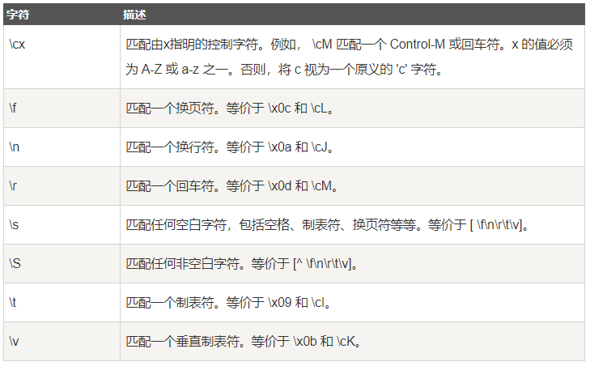
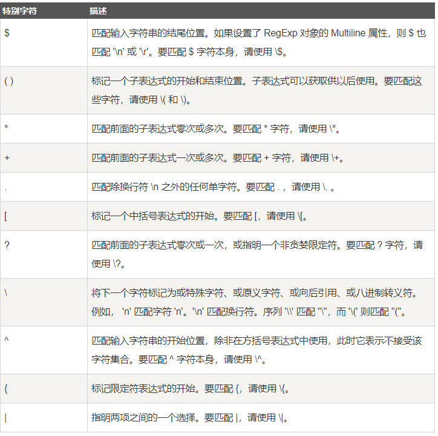
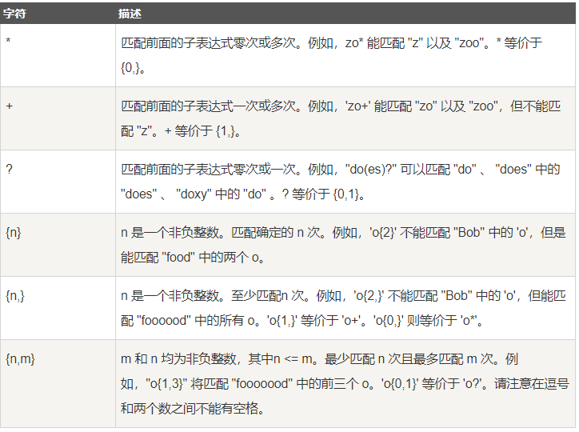
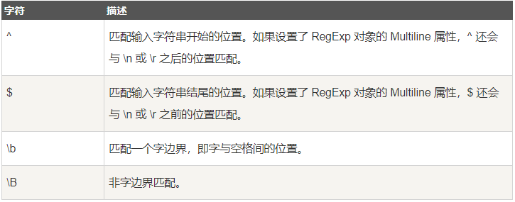
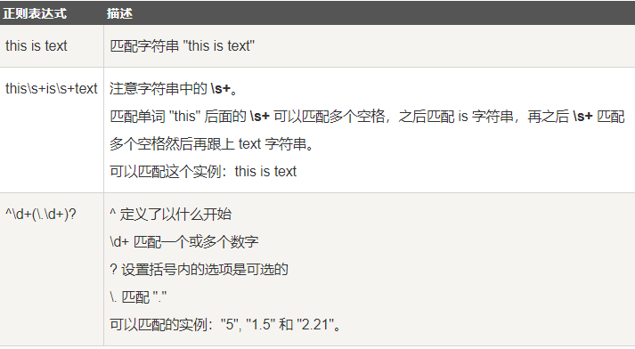

# 正则表达式
## 简介
\^[0-9] + abc $
- `^` 为匹配输入字符串的开始位置
- `[0-9] + `匹配多个数字，`[0-9]`匹配单个数字，`+`匹配一个或者多个
- `abc$`匹配字母`abc`并以`abc`结尾，`$`为匹配输入字符串的结束位置

使用正则表达式可以：
- 测试字符串内的模式
- 替换文本
- 基于模式匹配从字符串中提取子字符串

## 语法
- `runoo+b`，可以匹配 runoob、runooob、runoooooob 等，+ 号代表前面的字符必须至少出现一次（1次或多次）。
- `runoo*b `，可以匹配 runob、runoob、runoooooob 等，\* 号代表字符可以不出现，也可以出现一次或者多次（0次、或1次、或多次）。
- `colou?r` 可以匹配 color 或者 colour，? 问号代表前面的字符最多只可以出现一次（0次、或1次）。

**正则表达式是由普通字符（例如字符 a 到 z）以及特殊字符（称为"元字符"）组成的文字模式。**模式描述在搜索文本时要匹配的一个或多个字符串。正则表达式作为一个模板，将某个字符模式与所搜索的字符串进行匹配。
### 普通字符
普通字符包括没有显式指定为元字符的所有可打印和不可打印字符。这包括所有大写和小写字母、所有数字、所有标点符号和一些其他符号。
### 非打印字符
非打印字符也可以是正则表达式的组成部分。下表列出了表示非打印字符的转义序列：

### 特殊字符
许多元字符要求在试图匹配它们时特别对待。若要匹配这些特殊字符，必须首先使字符"转义"，即，将反斜杠字符\ 放在它们前面。下表列出了正则表达式中的特殊字符：

### 限定符
限定符用来指定正则表达式的一个给定组件必须要出现多少次才能满足匹配。有 * 或 + 或 ? 或 {n} 或 {n,} 或 {n,m} 共6种。
正则表达式的限定符有：

**\*、+限定符都是贪婪的，因为它们会尽可能多的匹配文字，只有在它们的后面加上一个?就可以实现非贪婪或最小匹配。**
### 定位符
定位符使您能够将正则表达式固定到行首或行尾。它们还使您能够创建这样的正则表达式，这些正则表达式出现在一个单词内、在一个单词的开头或者一个单词的结尾。    

定位符用来描述字符串或单词的边界，\^ 和 \$ 分别指字符串的开始与结束，\b 描述单词的前或后边界，\B 表示非单词边界。
正则表达式的定位符有：

**注意：**
- 不能将限定符和定位符一起使用。由于在紧靠换行或者字边界的前面或者后面不能有一个以上位置，因此不允许诸如`^*`之类的表达式
- 若要匹配一行文本开始处的文本，请在正则表达式的开始使用 ^ 字符。不要将 ^ 的这种用法与中括号表达式内的用法混淆。
- 若要匹配一行文本的结束处的文本，请在正则表达式的结束处使用 $ 字符。

**匹配字边界**稍有不同，但向正则表达式添加了很重要的能力。字边界是单词和空格之间的位置。非字边界是任何其他位置。下面的表达式匹配单词 Chapter 的开头三个字符，因为这三个字符出现在字边界后面：    
`/\bCha/`    
`\b` 字符的位置是非常重要的。如果它位于要匹配的字符串的开始，它在单词的开始处查找匹配项。如果它位于字符串的结尾，它在单词的结尾处查找匹配项。例如，下面的表达式匹配单词 Chapter 中的字符串 ter，因为它出现在字边界的前面：    
`/ter\b/`    
下面的表达式匹配 Chapter 中的字符串 apt，但不匹配 aptitude 中的字符串 apt：    
`/\Bapt/`    
字符串 apt 出现在单词 Chapter 中的非字边界处，但出现在单词 aptitude 中的字边界处。对于 \B 非字边界运算符，位置并不重要，因为匹配不关心究竟是单词的开头还是结尾。
### 选择 [^1]
用圆括号将所有选择项括起来，相邻的选择项之间用|分隔。但用圆括号会有一个副作用，使相关的匹配会被缓存，此时可用?:放在第一个选项前来消除这种副作用。

其中 ?: 是非捕获元之一，还有两个非捕获元是 ?= 和 ?!，这两个还有更多的含义，前者为正向预查，在任何开始匹配圆括号内的正则表达式模式的位置来匹配搜索字符串，后者为负向预查，在任何开始不匹配该正则表达式模式的位置来匹配搜索字符串。
### 反向引用 [^2]
# java 正则表达式（菜鸟教程）
正则表达式
- 定义了字符串的模式
- 可以用来搜索、编辑或处理文本。
- 并不仅限于某一种语言，但有细微的差别

## 实例

java.util.regex 包主要包括以下三个类：
- Pattern 类：
    - pattern 对象是一个正则表达式的编译表示。Pattern 类没有公共构造方法。要创建一个 Pattern 对象，你必须首先调用其公共静态编译方法，它返回一个 Pattern 对象。该方法接受一个正则表达式作为它的第一个参数。
- Matcher 类：
    - Matcher 对象是对输入字符串进行解释和匹配操作的引擎。与Pattern 类一样，Mat  cher 也没有公共构造方法。你需要调用 Pattern 对象的 matcher 方法来获得一个 Matcher 对象。
- PatternSyntaxException：
    - PatternSyntaxException 是一个非强制异常类，它表示一个正则表达式模式中的语法错误。

# java 正则表达式（超详细博客）
参考[Java正则表达式](https://www.cnblogs.com/xyou/p/7427779.html)

[^1]:选择是什么意思啊，不太懂？
[^2]:不懂。
