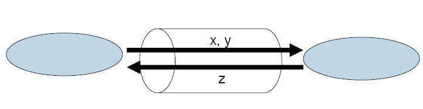
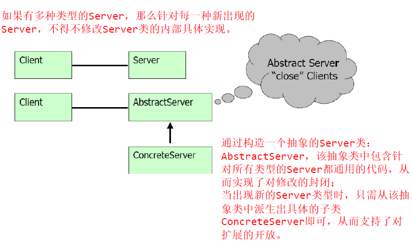

# 课堂笔记
## 6.面向可维护性的软件构造方法
### 6.1 可维护性的衡量和构造原则
#### 1. 软件可维护性
**维护：** 软件的生命周期进程
**优秀的 debug 技能** 
1. 诊断
2. 测试
3. 书写规格说明

**修正代码之后**
1. 正确测试规格说明
2. 回归性错误的检验
3. 更改所有的文档

**软件维护的种类**
1. 纠正性维护（Corrective maintenance） -25%
2. 适应性维护（Adaptive maintenance）   -21%
3. 完善性维护（Perfective maintenance）  -50%
4. 预防性维护（Preventive maintenance） -4%

**Lehman's Laws on Software Evolution**
Eight laws were formulated：
- 反馈系统 (Feedback System)
- 持续的改变 (Continuing Change)
- 持续的增长 (Continuing Growth)
- 下滑的质量 (Declining Quality)
- 增加的复杂度 (Increasing Complexity)
- 自我校准 (Self Regulation)
    - Conservation of Organizational Stability
    - Conservation of Familiarity

**熵 Entropy**    
物理意义是系统混乱程度的度量
    

#### 2. 可维护性的度量

**一些公共的可维护性的度量**
1. 循环复杂度（Cyclomatic Complexity）- 测量代码的结构复杂性
    - 通过计算在一个程序流中不同代码路径的数量
2. 代码的行数（Lines of Code）- 指代码大概的行数
    - 一个很大的数字说明这个类型或方法试图去做很多事情，应该把他分成不同的部分
    - 也说明这个类型或方法是很难去维持的。
3. 运算符和操作数的数目（Halstead Volume）[^1]
4. Maintainability Index（MI）-index 在0-100之间，越高说明可维护性越好
    - HV
    - CC
    - LOC（The average number of lines of code per module）
    - COM（The percentage of comment lines per module）

$$ 171 - 5.2 \ln (HV) - 0.23CC - 16.2 \ln (LOC) + 50.0 \sin \sqrt{2.46 * COM}$$

5. 继承的深度（Depth of Inheritance）- 继承的越深，代码越难以理解
6. 类连接（Class Coupling）[^2]
    - 一个好的软件设计要求类和方法都应该有高的结合度和低的连接度。
7. 单元测试覆盖率（Unit test coverage）

#### 3. 模块化设计及其原则
**Modular Programming**    
- 模块化编程通常是指高水平的代码的分解从一个完整的程序到片段，并且有广泛的使用结构化编程和OOP
    - 结构化编程是指结构化控制流中底层代码的使用
    - OOP是指对象的数据使用方式
- 这种设计的目标是把系统分割为模块并且在每个部分之间分配职责，用：
    - `High cohesion` within modules
    - `Loose coupling` between modules
- 模块化减少了程序员不得不解决的整个复杂度
    - 关注分离
    - 信息隐藏
- `The principles of cohesion and coupling are probably the most important design principles for evaluating the maintainability ofa dasign`
##### (1) 评价模块化的 5 个标准
- Decomposability（可分解性）
    - 将问题分解为各个可独立解决的子问题
    - 目标：使模块之间的依赖关系显示化
    - 
    - 例子：top-down structural design
- Composability（可组合性）
    - 可容易的将模块组合起来形成新的系统
    - 目标：使模块可在不同的环境下复用
    - 
    - 例子：Math libraries； Unix command &pipes
- Understandability（可理解性）[^3]
    - 每个子模块都可被系统设计者容易的理解
    - 
- Continuity（可持续性）
    - 小的变化将只影响一小部分模块，而不会影响整个体系结构
    - 例子：符号型变量； 模块提供的所有服务应该通过统一标识提供
    - 
- Protection（出现异常后的保护）
    - 运行时的不正常将局限于小范围模块内
    - 
    - 例子：验证源输入（Validating input at source）

##### (2) 模块化设计的5个原则
- 直接映射（Direct Mapping）
    - 模块的结构与现实世界中问题领域的结构保持一致
    - 对以下评价标准产生影响
        - 持续性（Continuity）：更加简单的去评估和限制改变的影响
        - 可分解性（Decomposability）：将问题域模型分解为软件分解的良好起点。
- 尽可能少的接口（Few Interfaces）
    - 模块应尽可能少的与其他模块通讯
    - 通讯路径的数目：$$ n-1, n(n-1)/2, n-1 
    - 
    - 会对可持续性，保护性，可理解性，可组合性产生影响
- 尽可能小的接口（Small Interfaces）
    - 如果两个模块通讯，那么它们应交换尽可能少的信息
    - 
        - 限制模块之间通讯的“带宽”
        - 对“可持续性”和“保护性”产生影响
- 显示接口（Explicit Interfaces）
    - 当 A 与 B 通讯时，应明显的发生在 A 与 B 接口之间
    - 对“可分解性”，“可组合性”，“可持续性”，“可理解性”产生影响
    - 反例
    - 
- 信息隐藏（Information Hiding）
    - 经常可能发生变化的设计决策应尽可能隐藏在抽象接口后面
    - 对“可持续性”产生影响

***强调*** Rule 2-3-4

- Few Interfaces : " Don't talk to many " ** 不要对太多人讲话**
- Small Interfaces : " Don't talk a lot" **不要讲太多**
- Explicit Interfaces: " Talk loud and in public ,Don't whisper" **公开的大声讲话，不要私下嘀咕**

##### (3) 连接与结合
**连接**

- 连接是模块间独立性的一种衡量
- 模块间的连接的程度决定于
    - 模块间接口的数目
    - 每一个接口的复杂度

**结合**

- 结合是一个模块内部功能的联系是否紧密的一种衡量
- 一个模型有很高的结合度，说明它的元素都为一个目标工作

最好的设计是有`高的结合度`和`低的连接度`（Strong cohesion And Weak coupling)


#### 4. 面向对象的设计原则：SOLID
- 单一责任原则
- 开放封闭原则
- Liskov替换原则
- 接口隔离原则
- 依赖转换原则

##### (1) Single responsibility principle(SRP)
引起类变化的原因只有一个，专心做一件事情    
反例：    


##### (2) Open/ closed principle(OCP)
> - Software entities(classes, modules, functions, etc.) should be open for extension, but closed for modification. 
> - Change a class's behavior using inheritance and composition

- 对扩展性的开放
    - 模块的行为应是可扩展的，从而该模块可表现出新的行为以满足需求的变化
- 对修改的封闭
    - 模块自身的代码是不应被修改的
    - 扩展模块行为的一般途径是修改模块的内部实现
    - 如果一个模块不能被修改，那么它通常是被认为具有固定的行为。
- 解决问题的关键在于：**抽象技术** 


**Bad example**
```java
class GraphicEditor{
    public void drawShape(Shape s){
        if (s.t==1)
            drawRec(s);
        else if (s.t==2)
            drawCir(s);
    }
    public void drawRec(Rec r){}
    public void drawCir(Rec r){}
}
class Shape{
    int t;
}
class Rec extends Shape{
    Rec(){
        super.t= 1;
    }
}
class Cir extends Shape{
    Cir(){
        super.t= 2;
    }
}
```
有几个问题
1. 必须修改`GraphEditor`才能添加一个新的`Shape`
2. `GraphEditor`和`Shape`的连接太紧密
3. 必须要`GraphEditor`的参与才能去测试一个特定的`Shape`
4. `if-else-/case` 应该避免使用
**Good example**
```java
class GraphEditor{
    public void drawShape(Shape s){
        s.draw();
    }
}
class Shape{
    abstract void draw();
}
class Rec extends Shape{
    public void draw(){
    }
}
```
**Single Choice**
无论什么时候软件系统都必须支持一组替代方案，系统中有且只有一个模块应该知道他们的详尽列表。

##### (3) Liskov substitution principle（LSP）
> Functions that use pointers or references to base classes must be able to use objects of derived classes without knowing it 

- 关注的是“操作”的可替换性
- LSP：子类型必须能够替换其基类型

##### (4) Interface segregation principle(ISP)

### 6.2 面向可维护性的设计模式
- 创建型模式
    - 工厂方法模式
    - 抽象工厂模式
    - 建造者模式
- 结构型模式
    - 桥接模式
    - 
### 6.3

[^1]:HV这个单词我都没有查到什么意思。。。

[^2]: 没有分清`cohesion`和`coupling`的区别

[^3]:可理解性说的是什么意思？给出的图片想要说明什么？


